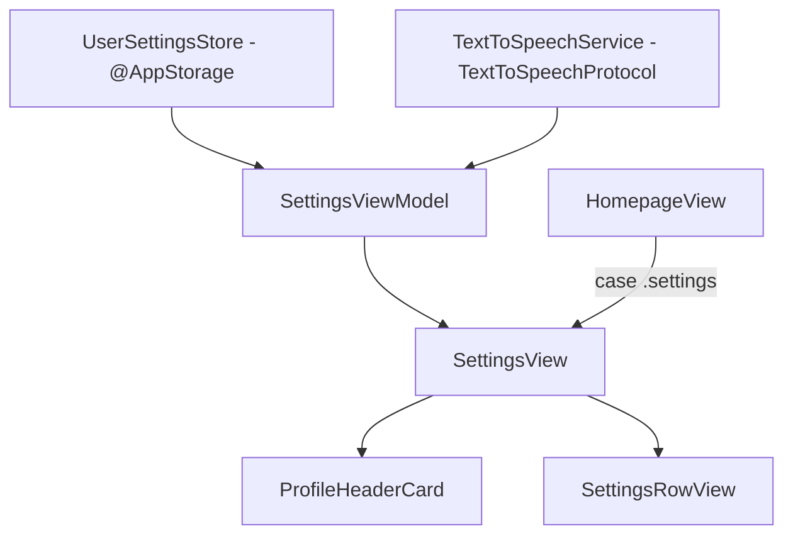

# Design Spec: VocabCraft Settings Screen UI & Feature Integration

**Date:** 2026-08-06  
**Status:** Approved  
**Feature:** Settings Screen (`SettingsView`)  
**Target App:** VocabCraftApp (iOS SwiftUI)  

---

## 1. Overview & Goals

The Settings screen in `VocabCraftApp` provides a unified, elegant, and responsive UI for managing user preferences, learning goals, audio settings (TTS voice & speed preview), app themes, haptics, and app maintenance data. 

The screen adheres to the **Modern Inset Form List** design style with custom `Color.vocabCanvas` background, `Color.vocabSurfaceCard` rows, rounded SF Symbol badges, and smooth integration with the existing `LiquidGlassTabBar`.

---

## 2. UI Layout & Component Architecture

### 2.1 Visual Hierarchy
The layout uses a SwiftUI `List` with `.insetGrouped` style, stripped of default list background and styled with `Color.vocabCanvas`.

#### Section 0: User Profile Header
- **Component:** `ProfileHeaderCard`
- **Elements:**
  - Avatar image or initials circle with gold/teal outline.
  - User Name: "Hooji N." (font: `.headline`, color: `vocabInk`).
  - Target CEFR Level Badge: "B2 Intermediate" (`vocabLavender` background).
  - Streak Chip: "🔥 14 ngày streak" (`vocabCoral` accent).

#### Section 1: Learning & SRS (`vocabHeroAccent`)
- **Daily Target Words:** Stepper & Picker for daily target (10, 15, 20, 25 words/day).
- **Daily Review Reminder:** Toggle switch for notifications + inline `DatePicker` for reminder time.
- **SRS Progress Reset:** Destructive button (`vocabCoral`) with confirmation dialog to reset review queue.

#### Section 2: Audio & Pronunciation TTS (`vocabPeach`)
- **Accent Voice:** Picker/Segmented Control (`US - Mỹ`, `UK - Anh`).
- **Speech Speed:** Slider (range `0.5x` to `1.0x`, default `0.85x`) with text indicator.
- **Interactive Audio Preview Button:** Tapping triggers TTS speech sample *"VocabCraft: Master English naturally"* using `TextToSpeechProtocol`, displaying a pulsing speaker icon while playing.

#### Section 3: Appearance & Experience (`vocabLavender`)
- **App Theme:** Segmented Picker (`Tối (Dark)`, `Sáng (Light)`, `Hệ thống (System)`).
- **Haptic Feedback:** Toggle switch for tactile touch responses.
- **Sound Effects:** Toggle switch for app interaction sounds.

#### Section 4: App Info & Data (`vocabMuted`)
- **iCloud Sync:** Sync status label + "Đồng bộ ngay" button.
- **Clear Cache:** Displays current cache size (e.g., "12.4 MB") + "Dọn dẹp" button.
- **App Version:** Read-only info row showing app version (`v1.2.0 (Build 42)`).

---

## 3. Architecture & Data Flow

### 3.1 Domain & State Management
- **`UserSettingsStore` (`@Observable` class):**
  - Manages persistent settings backed by `@AppStorage` / `UserDefaults`:
    - `dailyGoalCount: Int`
    - `isNotificationEnabled: Bool`
    - `notificationTime: Date`
    - `ttsVoiceGender: String` ("US" | "UK")
    - `ttsSpeed: Float`
    - `appTheme: String` ("system" | "dark" | "light")
    - `isHapticsEnabled: Bool`
    - `isSoundEffectsEnabled: Bool`

- **`SettingsViewModel` (`@Observable` class):**
  - Holds `UserSettingsStore`.
  - Injected with `TextToSpeechProtocol`.
  - Actions: `playAudioPreview()`, `clearCache()`, `resetSRSProgress()`.

---

## 4. File Structure

- **New Files:**
  - `VocabCraftApp/Core/Database/UserSettingsStore.swift`
  - `VocabCraftApp/Features/Settings/ViewModels/SettingsViewModel.swift`
  - `VocabCraftApp/Features/Settings/Views/SettingsView.swift`
  - `VocabCraftApp/Features/Settings/Views/Components/ProfileHeaderCard.swift`
  - `VocabCraftApp/Features/Settings/Views/Components/SettingsRowView.swift`

- **Modified Files:**
  - `VocabCraftApp/Features/Homepage/Views/HomepageView.swift` (replace `.settings` placeholder)

---

## 5. Verification Plan

- **UI Verification:** Build & run on iOS Simulator to verify dark/light mode rendering, list padding above `LiquidGlassTabBar`, and profile card layout.
- **Audio Verification:** Test TTS audio preview button to verify speech playback with US/UK voice and speech rate settings.
- **Persistence Verification:** Relaunch app to ensure user settings (theme, daily goal, TTS speed) are retained.
