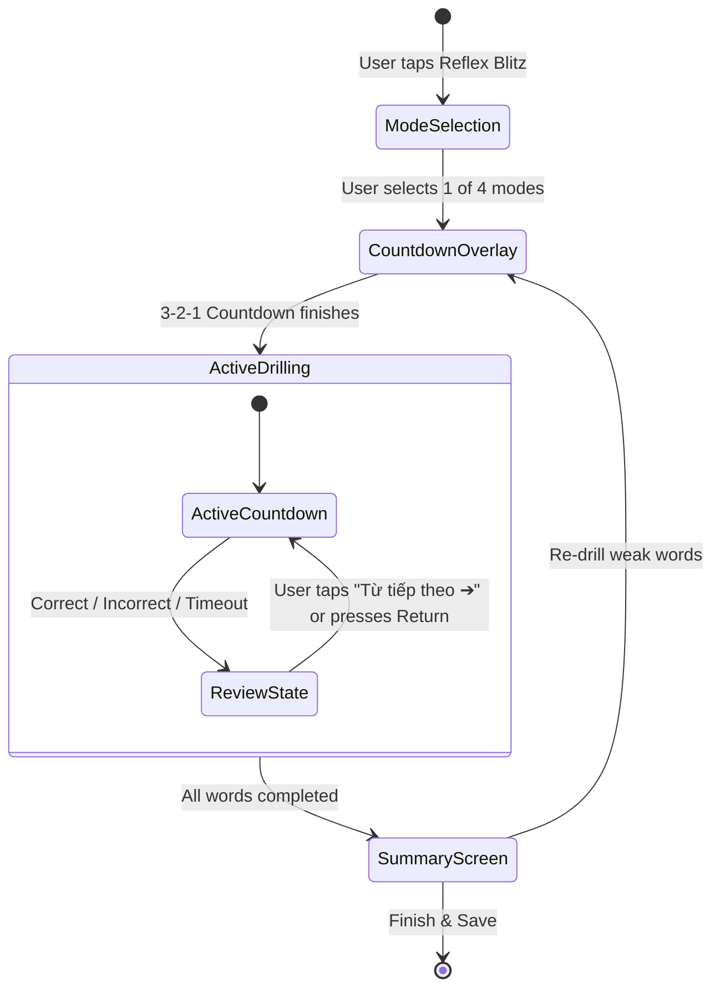

# Reflex Blitz Redesign — Feature Specification & Architecture

**Date:** 2026-08-20  
**Status:** Approved by User  
**Target Module:** `VocabCraftApp/Features/ReflexDrill`

---

## 1. Executive Summary & Goals

### 1.1 Problem Statement
The legacy Reflex Blitz implementation suffered from several UX friction points:
1. **Cognitive Overload during Reflex Timing:** Displaying Vietnamese meaning, POS, and a long cloze sentence simultaneously forced users to spend 1.5s–2.5s reading instead of activating pure instantaneous retrieval.
2. **Abrupt Transitions (Flow Interruption):** Automatically advancing to the next word after 1.0s or TTS speech left users without time to consolidate learning, read the completed context sentence, or reflect on mistakes.
3. **Lack of Dedicated Learning Modalities:** Mixing speech with manual toggling caused confusion. Users in different environments (noisy/quiet) lacked dedicated, clean learning modes.
4. **Overly Complex Starter Vocabulary:** Starter words (e.g. *serendipity*, *ephemeral*) were C1/C2 vocabulary with complex phonetics, hampering rapid reflex testing.

### 1.2 Core Objectives
- **Pre-session Modality Selection:** Allow users to choose 1 of 4 dedicated learning modes upfront:
  1. 🎙️ **Speaking:** Hands-free continuous speech recognition.
  2. ⌨️ **Typing:** Rapid spelling & recall with auto-focused text field.
  3. ⚡️ **Multiple Choice:** Instant 1-of-4 English word recognition.
  4. 🎧 **Listening Reflex:** Auditory prompt $\rightarrow$ 1-of-4 Vietnamese meaning selection.
- **Review & Consolidation Pause:** Stop the timer immediately upon receiving an answer (or timeout). Show the full target word, IPA, completed context sentence, and an explicit **"Từ tiếp theo ➔"** action button.
- **Accurate Reflex Stopwatch:** Response time (`responseTimeMs`) only measures active deliberation during the countdown phase, not the review reading time.
- **Common A1–B2 Mock Dataset:** Provide high-frequency, practical words for smooth and enjoyable testing.

---

## 2. User Journey & Interaction Flow



### 2.1 Pre-Session: Mode Selection
- **View:** `ReflexBlitzModeSelectionView`
- **Layout:** Bento Grid with 4 distinct mode cards.
- **Word Count:** Retrieved from `UserSettingsStore` (default count configured in app settings).
- **Start Action:** Tapping a card launches the 3-second animated countdown (`3 -> 2 -> 1 -> BẮT ĐẦU!`).

### 2.2 In-Session: Active Countdown & Modality Details

| Mode | Timer Limit | Initial Stimulus Display | User Action | Success / Failure Transition |
| :--- | :---: | :--- | :--- | :--- |
| **🎙️ Speaking** | `6.0s` | Vietnamese meaning + Cloze sentence `[ • • • ]`. First-letter hint after 3.5s. | Voice recognized via `ContinuousReflexSpeechService`. | Spoken match $\rightarrow$ `.reviewed(isCorrect: true)`. Timeout $\rightarrow$ TTS reads word $\rightarrow$ `.reviewed(isTimeout: true)`. |
| **⌨️ Typing** | `7.5s` | Vietnamese meaning + Cloze sentence + Auto-focused input field. | User types English lemma. Real-time match or `Return`. | Exact match $\rightarrow$ `.reviewed(isCorrect: true)`. Mismatch on submit $\rightarrow$ subtle shake. Timeout $\rightarrow$ `.reviewed(isTimeout: true)`. |
| **⚡️ Multiple Choice** | `4.5s` | Vietnamese meaning + Cloze sentence + 4 English word cards. | User taps 1 of 4 cards. | Correct card $\rightarrow$ green highlight $\rightarrow$ `.reviewed(isCorrect: true)`. Wrong card $\rightarrow$ red highlight + green outline on correct $\rightarrow$ `.reviewed(isCorrect: false)`. |
| **🎧 Listening Reflex** | `5.5s` | Lemma hidden, auto-plays audio + 4 Vietnamese meaning cards. | User taps 1 of 4 meaning cards. | Correct card $\rightarrow$ reveals lemma & IPA $\rightarrow$ `.reviewed(isCorrect: true)`. Wrong card / Timeout $\rightarrow$ reveals answer $\rightarrow$ `.reviewed(isCorrect: false)`. |

### 2.3 Review & Consolidation State (`.reviewed`)
- **Timer Status:** Paused immediately. Recorded `responseTimeMs` is stored.
- **Visuals:**
  - Card stroke: Emerald Mint (`.vocabMint`) if correct, Coral Red (`.vocabCoral`) if incorrect/timeout.
  - Badge: `⚡️ 1.2s - Phản xạ tuyệt vời!` or `⚠️ Hết giờ / Chưa chính xác`.
  - Target Word: Large font, Part of Speech badge, IPA phonetics, and Audio speaker button.
  - Sentence: Completed English sentence with target word bolded, plus Vietnamese translation.
- **Advance Trigger:**
  - Sticky bottom button: **`⚡️ [Time] • Từ tiếp theo ➔`**.
  - Keyboard shortcut: Tapping `Return` or `Space` in Typing mode triggers advance.

### 2.4 Summary & Re-drill Loop
- Displays Bento Metrics: Average Response Time, Accuracy (`X/Y`), Max Combo Streak.
- Speed Rating: `⚡️ Reflex Master`, `🔥 Swift Reflex`, `🌱 Steady Learner`.
- Weak Words List: Missed attempts or attempts $> 2.5s$.
- Primary Actions:
  - **"Luyện lại X từ chưa thuộc" (Re-drill):** Restarts session with only weak words in the same mode.
  - **"Hoàn thành & Lưu tiến độ":** Saves SRS progress and dismisses to Home.

---

## 3. Data Models & Architecture

### 3.1 Domain Enums & Structures (`ReflexBlitzModels.swift`)

```swift
public enum ReflexBlitzMode: String, CaseIterable, Identifiable, Sendable, Codable {
    case speaking
    case typing
    case multipleChoice
    case listening

    public var id: String { rawValue }

    public var timeLimitSeconds: Double {
        switch self {
        case .multipleChoice: return 4.5
        case .listening:      return 5.5
        case .speaking:       return 6.0
        case .typing:         return 7.5
        }
    }

    public var title: String {
        switch self {
        case .speaking:       return "Luyện nói"
        case .typing:         return "Gõ từ"
        case .multipleChoice: return "Trắc nghiệm"
        case .listening:      return "Phản xạ nghe"
        }
    }
}

public enum ReflexCardPhase: Equatable, Sendable {
    case activeCountdown
    case reviewed(result: ReflexCardResult)
}

public struct ReflexCardResult: Equatable, Sendable {
    public let isCorrect: Bool
    public let responseTimeMs: Int
    public let isTimeout: Bool
    public let selectedOption: String?
    public let typedText: String?
    public let recognizedSpoken: String?
}

public struct ReflexBlitzOption: Identifiable, Equatable, Sendable {
    public let id: String
    public let text: String
    public let isCorrect: Bool
}
```

### 3.2 Option Generation Algorithm
- `ReflexBlitzWordItem` helper method `generateOptions(mode:allPool:) -> [ReflexBlitzOption]`:
  - Extracts 1 correct answer (English lemma for Multiple Choice, Vietnamese definition for Listening).
  - Samples 3 unique distractor items from `allPool` (or `defaultStarterWords` if `allPool.count < 4`).
  - Shuffles the 4 options using `allPool.shuffled()`.

---

## 4. Curated A1–B2 Starter Mock Dataset

```swift
public static var defaultStarterWords: [ReflexBlitzWordItem] {
    [
        ReflexBlitzWordItem(id: 1, lemma: "habit", pos: "n.", ipa: "/ˈhæb.ɪt/", definitionVi: "Thói quen", exampleSentenceEn: "Reading books daily is a great habit.", exampleSentenceVi: "Đọc sách mỗi ngày là một thói quen tuyệt vời."),
        ReflexBlitzWordItem(id: 2, lemma: "improve", pos: "v.", ipa: "/ɪmˈpruːv/", definitionVi: "Cải thiện, nâng cao", exampleSentenceEn: "Practice helps you improve your English skills.", exampleSentenceVi: "Luyện tập giúp bạn cải thiện kỹ năng tiếng Anh."),
        ReflexBlitzWordItem(id: 3, lemma: "focus", pos: "v.", ipa: "/ˈfoʊ.kəs/", definitionVi: "Tập trung", exampleSentenceEn: "Please focus on your main goal.", exampleSentenceVi: "Hãy tập trung vào mục tiêu chính của bạn."),
        ReflexBlitzWordItem(id: 4, lemma: "create", pos: "v.", ipa: "/kriˈeɪt/", definitionVi: "Tạo ra, sáng tạo", exampleSentenceEn: "Artists always create beautiful paintings.", exampleSentenceVi: "Các nghệ sĩ luôn tạo ra những bức tranh tuyệt đẹp."),
        ReflexBlitzWordItem(id: 5, lemma: "journey", pos: "n.", ipa: "/ˈdʒɜːr.ni/", definitionVi: "Hành trình, chuyến đi", exampleSentenceEn: "Learning a language is an exciting journey.", exampleSentenceVi: "Học một ngôn ngữ là một hành trình thú vị."),
        ReflexBlitzWordItem(id: 6, lemma: "relax", pos: "v.", ipa: "/rɪˈlæks/", definitionVi: "Thư giãn, nghỉ ngơi", exampleSentenceEn: "Listening to music helps me relax after work.", exampleSentenceVi: "Nghe nhạc giúp tôi thư giãn sau giờ làm việc."),
        ReflexBlitzWordItem(id: 7, lemma: "challenge", pos: "n.", ipa: "/ˈtʃæl.ɪndʒ/", definitionVi: "Thử thách", exampleSentenceEn: "Overcoming a challenge makes you stronger.", exampleSentenceVi: "Vượt qua thử thách giúp bạn mạnh mẽ hơn."),
        ReflexBlitzWordItem(id: 8, lemma: "protect", pos: "v.", ipa: "/prəˈtekt/", definitionVi: "Bảo vệ", exampleSentenceEn: "We need to protect our environment.", exampleSentenceVi: "Chúng ta cần bảo vệ môi trường của mình."),
        ReflexBlitzWordItem(id: 9, lemma: "connect", pos: "v.", ipa: "/kəˈnekt/", definitionVi: "Kết nối", exampleSentenceEn: "The internet helps people connect worldwide.", exampleSentenceVi: "Internet giúp mọi người kết nối trên toàn thế giới."),
        ReflexBlitzWordItem(id: 10, lemma: "energy", pos: "n.", ipa: "/ˈen.ər.dʒi/", definitionVi: "Năng lượng", exampleSentenceEn: "A healthy breakfast gives you energy for the day.", exampleSentenceVi: "Bữa sáng lành mạnh cung cấp cho bạn năng lượng cho cả ngày."),
        ReflexBlitzWordItem(id: 11, lemma: "simple", pos: "adj.", ipa: "/ˈsɪm.pəl/", definitionVi: "Đơn giản, dễ dàng", exampleSentenceEn: "Keeping things simple is often the best choice.", exampleSentenceVi: "Giữ mọi thứ đơn giản thường là sự lựa chọn tốt nhất."),
        ReflexBlitzWordItem(id: 12, lemma: "success", pos: "n.", ipa: "/səkˈses/", definitionVi: "Thành công", exampleSentenceEn: "Hard work and patience lead to success.", exampleSentenceVi: "Chăm chỉ và kiên nhẫn dẫn đến thành công.")
    ]
}
```

---

## 5. UI/UX Hierarchy & Component Decomposition

1. **`ReflexBlitzModeSelectionView` [NEW]:**
   - Header title & subtitle.
   - 4 Bento Cards for Speaking, Typing, Multiple Choice, Listening.
2. **`ReflexBlitzHeaderView` [MODIFY]:**
   - Top navigation with close button, progress indicator `X/Y`, combo streak badge `🔥 xN`, and skip action.
3. **`ReflexBlitzCardView` [MODIFY]:**
   - Renders stimulus according to active `ReflexBlitzMode`.
   - Embeds:
     - Voice dock for `.speaking`.
     - Text field for `.typing`.
     - 4-Option grid for `.multipleChoice` and `.listening`.
   - Smoothly transforms to `.reviewed` state showing full lemma, IPA, completed cloze sentence, translation, and audio replay.
4. **`ReflexBlitzAdvanceDockView` [NEW]:**
   - Sticky bottom dock with action button `⚡️ 1.2s • Từ tiếp theo ➔`.
5. **`ReflexBlitzSummaryView` [MODIFY]:**
   - Bento metric cards, speed title badge, weak word list with audio, and re-drill button.

---

## 6. Testing & Quality Assurance Plan

### 6.1 Unit Tests (`ReflexBlitzViewModelTests.swift`, `ReflexBlitzModelsTests.swift`)
- Test mode selection initialization and time limits.
- Test active countdown vs. reviewed phase transitions.
- Verify `responseTimeMs` only counts active deliberation time.
- Verify 4-option generation correctness (1 correct, 3 unique distractors).
- Test combo streak increment on success and reset on timeout/error.
- Test weak word filtering and re-drill session reloading.

### 6.2 View & Component Tests (`ReflexBlitzComponentsTests.swift`, `ReflexBlitzViewIntegrationTests.swift`)
- Verify `ReflexBlitzModeSelectionView` renders all 4 mode options.
- Verify typing field focus and return key handling.
- Verify option card selection and visual feedback (mint / coral highlights).
- Verify the "Từ tiếp theo" button advances to the next word.

---

## 7. Spec Self-Review Checklist
- [x] **Placeholder Scan:** No TBD, TODO, or incomplete sections.
- [x] **Internal Consistency:** Architecture and state machine match the 4 modes and review state requirements.
- [x] **Scope Check:** Well-bounded within `Features/ReflexDrill` and its corresponding tests.
- [x] **Ambiguity Check:** Explicit timer durations, stimulus definitions, and advance mechanics.
