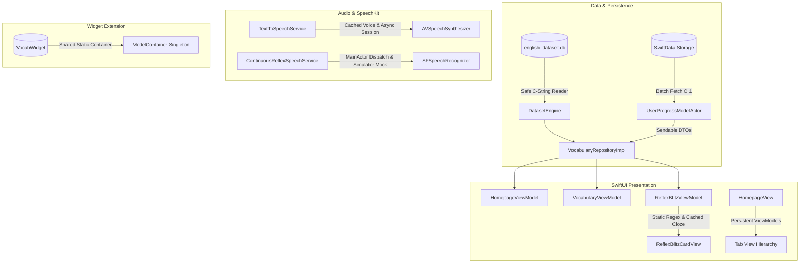

# VocabCraft Performance & Reliability Optimization Design Spec

**Date:** 2026-08-20  
**Author:** Antigravity (Superpowers Mode)  
**Status:** Approved / Ready for Implementation  
**Target:** VocabCraft App & Widget Extension (iOS 17+)

---

## 1. Executive Summary & Goals

VocabCraft is a modern SwiftUI English learning app utilizing SQLite for dictionary storage, SwiftData for user progress tracking, AVFoundation for Text-to-Speech (TTS), and SpeechKit for continuous acoustic reflex evaluation.

A performance audit identified critical runtime risks and bottlenecks:
1. **Crash Risk**: Unsafe SQLite C-String pointer dereferencing when encountering `NULL` fields.
2. **Main Thread Freezes (2-5s)**: N+1 queries during Topic Deck loading causing over 1,500 individual `ModelActor` round-trips.
3. **Audio Hangs & Stalls**: Synchronous `AVSpeechSynthesisVoice.speechVoices()` lookups and unhandled continuation deadlocks.
4. **Simulator Crashes**: Direct `AVAudioEngine.inputNode` access without hardware simulation.
5. **Frame Drops & Battery Drain (10Hz)**: Re-compiling `NSRegularExpression` inside the SwiftUI 100ms render loop.
6. **Widget Crash (30MB OOM)**: Recreating `ModelContainer` on every widget snapshot.
7. **View Lifecycle Invalidation**: Re-instantiating child view models on every tab change.

### Objectives
- Zero fatal crashes from SQLite `NULL` or Simulator audio hardware absence.
- Sub-50ms loading times for Topic Decks and Vocabulary Views.
- Smooth 60/120fps scrolling and card interactions with zero regex compilation in view bodies.
- Stable Widget memory consumption under 15MB (well below the 30MB limit).

---

## 2. Architecture & Subsystem Design



---

## 3. Detailed Component Specifications

### 3.1. Safe SQLite C-String Extraction (`DatasetEngine`)
* **Problem**: Passing a `nil` pointer from `sqlite3_column_text` directly to `String(cString:)` causes an instant SIGSEGV crash.
* **Specification**:
  - Implement two private helper functions within `DatasetEngine`:
    ```swift
    private func columnText(_ statement: OpaquePointer?, _ index: Int32) -> String {
        guard let cStr = sqlite3_column_text(statement, index) else { return "" }
        return String(cString: cStr)
    }

    private func optionalColumnText(_ statement: OpaquePointer?, _ index: Int32) -> String? {
        guard let cStr = sqlite3_column_text(statement, index) else { return nil }
        return String(cString: cStr)
    }
    ```
  - Audit and replace all 16 occurrences of raw `String(cString: sqlite3_column_text(...))` across `DatasetEngine.swift`.

### 3.2. Batch SwiftData Progress Retrieval (`UserProgressModelActor` & `VocabularyRepositoryImpl`)
* **Problem**: `fetchTopicDecks()` and `fetchTopicDeckDetails()` make individual async calls to `progressActor.getProgress(wordId:)` for every word in every node of every deck ($N \times M \times K \approx 1,600$ queries).
* **Specification**:
  - Add `fetchAllMasteryLevels() throws -> [Int64: Int]` to `UserProgressModelActor`:
    - Executes a single `FetchDescriptor<UserWordProgress>` with `propertiesToFetch = [\.wordId, \.masteryLevel]`.
    - Returns a `[Int64: Int]` dictionary mapping `wordId -> masteryLevel`.
  - Add `fetchAllProgressDTO() throws -> [Int64: SRSProgressItem]` for detailed deck views requiring `isBookmarked`.
  - In `VocabularyRepositoryImpl.fetchTopicDecks()`:
    - Call `progressActor.fetchAllMasteryLevels()` **once** before iterating decks.
    - Perform $O(1)$ in-memory lookups `(masteryMap[word.id] ?? 0) >= 5`.
    - Time complexity drops from $O(N)$ async database queries to $O(1)$ memory lookups per word.

### 3.3. Audio Performance & Deadlock Protection (`TextToSpeechService`)
* **Problem**: 
  - `AVSpeechSynthesisVoice.speechVoices()` queries the operating system bundle database synchronously on `@MainActor`.
  - `speakAsync` continuation hangs indefinitely if delegate completion isn't fired.
* **Specification**:
  - Static voice caching dictionary `[String: AVSpeechSynthesisVoice]` protected by `NSLock`.
  - Add a 10-second safety timeout task to `speakAsync` ensuring `continuation.resume()` is always called even if `AVSpeechSynthesizerDelegate` fails.
  - Setup `AVAudioSession` category once during initialization or lazily off the critical touch-event path.

### 3.4. Simulator Audio Fallback & Thread Safety (`ContinuousReflexSpeechService`)
* **Problem**: 
  - On iOS Simulator, `engine.inputNode` crashes with unhandled CoreAudio hardware exceptions.
  - `SFSpeechRecognitionTask` completion handler runs on a background queue and mutates state without synchronization.
* **Specification**:
  - Add `#if targetEnvironment(simulator)` mock speech recognition streaming (matching `SpeechRecognitionEngine.swift`).
  - Dispatch all callback invocations (`onTranscriptUpdate`, `onMatchDetected`, `onError`) to `@MainActor`.

### 3.5. Regex Pre-compilation & Render Loop Decoupling (`ReflexBlitzCardView` & `ReflexBlitzViewModel`)
* **Problem**: 
  - `NSRegularExpression(pattern: "\\[\\s*_{3,}\\s*\\]|_{3,}")` is re-compiled on every frame triggered by the 100ms timer.
  - 9 individual `Capsule` views execute implicit layout animations on every 100ms state update.
* **Specification**:
  - Declare `private static let clozeRegex = try? NSRegularExpression(pattern: "\\[\\s*_{3,}\\s*\\]|_{3,}")`.
  - Pre-parse `clozeParts` or compute using the static regex.
  - Fix display percentage bug in `VocabSpeechVisualizerView` from `Int(eval.overallScore * 100)` to `Int(eval.overallScore)`.

### 3.6. Widget Extension Memory Optimization (`VocabWidget`)
* **Problem**: Calling `SharedAppGroupContainer.createContainer()` on every snapshot/timeline request causes heap fragmentation and crosses the 30MB limit.
* **Specification**:
  - Declare a static singleton container holder:
    ```swift
    private enum WidgetContainerHolder {
        static let sharedContainer: ModelContainer? = try? SharedAppGroupContainer.createContainer()
    }
    ```
  - `VocabWidgetProvider.fetchCurrentEntry()` uses `WidgetContainerHolder.sharedContainer`.

### 3.7. Persistent Tab ViewModels (`HomepageView`)
* **Problem**: `switch currentRouter.selectedTab` calls `appContainer.makeVocabularyViewModel()` on each render, wiping user scroll position and loaded data.
* **Specification**:
  - Store child view models in `@State` inside `HomepageView` or resolve lazily through `AppContainer` cache.
  - Maintain view state across tab switching.

---

## 4. Error Handling & Edge Cases

| Edge Case | Mitigation |
| :--- | :--- |
| SQLite table contains NULL for non-optional column | Return safe default (`""` or `0`) via `columnText` / `optionalColumnText`. |
| SwiftData database empty on first launch | `fetchAllMasteryLevels()` returns empty dictionary `[:]`, fallback gracefully. |
| TTS engine stalls or interrupts during session | Timeout task resumes continuation after 10s, preventing view model lockup. |
| Microphone permission denied or audio interrupted | ContinuousReflexSpeechService transitions gracefully to keyboard fallback. |
| Widget memory pressure | Reusing static `ModelContainer` prevents duplicate schema initialization. |

---

## 5. Verification & Acceptance Criteria

1. **Automated Unit Tests**:
   - Run `swift test` ensuring all repository, SRS, and dataset tests pass.
2. **Crash Verification**:
   - Run DatasetEngine against mock datasets containing NULL fields.
   - Run Reflex Blitz on Simulator without hardware microphone connected.
3. **Performance Profiling**:
   - Measure `fetchTopicDecks()` execution time: **Target < 50ms** (down from > 2000ms).
   - Zero `NSRegularExpression` allocations observed during scrolling in `ReflexBlitzCardView`.
4. **Memory Verification**:
   - Profile `VocabWidgetExtension` in Instruments: **Target Memory < 15MB**.
