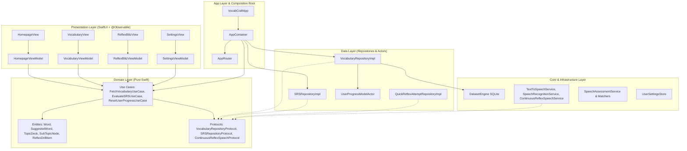

# Design Spec: Clean Architecture & Swift Concurrency Standardization

- **Date:** 2026-08-21
- **Status:** Draft / Under Review
- **Author:** Hooji Nguyen & Antigravity
- **Target Platform:** iOS 17+, macOS 14+ (SPM Host)

---

## 1. Executive Summary & Problem Statement

### 1.1 Background & Context
VocabCraftApp is an interactive English vocabulary and reflex-training application built in Swift with SwiftUI, SwiftData, and AVFoundation/SpeechKit. Recent rapid iterations expanded features such as Reflex Blitz, Quick Reflex Drills, and Topic Decks. While the codebase has strong test coverage (391 passing tests) and modular structure, an architectural audit identified several layer boundary leaks and concurrency inconsistencies:

1. **Domain Layer Leakage:** Domain protocols and use cases import/depend on SQLite DTOs (`ReflexDrillRecord` in `Core/Database`) and feature models (`TopicDeck`, `SubTopicNode` in `Features/Vocabulary/Models`), violating Clean Architecture's dependency rule.
2. **SwiftData Wiring & Concurrency Risk:** `AppContainer` omits passing `UserProgressModelActor` into `VocabularyRepositoryImpl`, resulting in permanent `nil` progress actors and 0% calculated deck mastery. Furthermore, `UserProgressModelActor` returns `@Model` class references across actor boundaries.
3. **Misplaced Core Audio Services:** Low-level `ContinuousReflexSpeechService` (using `AVFoundation` and `SFSpeechRecognizer`) and its protocol live inside `Features/ReflexDrill/Services/`.
4. **Triple Source of Truth for Navigation:** `HomepageView`, `HomepageViewModel`, and `AppRouter` all maintain independent `selectedTab` states, accompanied by process-argument parsing inside View initializers.
5. **Incomplete Settings Logic & Test Portability:** `resetSRSProgress()` modifies daily goal count rather than resetting database progress, and host `swift test` fails on macOS due to unguarded iOS `AVAudioSession` route change notifications.

### 1.2 Goals
- Enforce strict **Clean Architecture dependency rules** (Dependencies point inward: UI $\rightarrow$ Domain $\leftarrow$ Data/Core).
- Ensure **Domain Purity** (pure Swift, zero SwiftUI imports in Domain entities).
- Secure **SwiftData concurrency** with actor-safe `Sendable` boundary models and fix `AppContainer` wiring.
- Establish **`AppRouter` as the Single Source of Truth** for navigation and eliminate view `init` side effects.
- Ensure 100% cross-platform test pass rate on both macOS SPM host and iOS Simulator.

---

## 2. Architecture & Layer Boundaries



### Dependency Rules:
1. **Domain Layer:** Pure Swift (imports `Foundation` only). No `SwiftUI`, `SwiftData`, `AVFoundation`, or `SQLite` imports.
2. **Data Layer:** Implements Domain repository protocols. Maps database records and `@Model` entities into pure domain entities before returning them.
3. **Core Layer:** Low-level system implementations (Audio, SQLite, SpeechKit). Conforms to Domain protocols where applicable.
4. **Presentation Layer:** Views observe ViewModels; ViewModels interact strictly through Domain Use Cases or Protocols injected via `AppContainer`.
5. **App Layer:** Manages application bootstrap, dependency assembly in `AppContainer`, and URL / argument routing in `AppRouter`.

---

## 3. Detailed Component Specifications

### 3.1 Domain Layer Standardizations

#### 3.1.1 Entity Relocations & Purity
- Move `TopicDeck`, `SubTopicNode`, `TopicWord`, and `NodeState` from `Features/Vocabulary/Models/TopicDeckModels.swift` to `Domain/Entities/TopicDeckEntities.swift`.
- **Remove SwiftUI Import:** Change `TopicDeck.badgeColor: Color` to `TopicDeck.badgeColorHex: String`. In SwiftUI views, provide an extension or computed property `Color(hex: deck.badgeColorHex)` at the Presentation level.
- Define pure domain entity `ReflexDrillItem`:
  ```swift
  public struct ReflexDrillItem: Identifiable, Equatable, Sendable {
      public let id: Int64
      public let drillType: String
      public let promptText: String
      public let correctAnswer: String
      public let distractors: [String]
      public let targetTimeMs: Int
      public let sentenceTextEn: String?
      
      public init(
          id: Int64,
          drillType: String,
          promptText: String,
          correctAnswer: String,
          distractors: [String],
          targetTimeMs: Int,
          sentenceTextEn: String? = nil
      ) {
          self.id = id
          self.drillType = drillType
          self.promptText = promptText
          self.correctAnswer = correctAnswer
          self.distractors = distractors
          self.targetTimeMs = targetTimeMs
          self.sentenceTextEn = sentenceTextEn
      }
  }
  ```

#### 3.1.2 Protocol & Use Case Decoupling
- Update `VocabularyRepositoryProtocol` to return `[ReflexDrillItem]` instead of `[ReflexDrillRecord]`.
- Relocate `ContinuousReflexSpeechProtocol` from `Features/ReflexDrill/Services/` to `Domain/Protocols/ContinuousReflexSpeechProtocol.swift`.
- Add `ResetUserProgressUseCaseProtocol` and `ResetUserProgressUseCase` to `Domain/UseCases/ResetUserProgressUseCase.swift`:
  ```swift
  public protocol ResetUserProgressUseCaseProtocol: AnyObject {
      func executeResetAllProgress() async throws
  }
  
  public final class ResetUserProgressUseCase: ResetUserProgressUseCaseProtocol {
      private let srsRepository: SRSRepositoryProtocol
      
      public init(srsRepository: SRSRepositoryProtocol) {
          self.srsRepository = srsRepository
      }
      
      public func executeResetAllProgress() async throws {
          try await srsRepository.resetAllProgress()
      }
  }
  ```

---

### 3.2 Data Layer & SwiftData Concurrency

#### 3.2.1 `UserProgressModelActor` Thread-Safety
Eliminate all public methods returning SwiftData `@Model` classes across actor boundaries. Introduce `UserWordProgressData: Sendable`:

```swift
public struct UserWordProgressData: Sendable, Equatable {
    public let wordId: Int64
    public let cefrLevel: String
    public let masteryLevel: Int
    public let isBookmarked: Bool
    public let easeFactor: Double
    public let intervalDays: Int
    public let nextReviewDate: Date
    public let lastReviewDate: Date
    public let totalReviews: Int
}
```

Refactor `UserProgressModelActor` methods:
- `getProgress(wordId: Int64) throws -> UserWordProgressData?` (replaces returning `UserWordProgress`)
- `fetchAllProgressData() throws -> [UserWordProgressData]` (replaces returning `[UserWordProgress]`)
- Retain lightweight `fetchAllMasteryLevels() -> [Int64: Int]` and `fetchAllProgressSummaryMap() -> [Int64: UserProgressSummary]`.
- Add `resetAllProgress() throws` to delete all `UserWordProgress` and `ReflexSessionLog` entries.

#### 3.2.2 `AppContainer` Wiring Correction
In `AppContainer.init`:
```swift
// Initialize ModelActor when ModelContainer is provided
let progressActor: UserProgressModelActor? = modelContainer != nil
    ? UserProgressModelActor(modelContainer: modelContainer!)
    : nil

let vocabRepo: VocabularyRepositoryProtocol = shouldMock
    ? MockVocabularyRepository()
    : VocabularyRepositoryImpl(datasetEngine: datasetEngine, progressActor: progressActor)
```

#### 3.2.3 `SRSRepositoryProtocol` & `SRSRepositoryImpl` Extension
Add `resetAllProgress() async throws` to `SRSRepositoryProtocol` and implement in `SRSRepositoryImpl` to support the settings reset action.

---

### 3.3 Core & Audio Services Relocation

- Relocate `ContinuousReflexSpeechService.swift` to `VocabCraftApp/Core/Audio/ContinuousReflexSpeechService.swift`.
- Ensure `ContinuousReflexSpeechService` conforms to `Domain/Protocols/ContinuousReflexSpeechProtocol`.
- In `ReflexBlitzViewModel`, inject `ContinuousReflexSpeechProtocol` via `AppContainer`.

---

### 3.4 Presentation Layer & Navigation Unification

#### 3.4.1 Single Source of Truth for Tab Navigation
- **`AppRouter`** is the sole owner of `selectedTab: TabItem`.
- In `HomepageViewModel`: Remove `selectedTab` from `HomepageState`. Remove `updateSearchText` and `selectTab` redundant proxies.
- In `HomepageView`: Remove `@State private var selectedTab: TabItem`. Use `@Environment(\.appRouter) private var appRouter`.
- Tab bar binding in `HomepageView`:
  ```swift
  LiquidGlassTabBar(selectedTab: Bindable(appRouter).selectedTab)
  ```

#### 3.4.2 View Initializer Sanitization
- Remove `ProcessInfo.processInfo.arguments` inspection and mock view model creation from `HomepageView.init`.
- `VocabCraftApp.init` already inspects launch arguments and configures `AppRouter`. `HomepageView` simply renders the router's current state.

---

### 3.5 Test Suite Portability & Compatibility

#### 3.5.1 macOS SPM Host Build Fix
In `VocabCraftAppTests/Features/ReflexDrill/ContinuousReflexSpeechServiceTests.swift`:
Wrap test methods that post `AVAudioSession.routeChangeNotification` or use `AVAudioSessionRouteChangeReasonKey` inside `#if os(iOS) ... #endif`. This ensures `swift test` builds and passes on macOS development machines while full route-change test coverage executes on the iOS Simulator.

---

## 4. Verification & Testing Strategy

### 4.1 Automated Tests
1. **SPM Test Execution (macOS Host):**
   ```bash
   swift test
   ```
   *Expected:* Builds and executes all unit tests without `AVAudioSession` compile errors on macOS.
2. **Xcode iOS Simulator Test Execution:**
   ```bash
   xcodebuild test -project VocabCraftApp.xcodeproj -scheme VocabCraftApp -destination "platform=iOS Simulator,name=iPhone 17"
   ```
   *Expected:* All 391+ tests pass with zero failures.

### 4.2 Architectural Compliance Verification
- Verify that `VocabCraftApp/Domain/` contains zero occurrences of `import SwiftUI`, `import SwiftData`, or `import AVFoundation`.
- Verify that `AppContainer` properly initializes `UserProgressModelActor` with `modelContainer` and passes it to `VocabularyRepositoryImpl`.
- Verify that topic deck completion percentages and mastery counts calculate correctly from user progress.
- Verify that `SettingsViewModel.resetSRSProgress()` deletes database progress through `ResetUserProgressUseCase`.
- Verify that switching tabs via UI or deep link synchronizes through `AppRouter` without state drift.
