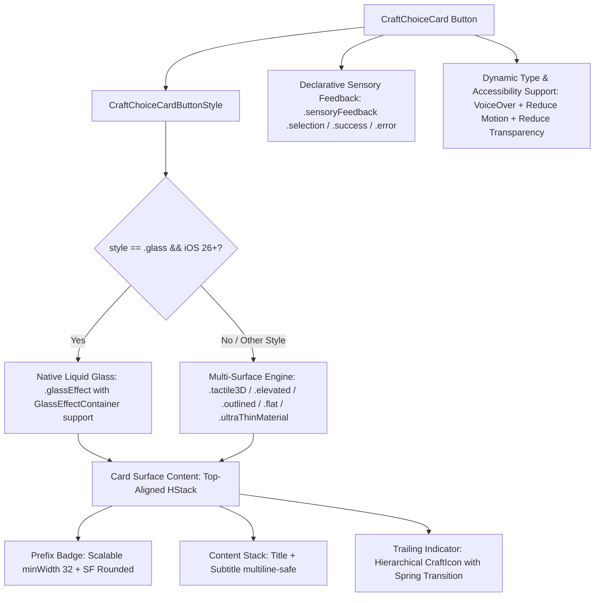

# Design Specification: CraftChoiceCard UI/UX Modernization & Liquid Glass Upgrade

**Date:** 2026-08-26  
**Target:** `CraftUIKit` -> `CraftChoiceCard` (`CraftUIKit/Sources/CraftUIKit/Components/Controls/CraftChoiceCard.swift`)  
**Status:** Design Specification (Awaiting User Review)  

---

## 1. Overview & Objectives

`CraftChoiceCard` is the core interactive quiz and multiple-choice component in `CraftUIKit`. While it features strong tactile 3D button physics and playful shake/bounce animations, our senior UI/UX audit identified key opportunities for refinement in **Dynamic Type scalability**, **Dark Mode contrast**, **Multiline vertical balance**, **Declarative haptics**, and **Apple Liquid Glass (iOS 26+) adoption**.

### Key Objectives:
1. **Dynamic Type & Scalable Prefix Badges**: Replace rigid 32×32pt frames with flexible min-size boundaries (`minWidth: 32`, `minHeight: 32`) and `@ScaledMetric` integration, ensuring prefix badges ("A", "B", "10.") never clip under large accessibility font sizes.
2. **Refined Multiline Alignment**: Implement top-aligned optical baseline balance (`HStack(alignment: .top)`) so that prefix badges and trailing status indicators remain anchored to the first line of text when titles/subtitles span multiple lines.
3. **Enhanced Dark Mode Contrast**: Double the `.selected` state background tint from `0.08` to `0.16` on Dark Mode surfaces (`.craftDynamic(light: 0.08, dark: 0.16)`) and eliminate hardcoded `Color.white` in favor of adaptive semantic tokens (`textInverse`, `borderDefault`).
4. **Declarative iOS 17+ Haptics & SF Symbol Motion**: Replace deprecated imperative `UIFeedbackGenerator` instances with declarative `.sensoryFeedback` modifiers, and upgrade status indicators with smooth `.scale.combined(with: .opacity)` transitions and SF Symbol hierarchical rendering.
5. **Dual-Path Liquid Glass (iOS 26+ Support & Graceful Fallback)**: Support native `.glassEffect(.regular.interactive(), in: RoundedRectangle)` on iOS 26+ with `GlassEffectContainer` compatibility, while preserving frosted `.ultraThinMaterial` and `accessibilityReduceTransparency` opaque fallbacks for iOS 17/18.
6. **100% Backward API Compatibility**: Maintain full parity with existing initializers (`String` and `LocalizedStringKey` variants) and theme integrations.

---

## 2. Component Architecture & Dual-Path Rendering



---

## 3. Detailed Technical Specifications

### 3.1 Prefix Badge (`prefixBadge`)
- **Typography**: `theme.typography.headline.bold()` with `.fontDesign(.rounded)` for an engaging, approachable quiz aesthetic.
- **Dynamic Sizing**:
  - `minWidth: 32`, `minHeight: 32` with `.padding(.horizontal, theme.spacing.xs)`.
  - Outer bevel container: `minWidth: 32`, `minHeight: 34`.
  - Removes fixed width/height constraints to allow text scaling under Dynamic Type / Accessibility Large Text.
- **Adaptive Strokes & Inks**:
  - Replace hardcoded `Color.white.opacity(0.3)` with `theme.colors.textInverse.opacity(0.35)`.
  - Preserve 3D bottom bevel rim offset `offset(y: 2)` in non-disabled states.

### 3.2 Content Layout & Multiline Alignment
- **Top Alignment**: Change `HStack(spacing: theme.spacing.md)` to `HStack(alignment: .top, spacing: theme.spacing.md)` when subtitle is present or title is multiline, adding optical vertical offset to the prefix badge (`.padding(.top, 1)`) so it aligns with the typographic cap-height of the title.
- **Title & Subtitle**:
  - Title: `theme.typography.headline`, `lineLimit(3)` with `.multilineTextAlignment(.leading)`.
  - Subtitle: `theme.typography.bodyMedium`, `foregroundStyle(subtitleColor)`, `.multilineTextAlignment(.leading)`.
  - Spacing between Title and Subtitle: `theme.spacing.xxs` (4pt) for tight grouping.

### 3.3 Trailing Status Indicator (`trailingIndicator`)
- **Component**: Utilize `CraftIcon` with hierarchical rendering:
  - Correct: `CraftIcon(.checkmarkCircle, size: .md, color: theme.colors.statusSuccess, renderingMode: .hierarchical)`
  - Wrong: `CraftIcon(.wrongCircle, size: .md, color: theme.colors.statusDanger, renderingMode: .hierarchical)`
- **Entrance Animation**: Wrapped in `.transition(.scale.combined(with: .opacity))` with `.animation(theme.animations.springBouncy, value: state)`.

### 3.4 State Tint & Dark Mode Contrast (`stateTintOverlay`)
- **Selected State**:
  ```swift
  case .selected:
      return theme.colors.brandPrimary.opacity(.craftDynamic(light: 0.08, dark: 0.16))
  ```
- **Correct State**:
  ```swift
  case .correct:
      return theme.colors.statusSuccess.opacity(.craftDynamic(light: 0.10, dark: 0.18))
  ```
- **Wrong State**:
  ```swift
  case .wrong:
      return theme.colors.statusDanger.opacity(.craftDynamic(light: 0.10, dark: 0.18))
  ```

### 3.5 Dual-Engine Background & Liquid Glass Support
- **iOS 26+ Liquid Glass (`style == .glass`)**:
  - Uses `.glassEffect(.regular.interactive(), in: RoundedRectangle(cornerRadius: theme.radii.lg))`
  - Respects `@Environment(\.accessibilityReduceTransparency)` by falling back to solid `theme.colors.surfaceCard`.
- **Pre-iOS 26 / Legacy Fallback (`style == .glass`)**:
  - Uses `RoundedRectangle(cornerRadius: theme.radii.lg).fill(.ultraThinMaterial)` + tint layer.
- **Tactile 3D (`style == .tactile3D`)**:
  - Maintained with `CraftChoiceCardButtonStyle` 3D bottom extrusion (`bottomLipColor`, `offset(y: depth)`, and physical spring press depression).

### 3.6 Declarative Feedback & Accessibility
- **Declarative Haptics (iOS 17+)**:
  ```swift
  .sensoryFeedback(.selection, trigger: state == .selected)
  .sensoryFeedback(.success, trigger: state == .correct)
  .sensoryFeedback(.error, trigger: state == .wrong)
  ```
- **VoiceOver Optimization**:
  - Combine elements with `.accessibilityElement(children: .combine)`
  - Add explicit `.accessibilityValue` with localized state strings (`CraftLocalized.string("craft.choice.selected")`, etc.).
  - Add `.accessibilityAddTraits(state == .selected ? [.isButton, .isSelected] : [.isButton])`.
- **Reduce Motion**:
  - Disable `scaleEffect` pop and `ChoiceShakeEffect` when `@Environment(\.accessibilityReduceMotion)` is active.

---

## 4. Public API Interface Parity

The public API remains 100% backward-compatible:

```swift
public struct CraftChoiceCard: View {
    public init(
        prefix: String? = "A",
        title: String,
        subtitle: String? = nil,
        state: CraftChoiceState = .idle,
        style: CraftSurfaceStyle = .tactile3D,
        action: @escaping () -> Void
    )

    public init(
        prefix: LocalizedStringKey? = nil,
        title: LocalizedStringKey,
        subtitle: LocalizedStringKey? = nil,
        state: CraftChoiceState = .idle,
        style: CraftSurfaceStyle = .tactile3D,
        action: @escaping () -> Void
    )
}
```

---

## 5. Verification & Testing Strategy

1. **Unit & Snapshot Tests**:
   - Validate `InteractiveCardTests.swift` and `ControlComponentTests.swift` pass with updated state assertions.
   - Add dedicated test cases verifying Dynamic Type scaling and accessibility traits.
2. **Catalog Showcase Verification**:
   - Verify `CraftCatalogView.swift` rendering all 5 styles (`.tactile3D`, `.glass`, `.elevated`, `.outlined`, `.flat`) across Light and Dark appearances.
   - Interactive quiz simulation test in catalog: click A -> selected haptic -> submit -> correct bounce / wrong shake.
3. **Accessibility Audit**:
   - Verify VoiceOver reading sequence, trait toggling, and High Contrast / Reduce Transparency appearances.
