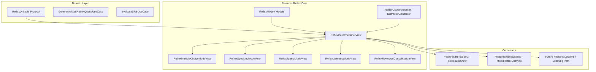

# Reflex Architecture & Folder Structure Refactoring Design Specification

## 1. Overview & Context

The Reflex system in `VocabCraftApp` provides fast-paced, multi-sensory retrieval practice across 4 distinct modalities:
1. **Multiple Choice** (Visual stimulus + 4 options with 3D Flip Card feedback)
2. **Speaking** (Continuous Speech Recognition + Waveform visualizer)
3. **Typing** (Auto-focused Cloze input field)
4. **Listening** (Audio stimulus + 4 definition options)

### 1.1 Current Architecture Debt & Problems
- **Monolithic & Massive Files**: `ReflexBlitzCardView.swift` (632 lines) mixes all 4 modalities, timer handling, cloze sentence rendering, and reviewed states in a single file.
- **Code Duplication**: `MixedDrillSectionViews.swift` (626 lines) in `Features/Vocabulary` replicates almost identical UI for the 4 modes for the Mixed Reflex session.
- **Model Fragmentation**: Separate data models (`ReflexBlitzWordItem`, `VaultWordItem`, `ReflexDrillItem`, `MixedReflexDrillItem`) hinder cross-feature reusability.
- **Scattered Structure**: Reflex code is split between `Features/ReflexDrill` and `Features/Vocabulary`.

### 1.2 Core Objectives
- **Protocol-Based Stimulus Abstraction**: Introduce `ReflexDrillable` in Domain, allowing any entity (Vault words, Lesson words, Decks) to be plugged into any Reflex mode.
- **Preserve Verified Mode (Multiple Choice)**: Preserve 100% of the UI/UX, 3D flip card dynamics, option elimination hints, and animations of `ReflexMultipleChoiceModeView` that was tested and verified on real devices.
- **Isolate In-Progress Modes (Speaking, Typing, Listening)**: Extract them into standalone, clean files (`ReflexSpeakingModeView`, `ReflexTypingModeView`, `ReflexListeningModeView`) to enable isolated debugging and future mode-specific refinements.
- **Unified Clean Folder Structure**: Centralize all reflex components, blitz sessions, and mixed drills under `VocabCraftApp/Features/Reflex/`.

---

## 2. Architecture & Domain Layer



### 2.1 `ReflexDrillable` Protocol (`VocabCraftApp/Domain/Protocols/ReflexDrillable.swift`)

```swift
public protocol ReflexDrillable: Sendable {
    var id: String { get }
    var lemma: String { get }
    var pos: String { get }
    var ipa: String { get }
    var definitionVi: String { get }
    var exampleSentenceEn: String { get }
    var exampleSentenceVi: String { get }
    var clozeSentenceEn: String { get }
    var cefrLevel: String { get }
    var audioResourceUrl: String? { get }
}

public extension ReflexDrillable {
    var cleanPos: String {
        let trimmed = pos.trimmingCharacters(in: .whitespacesAndNewlines).replacingOccurrences(of: ".", with: "").lowercased()
        switch trimmed {
        case "v", "verb": return "verb"
        case "n", "noun": return "noun"
        case "adj", "adjective": return "adj"
        case "adv", "adverb": return "adv"
        case "prep", "preposition": return "prep"
        case "conj", "conjunction": return "conj"
        case "pron", "pronoun": return "pron"
        default: return trimmed.isEmpty ? "word" : trimmed
        }
    }

    var cleanLevel: String {
        cefrLevel.isEmpty ? "B2" : cefrLevel
    }

    var cleanInitialLetterHint: String {
        let firstLetter = lemma.prefix(1).lowercased()
        return "\(firstLetter)... • \(cleanPos)"
    }
}
```

Conformances will be provided for:
- `ReflexBlitzWordItem`
- `VaultWordItem`
- `WordItem` / `Word`
- `TopicWordDTO`

### 2.2 Core Models (`VocabCraftApp/Features/Reflex/Core/Models/`)
1. **`ReflexMode.swift`**:
   - Cases: `speaking`, `typing`, `multipleChoice`, `listening`.
   - Properties: `timeLimitSeconds`, `title`, `iconName`, `instructionPrompt`.
2. **`ReflexCardPhase.swift`**:
   - Cases: `activeCountdown`, `reviewed(result: ReflexCardResult)`.
3. **`ReflexCardResult.swift`**:
   - Fields: `isCorrect`, `responseTimeMs`, `isTimeout`, `selectedOption`, `typedText`, `recognizedSpoken`.
4. **`ReflexAttempt.swift` & `ReflexSessionSummary.swift`**:
   - Session scoring, speed tiers (`flash`, `hinted`, `needsPractice`), combo calculation, weak word aggregations.

### 2.3 Pure Utilities (`VocabCraftApp/Features/Reflex/Core/Utilities/`)
1. **`ReflexClozeFormatter.swift`**:
   - Regex-based cloze slot formatting (`formatCloze`, `extractTemplateParts`, `completedSentenceWithTargetWord`).
2. **`ReflexDistractorGenerator.swift`**:
   - Generates 3 unique distractor options based on candidate words and default starter pool.

---

## 3. UI Component Hierarchy (`Features/Reflex/Core/Components/`)

### 3.1 `ReflexMultipleChoiceModeView.swift` *(Preserved 100% Intact)*
- **3D Flip Stimulus Card**: Front face (definition + cloze sentence), Back face (lemma, IPA, audio speaker replay button, POS/CEFR badges, definition, full example with highlighted slot).
- **Options List**: 4 vertical `CraftChoiceCard` items on canvas background with tactile 3D styling and `eliminatedOptionId` hint support.
- **Smooth Flipping**: `CraftFlipCard` driven by `isFlipped: isReviewed` with `statusGlow` tinting.

### 3.2 `ReflexSpeakingModeView.swift`
- Clean extraction from current card: Word stimulus, cloze sentence, `CraftWaveformView` live sound indicator, speech recognized badge (`liveTranscript`), and button to switch to keyboard input.

### 3.3 `ReflexTypingModeView.swift`
- Clean extraction: Word stimulus, cloze sentence, auto-focused `CraftTextField`, 3D submit button, enter-key trigger.

### 3.4 `ReflexListeningModeView.swift`
- Clean extraction: Audio pulse waveform `CraftWaveformView`, `CraftSpeakerButton` replay button, hidden lemma during active countdown, 4 definition choices via `CraftChoiceCard`.

### 3.5 `ReflexReviewedConsolidationView.swift`
- Unified post-answer review view for non-flip modes (`Speaking`, `Typing`, `Listening`):
  - Serif lemma header + IPA + POS/CEFR badge.
  - Audio replay button (`CraftSpeakerButton`).
  - Completed sentence with colored keyword slot (`statusSuccess` or `statusDanger`).
  - Modality-specific result badge (e.g. `Spoken: "..."`, `Typed: "..."`, `Selected: "..."`).

### 3.6 `ReflexCardContainerView.swift` & `ReflexHeaderBarView.swift`
- Outer card container with Bento styling, shadow tokens, Dynamic Pulse Timer, and shake offset animation.
- Header bar with Segmented progress capsules, combo streak counter, exit confirmation, and skip button.

---

## 4. Feature Modularization & Folder Structure

```text
VocabCraftApp/
├── Domain/
│   └── Protocols/
│       └── ReflexDrillable.swift              # [NEW] Common drillable protocol
│
└── Features/
    └── Reflex/                                # [NEW REFACTORED ROOT]
        ├── Core/
        │   ├── Models/
        │   │   ├── ReflexMode.swift
        │   │   ├── ReflexCardPhase.swift
        │   │   ├── ReflexCardResult.swift
        │   │   ├── ReflexBlitzOption.swift
        │   │   ├── ReflexBlitzWordItem.swift
        │   │   └── ReflexSessionSummary.swift
        │   ├── Utilities/
        │   │   ├── ReflexClozeFormatter.swift
        │   │   └── ReflexDistractorGenerator.swift
        │   └── Components/
        │       ├── Container/
        │       │   ├── ReflexCardContainerView.swift
        │       │   └── ReflexHeaderBarView.swift
        │       ├── Modes/
        │       │   ├── ReflexMultipleChoiceModeView.swift
        │       │   ├── ReflexSpeakingModeView.swift
        │       │   ├── ReflexTypingModeView.swift
        │       │   └── ReflexListeningModeView.swift
        │       └── Consolidation/
        │           └── ReflexReviewedConsolidationView.swift
        │
        ├── Blitz/
        │   ├── ViewModels/
        │   │   └── ReflexBlitzViewModel.swift
        │   └── Views/
        │       ├── ReflexBlitzView.swift
        │       ├── ReflexBlitzModeSelectionView.swift
        │       ├── ReflexBlitzSummaryView.swift
        │       └── ReflexCountdownOverlayView.swift
        │
        └── Mixed/
            ├── ViewModels/
            │   └── MixedReflexDrillViewModel.swift
            └── Views/
                ├── MixedReflexDrillView.swift
                └── MixedReflexSummaryView.swift
```

### 4.1 Deleted Legacy / Redundant Files
- `VocabCraftApp/Features/ReflexDrill/Views/ReflexBlitzCardView.swift` (monolithic 632 lines)
- `VocabCraftApp/Features/Vocabulary/Views/Components/MixedDrillSectionViews.swift` (duplicated 626 lines)
- `VocabCraftApp/Features/ReflexDrill/Views/ReflexBlitzMultipleChoiceCardView.swift` (migrated to `ReflexMultipleChoiceModeView.swift`)
- `VocabCraftApp/Features/ReflexDrill/ReflexDrillView.swift` (outdated legacy implementation)

---

## 5. Verification & Testing Plan

### 5.1 Automated Tests
1. Run all unit tests for Reflex Domain, Models, and ViewModels:
   ```bash
   swift test --filter Reflex
   ```
2. Run test suites for Mixed Drill:
   ```bash
   swift test --filter MixedReflex
   ```
3. Run CraftUIKit localization and visual test suites:
   ```bash
   swift test --filter LocalizationTests
   ```
4. Full App Build verification:
   Ensure **0 compiler errors and 0 warnings**.

### 5.2 Manual / UI Verification
- Verify `ReflexBlitzView` in all 4 modes (Speaking, Typing, Multiple Choice, Listening).
- Check `MixedReflexDrillView` from Vocabulary Vault, verifying random mode transitions, timer bars, audio playback, and Loop-Back on wrong answers.
- Verify 3D flip card behavior in Multiple Choice mode.
