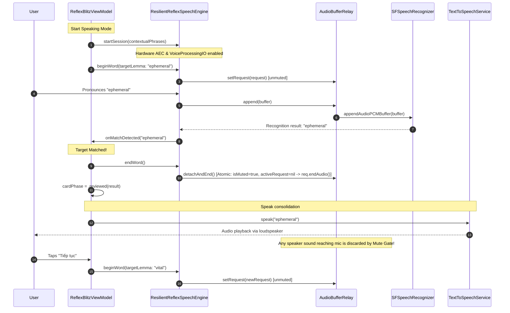

# Design Specification: Reflex Blitz Speaking Mode Architecture & Reliability

* **Date**: 2026-08-31
* **Topic**: Reflex Blitz Speaking Mode Performance, Thermal Stability & Acoustic Reliability
* **Status**: Proposed
* **Target Audience**: iOS Engineers, Audio/Speech Specialists, VocabCraft Team

---

## 1. Problem Diagnosis & Motivation

Trong quá trình người dùng sử dụng tính năng **Speaking Mode** trong **Reflex Drill** trên thiết bị thật (iOS), đã ghi nhận 5 vấn đề nghiêm trọng:

1. **Acoustic Feedback Loop (Lặp từ vô tận)**:
   - Khi phát âm chính xác từ mục tiêu, thẻ lật sang mặt sau (`.reviewed`) và Text-to-Speech (TTS) phát âm từ qua loa ngoài.
   - Microphone thu nhận lại chính tiếng loa vừa phát ra và gửi vào `SFSpeechRecognizer`.
   - Engine nhận diện lại đúng từ đó, kích hoạt lại `handleSpokenMatch`, tiếp tục phát âm lặp đi lặp lại nhiều lần.
2. **Fatal App Crash (`SIGABRT`)**:
   - `ResilientReflexSpeechEngine` thực thi `activeRequest?.endAudio()` khi kết thúc từ (`endWord()`).
   - Luồng CoreAudio realtime tap (chạy ở thread độc lập với priority cao) tiếp tục gọi `appendAudioPCMBuffer:` lên request đã kết thúc.
   - Speech framework của Apple ném ngoại lệ tầng Objective-C runtime `*** -[SFSpeechAudioBufferRecognitionRequest appendAudioPCMBuffer:]: audio has already ended`, dẫn đến app bị force quit ngay lập tức.
3. **Thermal Spike & UI Stutter (Nóng máy và giật lag)**:
   - `ReflexBlitzViewModel` khởi tạo và duy trì cùng lúc hai engine: `ContinuousReflexSpeechService` và `ResilientReflexSpeechEngine`.
   - Audio tap cài đặt buffer size nhỏ (`1024` frames), tạo ra xấp xỉ 48 lần ngắt lock/giây tại tần số 48kHz.
   - `SFSpeechRecognizer` trả về partial transcription liên tục, cập nhật `@Observable var liveTranscript` trên MainActor, làm re-render toàn bộ thẻ 3D `CraftFlipCard` (tính toán matrix 3D + specular glare shaders) ở tần số cao.
4. **Không loại bỏ tạp âm môi trường (Noise Interference)**:
   - `AVAudioEngine.inputNode` chưa bật VoiceProcessingIO (`isVoiceProcessingEnabled = true`), bỏ qua bộ lọc phần cứng Acoustic Echo Cancellation (AEC) và Noise Suppression của iOS.
   - `taskHint = .dictation` khiến speech recognizer phiên âm cả tiếng thở, tiếng thì thầm, và tiếng ồn xung quanh thành từ ngữ.
5. **Nhận diện sai hoặc không nhận diện được (Recognition Misses / False Positives)**:
   - `ReflexSpeechMatcher` sử dụng ngưỡng Levenshtein cố định `0.70` cho mọi từ. Với các từ ngắn 3 ký tự (e.g. "cat", "run"), tiếng thở hoặc tạp âm 2 ký tự ("at", "un") dễ bị nhận diện thành đúng (false positive).
   - `contextualStrings` truyền toàn bộ câu ví dụ dài làm loãng xác suất ngôn ngữ (language model bias).

Tài liệu này xác lập thiết kế kiến trúc chuẩn hóa để giải quyết triệt để cả 5 vấn đề trên theo các tiêu chuẩn kỹ thuật nghiêm ngặt của dự án `VocabCraftApp`.

---

## 2. Architectural Design

```
+-------------------------------------------------------------------------------+
|                            ReflexBlitzViewModel                               |
|  - Manages Session State (.countdown -> .drilling -> .reviewed -> .summary)   |
|  - Holds Single Engine: ResilientReflexSpeechEngine                           |
+-----------------------+-------------------------------+-----------------------+
                        |                               |
                        | (1) beginWord / endWord       | (4) speak(lemma)
                        v                               v
+-----------------------------------------------+   +---------------------------+
|          ResilientReflexSpeechEngine          |   |    TextToSpeechService    |
|  - VoiceProcessingIO enabled (Hardware AEC)   |   |  - AVSpeechSynthesizer    |
|  - Throttle dispatching (<= 6 updates/s)      |   |  - Audio session safe     |
+-----------------------+-----------------------+   +---------------------------+
                        |
                        v (Buffers)
+-----------------------------------------------+
|               AudioBufferRelay                |
|  - Atomic Mute Gate (discard when muted)      |
|  - Atomic detachAndEnd() (prevents SIGABRT)   |
+-----------------------+-----------------------+
                        |
                        v (PCM Buffers)
+-----------------------------------------------+
|     SFSpeechAudioBufferRecognitionRequest     |
|  - taskHint: .search                          |
|  - Biased lemma + inflections only            |
+-----------------------------------------------+
```

### 2.1 Audio Session & Hardware VoiceProcessingIO
* **VoiceProcessingIO (AEC & Noise Suppression)**:
  - Khi khởi tạo `AVAudioEngine`, kích hoạt bộ xử lý giọng nói phần cứng của Apple trên input node:
    ```swift
    try engine.inputNode.setVoiceProcessingEnabled(true)
    ```
  - Cung cấp:
    1. **Acoustic Echo Cancellation (AEC)**: Tự động lọc bỏ hoàn toàn âm thanh phát ra từ loa của chính thiết bị trước khi đưa vào buffer phân tích.
    2. **Automatic Gain Control (AGC)**: Cân bằng biên độ âm thanh cho cả phát âm nhỏ hoặc lớn.
    3. **Background Noise Suppression**: Triệt tiêu tiếng ồn môi trường ổn định (quạt gió, điều hòa, tiếng vang trong phòng).
* **AVAudioSession Configuration**:
  ```swift
  try audioSession.setCategory(
      .playAndRecord,
      mode: .voiceChat,
      options: [.defaultToSpeaker, .allowBluetoothHFP, .allowBluetoothA2DP, .duckOthers]
  )
  ```
  Chế độ `.voiceChat` kích hoạt DSP Voice Processing tối ưu của Apple trên đường truyền vào/ra của thiết bị.

### 2.2 Thread-Safe Atomic AudioBufferRelay (Ngăn chặn Crash `SIGABRT`)
Để ngăn chặn hoàn toàn việc gọi `appendAudioPCMBuffer:` sau khi `endAudio()` đã được gọi, `AudioBufferRelay` phải quản lý trạng thái khóa (lock) và cờ ngắt âm (mute gate) một cách nguyên tử:

```swift
public final class AudioBufferRelay: @unchecked Sendable {
    private let lock = NSLock()
    private weak var activeRequest: SFSpeechAudioBufferRecognitionRequest?
    private var isMuted: Bool = false

    public init() {}

    public func setRequest(_ request: SFSpeechAudioBufferRecognitionRequest?) {
        lock.lock()
        defer { lock.unlock() }
        activeRequest = request
        isMuted = false
    }

    public func mute() {
        lock.lock()
        defer { lock.unlock() }
        isMuted = true
    }

    public func unmute() {
        lock.lock()
        defer { lock.unlock() }
        isMuted = false
    }

    /// Tách rời request và kết thúc nhận diện atomically.
    /// Đảm bảo không có buffer nào được append sau khi endAudio() được gọi.
    public func detachAndEnd() {
        lock.lock()
        let requestToEnd = activeRequest
        activeRequest = nil
        isMuted = true
        lock.unlock()

        requestToEnd?.endAudio()
    }

    public func append(_ buffer: AVAudioPCMBuffer) {
        lock.lock()
        guard !isMuted, let request = activeRequest else {
            lock.unlock()
            return
        }
        lock.unlock()

        request.append(buffer)
    }
}
```

**Bảo đảm toán học & concurrency**:
1. Trong `detachAndEnd()`, `activeRequest` được gán thành `nil` và `isMuted` được gán thành `true` ngay trong phạm vi khóa `lock`.
2. Khi audio tap thread gọi `append(_ buffer:)`, nó phải acquire `lock`. Nếu `isMuted == true` hoặc `activeRequest == nil`, buffer sẽ bị discard ngay lập tức mà không bao giờ gọi `request.append(buffer)`.
3. Nhờ đó, race condition dẫn đến ngoại lệ `appendAudioPCMBuffer: after endAudio` được triệt tiêu 100%.

### 2.3 Thống nhất Kiến trúc ViewModel (Loại bỏ Duplicate Service)
* Xóa bỏ hoàn toàn thuộc tính và các phương thức binding của `continuousSpeechService: ContinuousReflexSpeechProtocol` trong `ReflexBlitzViewModel`.
* `ReflexBlitzViewModel` chỉ giữ lại duy nhất một engine âm thanh: `speechEngine: ReflexSpeechEngineProtocol` (mặc định là `ResilientReflexSpeechEngine`).
* Trình tự xử lý trong `handleSpokenMatch`:
  ```swift
  public func handleSpokenMatch(_ matchedLemma: String) {
      guard phase == .drilling, cardPhase == .activeCountdown, !currentAttemptIsCorrect, let word = currentWord else { return }
      cancelActiveTimers()
      currentAttemptIsCorrect = true

      // 1. Ngắt mic & đóng buffer recognition request NGAY LẬP TỨC
      speechEngine.endWord()

      // 2. Chuyển trạng thái thẻ sang Reviewed
      withAnimation(.spring(response: 0.38, dampingFraction: 0.82)) {
          self.cardPhase = .reviewed(result: ReflexCardResult(
              isCorrect: true, responseTimeMs: responseMs, isTimeout: false,
              selectedOption: nil, typedText: nil, recognizedSpoken: matchedLemma
          ))
      }

      // 3. Phát âm từ vựng (sau khi relay đã ngắt hoàn toàn)
      Task { @MainActor [weak self] in
          try? await Task.sleep(for: .milliseconds(250))
          guard let self, self.cardPhase != .activeCountdown else { return }
          self.ttsService.speak(text: word.lemma, rate: 1.0, locale: "en-US")
      }
  }
  ```

### 2.4 Tiered Phonetic Matching & Precision Model Bias
* **Cải tiến `ReflexSpeechMatcher`**:
  Thay thế ngưỡng cố định bằng thuật toán phân tầng theo độ dài từ (Tiered Length Thresholds):
  1. **Từ ngắn (1–4 ký tự)** (ví dụ *"cat"*, *"run"*, *"fast"*):
     - Bắt buộc exact match (`token == normalizedTarget`) hoặc prefix matching rõ ràng khi `target.count >= 4`.
     - Tuyệt đối không áp dụng fuzzy Levenshtein distance lỏng lẻo cho từ ngắn để ngăn chặn false positive từ tạp âm.
  2. **Từ trung bình (5–7 ký tự)** (ví dụ *"vital"*, *"simple"*, *"review"*):
     - Ngưỡng tương đồng tối thiểu `0.80` (chỉ cho phép sai lệch tối đa 1 ký tự).
  3. **Từ dài (≥ 8 ký tự)** (ví dụ *"ephemeral"*, *"hesitation"*, *"infrastructure"*):
     - Ngưỡng tương đồng `0.72` để hỗ trợ người dùng có accent hoặc nuốt âm đuôi nhẹ.
* **Tối ưu Language Model Bias (`contextualStrings`)**:
  - Loại bỏ việc nạp câu ví dụ dài vào `contextualStrings`.
  - Chỉ nạp target lemma và các dạng biến thể hình thái học (morphological inflections: `-s`, `-ed`, `-ing`, irregular forms).
* **Task Hint**: Chuyển từ `.dictation` sang `.search`. Chế độ `.search` được Apple tối ưu cho việc tìm kiếm từ khóa độc lập hoặc cụm từ ngắn thay vì cố ghép nối hội thoại dài.

### 2.5 Tối ưu hóa Hiệu năng & Tản nhiệt (Thermal & Frame Rate)
* **Buffer Size**: Tăng `bufferSize` từ `1024` lên `2048` frames trong `inputNode.installTap(onBus: 0, bufferSize: 2048, ...)`. Giảm tần suất ngắt CoreAudio xuống ~24 lần/giây.
* **Throttling UI Updates**: Giới hạn cập nhật `liveTranscript` lên `@MainActor` ở mức tối đa 6 lần/giây (interval `0.16s`), ngoại trừ trường hợp match thành công sẽ được dispatch tức thì.
* **View Hierarchy Isolation**: Đảm bảo cập nhật `liveTranscript` chỉ re-render huy hiệu hiển thị âm thanh (`CraftBadge`) mà không kích hoạt re-render lại thẻ 3D `CraftFlipCard`.

---

## 3. Data Flow & Lifecycle Sequence



---

## 4. Quality & Verification Gates

### 4.1 Automated Test Suite
1. **`AudioBufferRelayTests`**:
   - `testDetachAndEnd_setsRequestNilAndMutesImmediately()`: Xác minh `detachAndEnd` ngắt lập tức request và mute relay.
   - `testAppendBuffer_whenMuted_doesNotForwardToRequest()`: Xác minh buffer không bao giờ được chuyển tiếp khi đang mute.
   - `testConcurrentAppendAndDetach_noCrash()`: Mô phỏng gọi đồng thời 1000 lần `append` từ background thread và `detachAndEnd` từ main thread mà không phát sinh exception hay crash.
2. **`ReflexSpeechMatcherTests`**:
   - `testShortWords_rejectsAmbientNoiseTokens()`: Kiểm tra các từ 3 ký tự (e.g. "cat") không match với "at", "bat", "car".
   - `testLongWords_acceptsAccentTolerantVariants()`: Kiểm tra "ephemeral" match với độ lệch ngữ âm nhẹ.
   - `testInflectionVariations_matchesStems()`: Kiểm tra "hesitate" match với "hesitated".
3. **`ReflexBlitzViewModelSpeakingTests`**:
   - Xác minh toàn bộ 13 test hiện tại pass 100%.
   - Thêm test xác nhận khi `handleSpokenMatch` kích hoạt, `speechEngine.endWord()` được gọi đồng bộ trước khi `ttsService.speak` được gọi.

### 4.2 Quality Gate Standards (Theo AGENTS.md)
* **Zero Hardcoded Strings**: Toàn bộ chuỗi hiển thị mới (nếu có) phải khai báo đầy đủ trong `Localizable.xcstrings` với 100% cặp EN/VI.
* **Design Token Conformance**: Tuân thủ 100% `CraftUIKit` tokens (`CraftColor`, `CraftFont`, `CraftSpacingTokens`).
* **Zero Warnings, Zero Errors**: Biên dịch `0 errors, 0 warnings` trên Xcode.
* **Device Hardware Verification**: Kiểm tra trực tiếp trên thiết bị iOS thật, kiểm tra âm lượng loa ngoài 100% không gây lặp lại âm thanh và không giật lag.
