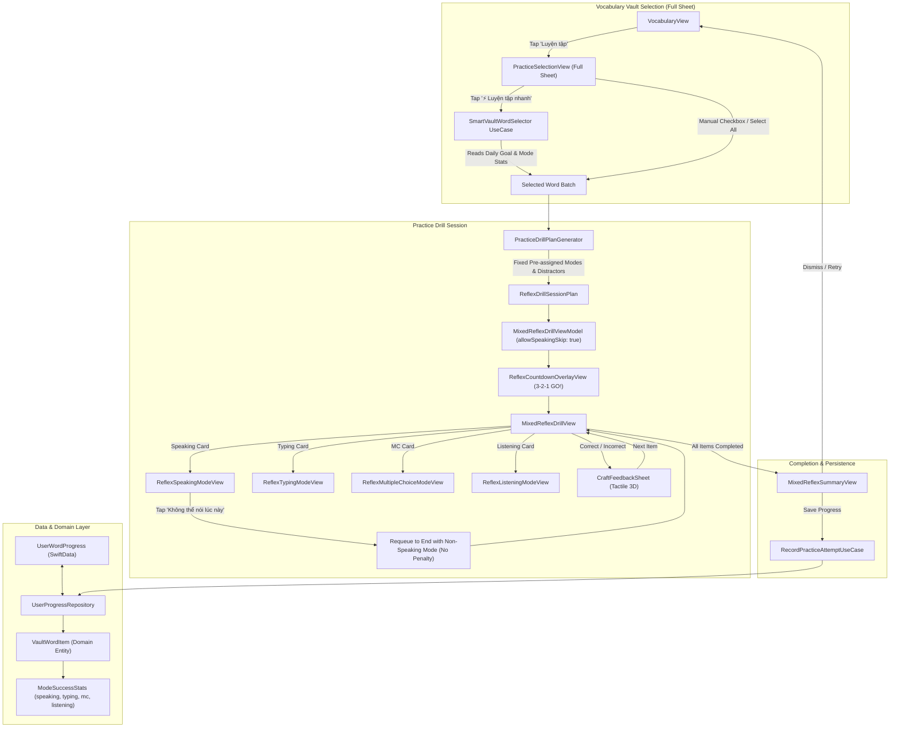

# Design Specification: Vocabulary Vault Mixed Reflex Practice Enhancement

- **Date**: 2026-08-31
- **Status**: Approved by User
- **Authors**: Antigravity & User

---

## 1. Executive Summary & Goals

The **Vocabulary Vault (Kho từ) Practice** feature enables learners to actively drill vocabulary words across different categories (*Chưa thuộc / Not Mastered*, *Đã thuộc / Mastered*, *Đã lưu / Bookmarked*). This enhancement upgrades the Practice flow into an intelligent, multi-sensory **Mixed Reflex Drill** experience:

1. **Full Sheet Selection**: Tapping "Luyện tập" opens a dedicated `PracticeSelectionView` presented as a full sheet with 3 category tabs, manual selection checkboxes, a "Select All" toggle, and a prominent "⚡️ Luyện tập nhanh (Smart Pick)" button.
2. **Smart Word Selection Algorithm**: Automatically picks an optimal batch of words (sized by `UserSettingsStore.dailyGoalCount`) by prioritizing words with low mode coverage (unmastered sensory modes), low streaks, and longer intervals since last practice.
3. **Pre-Computed Fixed Mode Assignment**: Upfront, every selected word is assigned a specific modality (`.speaking`, `.typing`, `.multipleChoice`, or `.listening`) targeting that word's weakest modality while balancing all 4 modes across the entire session. All modes, distractor options, cloze hint stages, and hint badges are pre-generated into an immutable `ReflexDrillSessionPlan`.
4. **Synchronized Sensory Countdown (3-2-1 Go!)**: Full-screen Apple Fitness+ style countdown overlay before the first question.
5. **100% UI/UX Reuse of Reflex Blitz Components**: Reuses existing challenge cards, 3D flip consolidation cards, and tactile feedback sheets.
6. **Practice-Exclusive "Can't Speak Now" Fallback**: When encountering a Speaking question in Practice, users in noisy/public environments can tap "Không thể nói lúc này" (`allowSpeakingSkip = true`). This skips the prompt without penalty, keeps the combo streak intact, and requeues the word at the end of the session with an alternative mode (Typing, Multiple Choice, or Listening). This option is strictly disabled in standalone Reflex Drill Speaking.
7. **Unified Mode Statistics Tracking**: Granular tracking of successful completions per mode (`speakingSuccessCount`, `typingSuccessCount`, `mcSuccessCount`, `listeningSuccessCount`) synchronized in `UserWordProgress` across the entire app (Reflex Drills, Topic Decks, and Vault Practice).

---

## 2. Architecture & Data Flow



---

## 3. Detailed Specifications

### 3.1 Data Model & Persistence Schema

#### `ModeSuccessStats` (Domain Value Type)
```swift
public struct ModeSuccessStats: Codable, Equatable, Sendable {
    public var speaking: Int
    public var typing: Int
    public var multipleChoice: Int
    public var listening: Int

    public init(
        speaking: Int = 0,
        typing: Int = 0,
        multipleChoice: Int = 0,
        listening: Int = 0
    ) {
        self.speaking = speaking
        self.typing = typing
        self.multipleChoice = multipleChoice
        self.listening = listening
    }

    public func count(for mode: ReflexBlitzMode) -> Int {
        switch mode {
        case .speaking: return speaking
        case .typing: return typing
        case .multipleChoice: return multipleChoice
        case .listening: return listening
        }
    }

    public mutating func increment(for mode: ReflexBlitzMode) {
        switch mode {
        case .speaking: speaking += 1
        case .typing: typing += 1
        case .multipleChoice: multipleChoice += 1
        case .listening: listening += 1
        }
    }

    public var totalSuccesses: Int {
        speaking + typing + multipleChoice + listening
    }

    public var completedModes: Set<ReflexBlitzMode> {
        var set = Set<ReflexBlitzMode>()
        if speaking > 0 { set.insert(.speaking) }
        if typing > 0 { set.insert(.typing) }
        if multipleChoice > 0 { set.insert(.multipleChoice) }
        if listening > 0 { set.insert(.listening) }
        return set
    }

    public var isFullyMasteredAllModes: Bool {
        completedModes.count == 4
    }

    public var lowestSuccessModes: [ReflexBlitzMode] {
        let all: [(ReflexBlitzMode, Int)] = [
            (.speaking, speaking),
            (.typing, typing),
            (.multipleChoice, multipleChoice),
            (.listening, listening)
        ]
        let minVal = all.map(\.1).min() ?? 0
        return all.filter { $0.1 == minVal }.map(\.0)
    }
}
```

#### `UserWordProgress` (SwiftData Storage)
- Persists `lastReviewDate: Date` for time-decay calculations.
- Stores `modeSuccessCountsRaw: String` (e.g. `"s:2,t:1,m:4,l:3"`) to guarantee 100% schema backward compatibility.
- Provides accessor:
  ```swift
  public var modeStats: ModeSuccessStats {
      get { ModeSuccessStatsCodec.decode(modeSuccessCountsRaw) }
      set { modeSuccessCountsRaw = ModeSuccessStatsCodec.encode(newValue) }
  }
  ```

#### `VaultWordItem` (Domain Model)
- Updated with `public let modeStats: ModeSuccessStats` alongside existing `public let lastPracticedAt: Date?`.

---

### 3.2 Algorithms

#### A. Smart Vault Word Selection Algorithm (`SmartVaultWordSelector`)
1. **Input**: Tab word list, target count $N$ from `UserSettingsStore.dailyGoalCount`.
2. **Formula**:
   $$S = (4 - \text{modeCount}) \times 10 + \max(0, 5 - \text{correctStreak}) \times 3 + \min(10, \text{daysSinceLastPractice}) \times 2 + \text{jitter}(0.0 \dots <1.0)$$
   *(where jitter is drawn from half-open range `0.0..<1.0`, and `daysSinceLastPractice` is computed from `word.lastPracticedAt` vs current date)*
3. **Execution**:
   - Calculate score $S$ for each candidate word in the current tab.
   - Sort descending by $S$.
   - Select top $N$ items (or all if total count $\le N$).

#### B. Pre-computed Fixed Mode Allocation Algorithm (`PracticeDrillPlanGenerator`)
1. **Input**: Selected words $W_1 \dots W_n$.
2. **Assignment Rules**:
   - For each word, retrieve `modeStats.lowestSuccessModes`.
   - Distribute the 4 modes evenly across the session so each mode has roughly $N/4$ items.
   - Assign the candidate mode that best balances the global session quota.
   - Avoid having the same mode repeat more than 2 times in sequence.
3. **Plan Pre-computation & Dynamic Requeue**:
   - Generate distractor options for MC and Listening via `ReflexDistractorGenerator`.
   - Generate progressive cloze hint stages via `ReflexHintMaskGenerator`.
   - Build initial `ReflexDrillSessionPlan` for the $N$ selected words.
   - If a Speaking question is skipped via "Can't Speak Now" or a question is failed, the loop-back mechanism appends a retry item to the queue and generates its plan item on-the-fly via shared `ReflexDrillPlanItemBuilder`.

---

### 3.3 UI/UX Specifications

#### 1. `PracticeSelectionView` (Full Sheet)
- Displayed via `.sheet(isPresented: $isPresentingPracticeSelection)` with full interactive presentation.
- Top bar: Close action button, "Luyện tập" title, selected count pill badge.
- Segmented tab filter: 3 tabs (*Chưa thuộc*, *Đã thuộc*, *Đã lưu*).
- Action toolbar:
  - Button "⚡️ Luyện tập nhanh ($N$ từ)" with primary accent styling.
  - Button "Chọn tất cả / Bỏ chọn tất cả".
- Word list rows (`PracticeSelectionRow`): Checkbox, lemma, POS, phonetic, Vietnamese definition, and 4 mini sensory icons (🎙️ ⌨️ 🔲 🎧) indicating mode mastery.
- Sticky bottom bar: CTA button `CraftButton` (*BẮT ĐẦU LUYỆN TẬP ($K$ TỪ)*).

#### 2. Countdown State
- Full-screen `ReflexCountdownOverlayView` before the first drill question with 3 ➔ 2 ➔ 1 ➔ GO! sequence.

#### 3. In-Drill Challenge Experience
- Mode badge on header (`🎙️ Nói` / `⌨️ Gõ` / `🔲 Trắc nghiệm` / `🎧 Nghe`).
- Mode timer with specific duration (MC: 4.5s, Listening: 5.5s, Speaking: 6.0s, Typing: 7.5s).
- **Speaking Mode "Can't Speak Now" Button**:
  - Gated by `allowSpeakingSkip: true` (only true during Practice, false during Reflex Drill Speaking).
  - Button: `CraftButton("Không thể nói lúc này", iconName: "waveform.slash", variant: .outline, size: .md)`.
  - Action: Invokes `viewModel.skipSpeakingCurrentWord()`, which requeues the word to the end of `queue` with a non-speaking mode (Typing, Multiple Choice, or Listening) without breaking streak or logging a negative attempt.

#### 4. Summary Screen
- Shows accuracy %, max combo streak, average response time, word list with audio buttons.
- Records attempts to `UserWordProgress` (increments mode counts and updates SRS streaks).

---

## 4. Localization Strategy

All strings placed in `VocabCraftApp/Resources/Localizable.xcstrings` under `app.practice.*` and `app.vault.*` taxonomy:
- `app.practice.selection.title`: "Luyện tập" / "Practice"
- `app.practice.selection.smart_pick`: "Luyện tập nhanh (%lld từ)" / "Quick Practice (%lld words)"
- `app.practice.selection.select_all`: "Chọn tất cả" / "Select All"
- `app.practice.selection.deselect_all`: "Bỏ chọn tất cả" / "Deselect All"
- `app.practice.drill.cant_speak_now`: "Không thể nói lúc này" / "Can't speak right now"
- `app.practice.drill.start_button`: "BẮT ĐẦU LUYỆN TẬP (%lld TỪ)" / "START PRACTICE (%lld WORDS)"

---

## 5. Verification & Test Plan

1. **Automated Unit Tests**:
   - `ModeSuccessStatsTests`: Verify encoding/decoding, incrementing, and lowest success calculation.
   - `SmartVaultWordSelectorTests`: Verify priority ranking, daily goal count bounds, and tab filtering.
   - `PracticeDrillPlanGeneratorTests`: Verify fixed pre-assignment, mode balancing, and distractor generation.
   - `MixedReflexDrillViewModelTests`: Verify countdown, skip speaking behavior (no penalty, proper requeue), answer submission, and summary compilation.
2. **UI & Quality Gate Verification**:
   - Build on Xcode with 0 errors and 0 warnings.
   - Run `swift test` across all targets.
   - Verify SwiftLint compliance.
