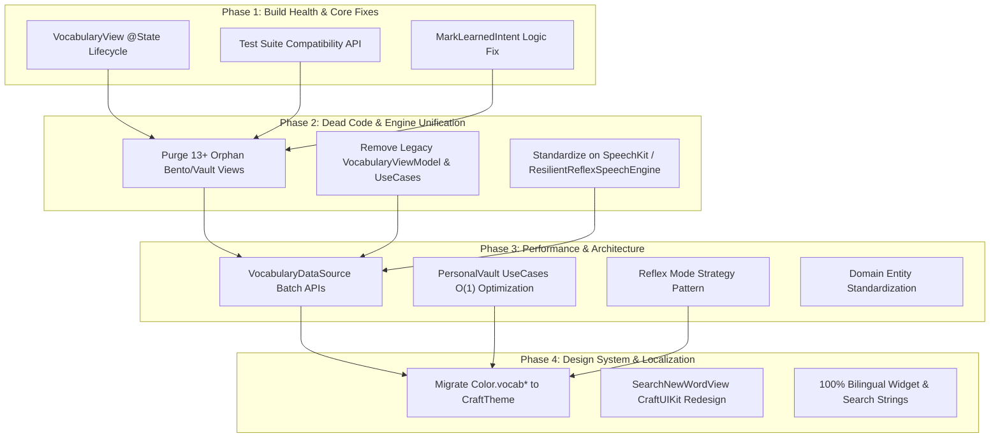

# Codebase Health, Performance & Architecture Standardization Design

**Author:** Antigravity Team  
**Date:** 2026-09-01  
**Status:** In Review  
**Target:** VocabCraft iOS App (`VocabCraftApp`, `Packages/CraftUIKit`, `Packages/SpeechKit`, `VocabCraftWidgetExtension`)

---

## 1. Overview & Objectives

Following an exhaustive audit of the `VocabCraft` codebase against `AGENTS.md` and the `.agents/skills` repository, this design specification provides a structured, 4-phase architectural blueprint to:
1. **Fix Critical Bugs & Restore Build Health**: Resolve compilation errors in the test suite, eliminate ViewModel lifecycle churn in SwiftUI view bodies, and correct logic bugs in Widget App Intents.
2. **Eliminate Dead Code & Consolidate Engines**: Remove 13+ orphaned views/viewmodels lingering from previous redesign cycles (Bento/Vault v1) and consolidate duplicate speech recognition engines into `SpeechKit` / `ResilientReflexSpeechEngine`.
3. **Optimize Data Layer & Decompose God ViewModels**: Introduce batch lookup APIs (`fetchWordsByIds`) in `VocabularyDataSourceProtocol` to eliminate $O(N)$ sequential async loops in Use Cases, and decouple `ReflexBlitzViewModel` via Strategy Pattern.
4. **Achieve 100% CraftUIKit Theme & Localization Conformance**: Replace 480+ legacy `Color.vocab*` calls with dynamic `CraftTheme` tokens to enable seamless 12-Theme Preset switching, and eliminate all remaining hardcoded strings in Widgets and Search screens.

---

## 2. Architecture & Design Specification



---

## 3. Detailed Phase Breakdown

### Phase 1: Build Health, Test Suite Compatibility & ViewModel Lifecycle

#### 3.1.1 `VocabularyView` ViewModel Lifecycle Fix
* **Problem**: `VocabularyView` used a computed property `activeVaultVM` that called `appContainer.makePersonalVaultViewModel()` whenever `vaultVM` was `nil`. When SwiftUI re-evaluates `body` (due to scroll offset, search text change, or theme switch), a new `PersonalVaultViewModel` was instantiated, resetting search queries, tab selections, and discarding ongoing tasks.
* **Solution**:
  - Encapsulate `PersonalVaultViewModel` ownership in `@State private var vaultVM: PersonalVaultViewModel`.
  - In `init(vaultViewModel: PersonalVaultViewModel? = nil, isSearchHiddenByScroll: Bool = false, isScrolledPastHeader: Bool = false, isSearchVisible: Bool? = nil)`:
    - If `vaultViewModel` is provided, initialize `_vaultVM = State(initialValue: vaultViewModel)`.
    - If `nil`, lazily initialize with a default container instance.
  - Provide a backward-compatible testing accessor `isSearchVisibleForTesting` that bridges to `!isSearchHiddenByScroll`.
  - Support legacy `isSearchVisible` parameter in `init` by converting `isSearchHiddenByScroll = !isSearchVisible`.

#### 3.1.2 Test Suite Compatibility
* **Problem**: `VocabularyViewTests.swift` and `PersonalVaultViewsTests.swift` failed compilation because `isSearchVisible` and `isSearchVisibleForTesting` were modified without backward-compatible test hooks.
* **Solution**:
  - Update `VocabularyView` to support both the new signature and the test convenience initializers.
  - Fix any test assertions in `PersonalVaultViewsTests.swift` and `VocabularyViewTests.swift`.
  - Verify `swift test` builds and passes 100%.

#### 3.1.3 `MarkLearnedIntent` Logic Fix
* **Problem**: `progress.masteryLevel = max(5, srsResult.nextMastery)` in `MarkLearnedIntent.swift` forces mastery to $\ge 5$ always.
* **Solution**:
  - Update assignment to `progress.masteryLevel = min(5, max(1, srsResult.nextMastery))` or appropriately set `progress.masteryLevel = 5` only if intended to instantly mark as mastered, preserving correct SRS interval calculations.

---

### Phase 2: Dead Code Elimination & Engine Consolidation

#### 3.2.1 Orphan Views Purge
Delete the following obsolete files and remove their references from `project.pbxproj` and test files:
1. `VocabCraftApp/Features/Vocabulary/Views/WordAccordionCard.swift`
2. `VocabCraftApp/Features/Vocabulary/Views/VocabularySummaryCard.swift`
3. `VocabCraftApp/Features/Vocabulary/Views/TopicDecksGridView.swift`
4. `VocabCraftApp/Features/Vocabulary/Views/TopicDeckDetailView.swift`
5. `VocabCraftApp/Features/Vocabulary/Views/SubTopicStudySessionView.swift`
6. `VocabCraftApp/Features/Vocabulary/Views/SubTopicSessionSummaryView.swift`
7. `VocabCraftApp/Features/Vocabulary/Views/SubTopicPreviewSheet.swift`
8. `VocabCraftApp/Features/Vocabulary/Views/QuickReflexDrillSheetView.swift`
9. `VocabCraftApp/Features/Vocabulary/Views/QuickReflexResultCardView.swift`
10. `VocabCraftApp/Features/Vocabulary/Views/ReflexFlipCardView.swift`
11. `VocabCraftApp/Features/Vocabulary/Views/Components/TopCarouselFlashcardView.swift`
12. `VocabCraftApp/Features/Vocabulary/PersonalVault/Views/CleanWordCardView.swift`
13. `VocabCraftApp/Features/Vocabulary/PersonalVault/Views/PersonalVaultHeroCard.swift`
14. `VocabCraftApp/Features/Vocabulary/PersonalVault/Views/PersonalSearchFilterBar.swift`

#### 3.2.2 Dead ViewModels, Models & UseCases Purge
1. `VocabCraftApp/Features/Vocabulary/ViewModels/VocabularyViewModel.swift` & `VocabularyViewModelTests.swift`
2. `VocabCraftApp/Domain/UseCases/FetchVocabularyUseCase.swift`
3. `VocabCraftApp/Features/Vocabulary/ViewModels/StudySessionViewModel.swift`
4. `VocabCraftApp/Features/Vocabulary/ViewModels/QuickReflexDrillViewModel.swift`
5. Remove `legacyVM` property from `VocabularyView.swift` and `AppContainer.makeVocabularyViewModel()`.

#### 3.2.3 Speech Engine Consolidation
* **Problem**: `ContinuousReflexSpeechService.swift` and `ResilientReflexSpeechEngine.swift` coexist. `VocabularyView.swift:235` passes `ContinuousReflexSpeechService()` into `MixedReflexDrillView`.
* **Solution**:
  - Standardize `MixedReflexDrillView` to consume `ResilientReflexSpeechEngine` (which delegates to `Packages/SpeechKit`).
  - Safely deprecate/remove `ContinuousReflexSpeechService.swift` and its mock/tests after migrating consumers.

---

### Phase 3: Performance Optimization & Clean Architecture

#### 3.3.1 Batch Lookup in `VocabularyDataSourceProtocol`
* **Problem**: `FetchPersonalVaultUseCase` and `ReviewWeakWordsUseCase` iterate through `allProgress` with `await dataSource.fetchWordById(id:)`, causing $O(N)$ sequential async round-trips.
* **Solution**:
  - Add to `VocabularyDataSourceProtocol`:
    ```swift
    func fetchWordsByIds(ids: Set<Int64>) async throws -> [TopicWordDTO]
    func fetchAllWordsMap() async throws -> [Int64: TopicWordDTO]
    ```
  - Implement in `SampleVocabularyDataSource`:
    ```swift
    public func fetchWordsByIds(ids: Set<Int64>) async throws -> [TopicWordDTO] {
        ids.compactMap { Self.wordById[$0] }
    }
    public func fetchAllWordsMap() async throws -> [Int64: TopicWordDTO] {
        Self.wordById
    }
    ```
  - In `FetchPersonalVaultUseCase` and `ReviewWeakWordsUseCase`, fetch the dictionary/batch once $\rightarrow$ in-memory $O(1)$ mapping with zero async loops.

#### 3.3.2 Domain Entity Normalization
* Standardize the representations of a vocabulary word across the codebase into:
  - **`Word` (Core Domain Entity)**: Immutable representation containing linguistic properties (lemma, phonetic, pos, cefrLevel, definitions, examples).
  - **`VaultWordItem` (UI / Presentation Item)**: Enriched with user progress, mastery level, bookmarked flag, mode stats, and streak.

#### 3.3.3 Decomposing `ReflexBlitzViewModel` (Strategy Pattern)
* Extract the 4 mode execution strategies out of `ReflexBlitzViewModel.swift`:
  - `ReflexSpeakingModeHandler`
  - `ReflexListeningModeHandler`
  - `ReflexTypingModeHandler`
  - `ReflexMultipleChoiceModeHandler`
* `ReflexBlitzViewModel` retains overall session state, countdown, combo streak, and timer coordination.

---

### Phase 4: Full CraftUIKit Design System Migration & 100% Localization

#### 3.4.1 Migrating 480+ `Color.vocab*` to `CraftTheme`
* Replace legacy `Color.vocab*` references across views (`SearchNewWordView`, `MobileSearchView`, `VocabSpeechVisualizerView`, `VocabMicControlHubView`, `StreakWeekStripView`, `HomeTopHeaderView`, `HomepageView`, `SRSSparkleEffectView`, etc.) with `theme.colors`:
  - `Color.vocabCanvas` $\rightarrow$ `theme.colors.canvasBackground`
  - `Color.vocabSurfaceCard` $\rightarrow$ `theme.colors.surfaceCard`
  - `Color.vocabSurfaceSoft` $\rightarrow$ `theme.colors.surfaceSecondary`
  - `Color.vocabInk` $\rightarrow$ `theme.colors.textPrimary`
  - `Color.vocabMuted` $\rightarrow$ `theme.colors.textSecondary`
  - `Color.vocabHeroAccent` $\rightarrow$ `theme.colors.accent`
  - `Color.vocabHairline` $\rightarrow$ `theme.colors.borderLight`
* Deprecate `Color+VocabCraft.swift` and `VocabTheme.swift` once migration completes.

#### 3.4.2 Redesign `SearchNewWordView` with `CraftUIKit`
* Replace custom `HStack` search bar with `CraftSearchBar`.
* Use `CraftCard`, `CraftPill`, `CraftBadge`, `CraftIcon` for suggested categories and recent searches.
* Localize category titles and strings into `Localizable.xcstrings`.

#### 3.4.3 Zero Hardcoded Strings & 100% Bilingual Parity
* Localize:
  - `SettingsView.swift`: Goal input alert placeholder (`app.settings.daily_goal_placeholder`).
  - `VocabWidgetView.swift`: Next button, Mastered button, Level labels (`app.widget.next`, `app.widget.mastered`, `app.widget.level_format`).
  - `SearchNewWordView.swift`: Category topics and recent searches (`app.search.*`).
  - `NextWordIntent.swift` fallback strings.
* Ensure both `en` and `vi` translations are complete with identical format tokens.

---

## 4. Verification Plan

### 4.1 Automated Tests
1. **CraftUIKit & SpeechKit Packages**:
   - `swift test --package-path Packages/CraftUIKit`
   - `swift test --package-path Packages/SpeechKit`
2. **Main Application Test Suite**:
   - `swift test` (All 80+ test suites in `VocabCraftAppTests`)
3. **Localization Tests**:
   - `swift test --filter HomeLocalizationTests`
   - `swift test --filter PersonalVaultLocalizationTests`
   - `swift test --filter SettingsLocalizationTests`
   - `swift test --filter ReflexBlitzLocalizationTests`

### 4.2 Manual / Visual Verification
1. **Multi-theme switching in Settings**: Verify changing across Default, Oxford Heritage, Kyoto Matcha, Nordic Zen, etc. correctly updates all screens without sticking to static colors.
2. **Vocabulary Vault navigation & search**: Verify search query typing, tab filtering (Chưa thuộc, Đã thuộc, Đã lưu), and modal drill presentations operate smoothly without state drops or UI glitches.
3. **Mixed Reflex Drill & Speaking recognition**: Verify speech recognition works seamlessly via `SpeechKit` and `ResilientReflexSpeechEngine`.
4. **Widget Interaction**: Verify `NextWordIntent` and `MarkLearnedIntent` operate cleanly with accurate SRS mastery level updates.

---

## 5. User Review Gate

Please review this detailed design specification. Upon your approval, we will invoke the `writing-plans` skill to generate a step-by-step implementation plan with explicit checkpoints.
