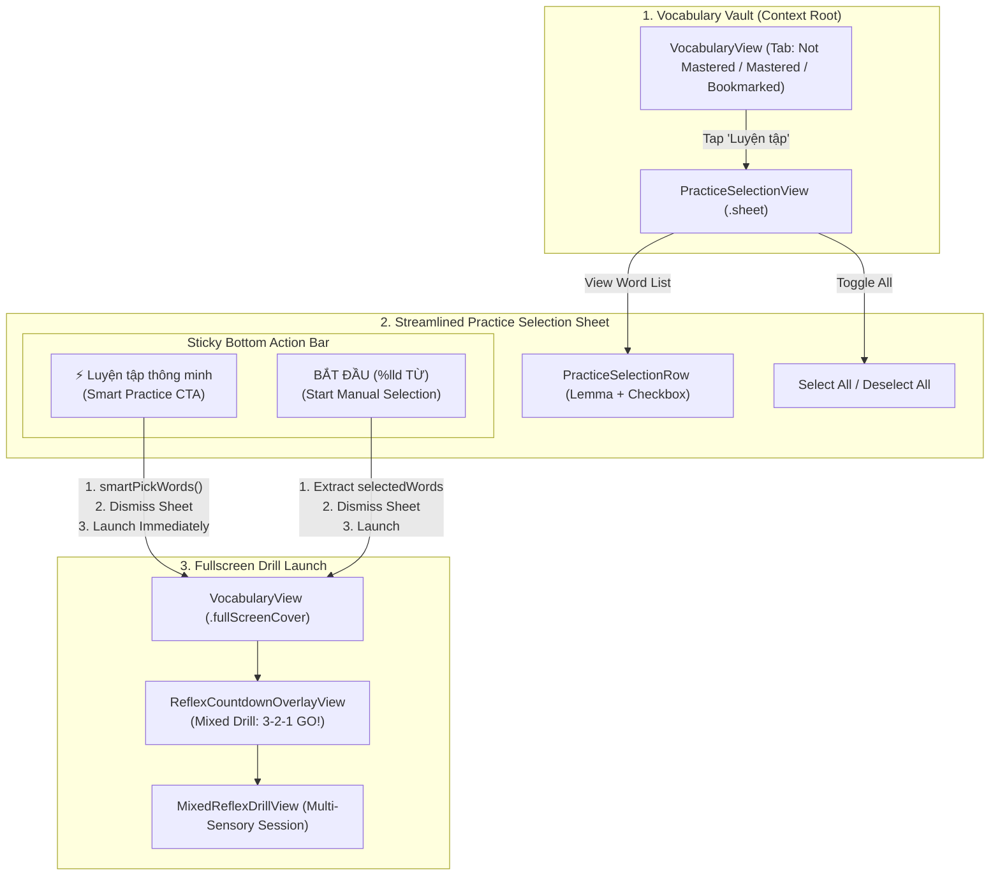

# Design Specification: Practice Selection UI Streamline, Smart Practice Relocation & Fullscreen Countdown Fix

- **Date**: 2026-09-01
- **Status**: Draft for User Review
- **Issue Reference**: [GitHub Issue #8](https://github.com/hoojinguyen/vocab-craft-app/issues/8)
- **Authors**: Antigravity & User

---

## 1. Problem Statement & Objectives

### 1.1 Context & Current Issues
In the Vocabulary Vault (`VocabularyView`), tapping the **Luyện tập (Practice)** action presents `PracticeSelectionView` as a sheet. While functionally complete, the current user experience has several friction points:

1. **Over-Cluttered Word Rows (`PracticeSelectionRow`)**: Rows display IPA phonetics, audio playback buttons, Vietnamese definitions, CEFR badges, POS tags, and 4 mini sensory icons (🎙️ ⌨️ 🔲 🎧). In a selection sheet where the user's sole objective is picking words to drill, this dense information overwhelms the visual hierarchy and slows down selection.
2. **Suboptimal Placement & Behavior of "Smart Practice"**: The "⚡️ Luyện tập nhanh" (Smart Pick) CTA is placed on a small secondary sub-toolbar at the top. Its current behavior only selects 10 words into the list, requiring a second tap on the bottom CTA to actually start the drill.
3. **Redundant Segmented Category Filter**: `PracticeSelectionView` re-renders a 3-tab segmented control ("Chưa thuộc", "Đã thuộc", "Đã lưu"), duplicating the exact tab filter the user already selected in the parent `VocabularyView`.
4. **Repetitive & Fragmented Label Text**: Total count, selected count, and filter labels are repeated across multiple rows and headers.
5. **Nested Sheet Presentation & Misleading Countdown Screen**:
   - The drill session is presented as a second stacked `.sheet` over `PracticeSelectionView` rather than a dedicated `.fullScreenCover`.
   - In `MixedReflexDrillView`, the countdown overlay (`ReflexCountdownOverlayView`) receives the mode of the first word item. If the first word happens to be `.speaking`, the overlay displays "Nói từ vựng" (Speaking Mode), confusing users into thinking the entire session is purely speaking rather than a multi-sensory mixed drill.

### 1.2 Core Objectives & Success Criteria
- **Streamlined Word Row**: Pure focus on word identification (`lemma`) and an accessible checkbox ($\ge 44\times 44\text{pt}$ touch target).
- **Relocated & Instant Smart Practice CTA**: Positioned as a prominent tactile action in the bottom sticky bar that selects the optimal word batch and **immediately launches the drill session**.
- **Clean Single-Context Selection**: Inherit the word list directly from the active Vault filter with a lightweight header and simple "Select All / Deselect All" toggle.
- **True Full-Screen Transition**: Dismiss selection sheet and present `MixedReflexDrillView` via `.fullScreenCover`.
- **Accurate Mixed Drill Countdown**: Display a dedicated title ("Luyện tập tổng hợp" / "Mixed Reflex Drill"), multi-sensory prompt, and hero icon (`bolt.fill`).
- **Standardized & Polished Copy**: 100% bilingual parity (EN/VI) with concise, punchy, and meaningful localized strings.

---

## 2. Architecture & Presentation Flow



---

## 3. Detailed Specifications

### 3.1 Streamlined Word Row (`PracticeSelectionRow`)
- **Visual Design**:
  - **Left Side**: Word `lemma` using `theme.typography.headline` (`.font(.headline)` / `CraftFont.headline`) in `theme.colors.textPrimary`.
  - **Right Side**: Checkbox indicator (`Image(systemName: isSelected ? "checkmark.circle.fill" : "circle")`) with 24pt icon size, tint `brandPrimary` when selected and muted gray when unselected.
  - **Container**: Card container with `theme.colors.surfaceCard`, corner radius `theme.radii.md`, and subtle border highlight when selected.
  - **Interaction**: Tap anywhere on the row toggles selection. Provides `.selection` haptic feedback and spring animation.
  - **Accessibility**: Touch target height $\ge 56\text{pt}$ (well exceeding Apple HIG 44pt minimum), accessibility label `AppStrings.Practice.toggleA11yLabel(lemma:)`, accessibility traits `[.isButton, isSelected ? .isSelected : []]`.
- **Removed Elements**: Phonetic text, audio playback button, CEFR badge, POS badge, Vietnamese definition line, 4 mini sensory icons.

```swift
// Target Structure of PracticeSelectionRow
public struct PracticeSelectionRow: View {
    @Environment(\.craftTheme) private var theme

    public let word: VaultWordItem
    public let isSelected: Bool
    public let onToggle: () -> Void

    public var body: some View {
        Button(action: onToggle) {
            HStack(alignment: .center, spacing: theme.spacing.md) {
                Text(word.lemma)
                    .font(theme.typography.headline)
                    .foregroundStyle(theme.colors.textPrimary)
                    .multilineTextAlignment(.leading)

                Spacer(minLength: theme.spacing.xs)

                Image(systemName: isSelected ? "checkmark.circle.fill" : "circle")
                    .font(.system(size: 24, weight: .semibold))
                    .foregroundStyle(isSelected ? theme.colors.brandPrimary : theme.colors.textMuted.opacity(0.4))
                    .contentTransition(.symbolEffect(.replace))
                    .frame(minWidth: 44, minHeight: 44)
            }
            .padding(.horizontal, theme.spacing.md)
            .padding(.vertical, theme.spacing.md)
            .frame(minHeight: 56)
            .background(theme.colors.surfaceCard)
            .clipShape(RoundedRectangle(cornerRadius: theme.radii.md))
            .overlay(
                RoundedRectangle(cornerRadius: theme.radii.md)
                    .stroke(
                        isSelected ? theme.colors.brandPrimary.opacity(0.6) : theme.colors.borderDefault,
                        lineWidth: isSelected ? 1.5 : 1
                    )
            )
            .craftShadow(isSelected ? theme.shadows.sm : CraftShadow(color: .clear, radius: 0))
            .contentShape(Rectangle())
        }
        .buttonStyle(.plain)
        .sensoryFeedback(.selection, trigger: isSelected)
        .animation(theme.animations.springSnappy, value: isSelected)
        .accessibilityLabel(AppStrings.Practice.toggleA11yLabel(lemma: word.lemma))
        .accessibilityAddTraits(isSelected ? [.isSelected] : [])
    }
}
```

### 3.2 Simplified Sheet View (`PracticeSelectionView`)
- **Navigation Header**:
  - **Leading**: "Quay lại" (Back) button with `chevron.left` and 44x44pt touch area.
  - **Center**: Title "Chọn từ luyện tập" (Select Words) with `theme.typography.headline`.
  - **Trailing**: Selected count pill badge (`CraftBadge("%lld đã chọn", variant: .subtle, tone: .primary, size: .sm)`) displayed when `selectedWordsCount > 0`.
- **Sub-Header Toolbar**:
  - Contains only the Select All / Deselect All toggle button (`CraftButton(variant: .ghost, size: .sm)`), aligned to the trailing edge.
- **Word List**:
  - Scrollable `LazyVStack` rendering `PracticeSelectionRow` items directly from `vaultViewModel.vaultWords`.
  - Displays `CraftEmptyState` if no words are available in the current category.
- **Removed Elements**:
  - `CraftSegmentedControl` filter tabs (removed completely from sheet).
  - Duplicate total word count text.

### 3.3 Sticky Bottom Action Bar (`stickyBottomBar`)
- Anchored via `.safeAreaInset(edge: .bottom)` with ultra-thin material blur background and top divider.
- Contains two clearly differentiated actions stacked vertically:
  1. **Top Button (Secondary Tactile CTA: Smart Practice)**:
     - **Title**: `⚡️ Luyện tập thông minh` (VI) / `⚡️ Smart Practice` (EN).
     - **Icon**: `bolt.fill`.
     - **Style**: `variant: .tactile`, `size: .md` (or `.lg`), `isFullWidth: true`.
     - **Behavior**:
       ```swift
       let picked = vaultViewModel.smartPickWords()
       guard !picked.isEmpty else { return }
       onStartPractice(picked)
       ```
       Triggers immediate launch into drill session without requiring additional taps.
  2. **Bottom Button (Primary Bold CTA: Start Practice)**:
     - **Title**: `BẮT ĐẦU (%lld TỪ)` (VI) / `START PRACTICE (%lld WORDS)` (EN) when words are selected; `CHỌN TỪ ĐỂ BẮT ĐẦU` (VI) / `SELECT WORDS TO START` (EN) when count is 0.
     - **Icon**: `play.fill`.
     - **Style**: `variant: .tactile`, `size: .lg`, `isFullWidth: true`.
     - **Behavior**: Starts practice with manually checked words (`vaultViewModel.selectedWords`). Disabled when `selectedWordsCount == 0`.

### 3.4 Fullscreen Transition Management in `VocabularyView`
- In `VocabularyView.swift`:
  ```swift
  // Change from .sheet to .fullScreenCover:
  .fullScreenCover(item: $activeDrillViewModel) { drillVM in
      MixedReflexDrillView(
          viewModel: drillVM,
          speechService: ContinuousReflexSpeechService(),
          onFinish: {
              activeDrillViewModel = nil
              Task {
                  await currentVaultVM.loadData()
              }
          }
      )
  }
  .sheet(isPresented: $isPresentingPracticeSelection) {
      PracticeSelectionView(
          vaultViewModel: currentVaultVM,
          onStartPractice: { selectedWords in
              isPresentingPracticeSelection = false
              let drillVM = appContainer.makeMixedReflexDrillViewModel(
                  selectedWords: selectedWords,
                  allowSpeakingSkip: true
              )
              activeDrillViewModel = drillVM
          },
          onClose: {
              isPresentingPracticeSelection = false
          }
      )
  }
  ```

### 3.5 Mixed Reflex Drill Countdown Overlay Enhancement
- **In `ReflexCountdownOverlayView.swift`**:
  - Support configuring countdown overlay for either:
    1. Single-mode blitz (`mode: ReflexBlitzMode`)
    2. Mixed multi-sensory drill (`title: String, subtitle: String, iconName: String, tintColor: Color`)
- **In `MixedReflexDrillView.swift`**:
  - Pass mixed drill configuration to the countdown overlay:
    - **Title**: `AppStrings.Practice.mixedDrillTitleText` ("Luyện tập tổng hợp" / "Mixed Reflex Drill")
    - **Subtitle**: `AppStrings.Practice.mixedDrillSubtitleText` ("Phản xạ 4 kỹ năng: Trắc nghiệm, Gõ, Nghe & Nói" / "Multi-sensory reflex: Quiz, Typing, Listening & Speaking")
    - **Icon**: `"bolt.fill"`
    - **Tint**: `theme.colors.brandPrimary`

---

## 4. Text Standardization & Localization Taxonomy

All strings strictly comply with Layer 2 (`app.practice.*`) taxonomy in `VocabCraftApp/Resources/Localizable.xcstrings` and typed accessors in `AppStrings+Practice.swift`.

| Localization Key | Vietnamese (`vi`) | English (`en`) | Usage / Placement |
| :--- | :--- | :--- | :--- |
| `app.practice.selection.title` | `Chọn từ luyện tập` | `Select Words` | Sheet Navigation Title |
| `app.practice.selection.back` | `Quay lại` | `Back` | Back navigation button |
| `app.practice.selection.close` | `Đóng` | `Close` | Modal close button |
| `app.practice.selection.selected_count` | `%lld đã chọn` | `%lld selected` | Header pill count badge |
| `app.practice.selection.select_all` | `Chọn tất cả` | `Select All` | Quick action toggle button |
| `app.practice.selection.deselect_all` | `Bỏ chọn tất cả` | `Deselect All` | Quick action toggle button |
| `app.practice.selection.smart_pick` | `⚡️ Luyện tập thông minh` | `⚡️ Smart Practice` | Bottom sticky secondary CTA |
| `app.practice.selection.start_button` | `BẮT ĐẦU (%lld TỪ)` | `START PRACTICE (%lld WORDS)` | Bottom sticky primary CTA |
| `app.practice.selection.empty_prompt` | `CHỌN TỪ ĐỂ BẮT ĐẦU` | `SELECT WORDS TO START` | Bottom primary CTA (disabled) |
| `app.practice.selection.empty_title` | `Chưa có từ vựng` | `No vocabulary` | Empty state title |
| `app.practice.selection.empty_message` | `Không tìm thấy từ vựng nào trong mục này.` | `No vocabulary found in this section.` | Empty state subtitle |
| `app.practice.selection.toggle_a11y` | `Chọn từ %@` | `Select word %@` | Checkbox accessibility label |
| `app.practice.countdown.mixed_title` | `Luyện tập tổng hợp` | `Mixed Reflex Drill` | Countdown overlay title |
| `app.practice.countdown.mixed_subtitle` | `Phản xạ 4 kỹ năng: Trắc nghiệm, Gõ, Nghe & Nói` | `Multi-sensory reflex: Quiz, Typing, Listening & Speaking` | Countdown overlay subtitle |

---

## 5. Affected Files & Unit Test Matrix

### 5.1 Modified Files
1. `VocabCraftApp/Features/Vocabulary/Views/Components/PracticeSelectionRow.swift`
2. `VocabCraftApp/Features/Vocabulary/Views/PracticeSelectionView.swift`
3. `VocabCraftApp/Features/Vocabulary/Views/VocabularyView.swift`
4. `VocabCraftApp/Features/Reflex/Blitz/Views/ReflexCountdownOverlayView.swift`
5. `VocabCraftApp/Features/Reflex/Mixed/Views/MixedReflexDrillView.swift`
6. `VocabCraftApp/Core/Localization/AppStrings+Practice.swift`
7. `VocabCraftApp/Resources/Localizable.xcstrings`

### 5.2 Unit & Integration Tests to Update / Add
1. `VocabCraftAppTests/Features/Vocabulary/PracticeSelectionViewsTests.swift`:
   - Verify `PracticeSelectionRow` toggles selection via full row tap.
   - Verify `PracticeSelectionView` launches Smart Practice immediately on CTA tap.
   - Verify `PracticeSelectionView` launches manual selection on Start button tap.
   - Verify Select All / Deselect All behavior.
2. `VocabCraftAppTests/Features/MixedReflexDrillViewsTests.swift`:
   - Verify `ReflexCountdownOverlayView` configuration for both single mode and mixed drill.
   - Verify `MixedReflexDrillView` correctly initializes with mixed countdown metadata.
3. `VocabCraftAppTests/Features/PracticeSelectionLocalizationTests.swift`:
   - Verify catalog integrity and 100% EN/VI pair completeness for all `app.practice.*` keys.

---

## 6. Verification Plan

1. **Unit Tests Execution**:
   - `swift test --filter PracticeSelectionLocalizationTests`
   - `swift test --filter PracticeSelectionViewsTests`
   - `swift test --filter MixedReflexDrillViewsTests`
2. **SwiftLint & Static Analysis**:
   - Zero SwiftLint warnings and zero errors.
3. **Build & Compiler Checks**:
   - Clean Xcode simulator compilation with 0 warnings.
