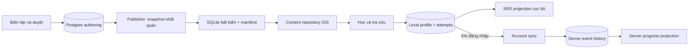

# VocabCraft — Shared Learning Contract & Schema

**Ngày:** 2026-09-05  
**Trạng thái:** Approved — owner đã duyệt kiến trúc và bản chi tiết trong cuộc thảo luận này; chuyển sang implementation plans Phase 3A.
**Áp dụng:** vocab-craft-api và vocab-craft-app.  
**Mốc đầu:** Một bộ nội dung thật học được offline, chưa yêu cầu auth/sync production.

## 1. Phạm vi và quyết định

Thiết kế lại mô hình chung theo nghiệp vụ; không lấy schema service hoặc DTO iOS hiện tại làm chuẩn. App chưa release nên cho phép đổi cả hai. Bản này thay thế các giả định word-level progress, bắt buộc login, content delta v1 và schema cũ trong tài liệu Phase 0–2 đối với công việc tiếp theo. Không mô tả các chức năng đó là đã triển khai.

Owner đã duyệt:

- Người Việt học tiếng Anh; definition và example có EN/VI.
- Entry hỗ trợ từ đơn, phrasal verb và cụm nhiều từ. Mỗi entry có nhiều sense.
- Tiến độ theo sense; một lịch ôn chung, bằng chứng riêng cho recognition, recall, application.
- Nghe/nói/đọc/viết là hình thức luyện tập; phát âm được đánh giá riêng.
- Lesson chọn sense cụ thể; một sense có thể dùng trong nhiều lesson.
- Practice attempt là dữ liệu gốc; SRS/progress là projection có thể tính lại.
- Nội dung nháp tách release; v1 cập nhật toàn bộ SQLite, progress nằm ở kho riêng.
- Phát âm dùng Apple trên iOS; không đóng gói audio hay xây audio service ở v1.
- Học guest không cần mạng/tài khoản; login để backup/sync. Guest và account profile tách biệt.

Các chi tiết bên dưới như UUID, tên bảng, API và quy tắc publish là thiết kế kỹ thuật đã được duyệt. Công thức SRS, nhà cung cấp đăng nhập và hạ tầng sync sẽ có spec riêng trước triển khai tương ứng; không phải phần còn thiếu của builder/offline content.

## 2. Ranh giới hệ thống



Nội dung công khai không chứa thông tin học viên. Postgres authoring chứa nguồn và quy trình duyệt; SQLite chỉ chứa nội dung đã xuất bản và attribution cần hiển thị. Nội dung lịch sử trên server được giữ để xác minh attempt dùng release cũ. App không gọi service để đọc từng từ trong một buổi học offline.

## 3. Định danh, kiểu và phiên bản

- Entity ID là UUID v4 tạo một lần, không suy ra từ lemma/thứ tự và không tái sử dụng. Postgres dùng UUID; SQLite dùng TEXT lowercase canonical; JSON là string; Swift dùng typed wrapper quanh UUID cho EntryID/SenseID/LessonID/ProfileID/AttemptID.
- Không tiếp tục dùng Int64 word ID làm khóa học. Migration cần mapping rõ ràng sang sense, không gán một word progress cho mọi nghĩa.
- `content_version`: số nguyên tăng dần theo release thành công; có thể bỏ số khi build thất bại, không tái sử dụng. API giới hạn integer trong khoảng an toàn JSON 1..9007199254740991.
- `dataset_schema_version`: số nguyên độc lập mô tả schema SQLite. `event_schema_version` và `srs_algorithm_version` cũng độc lập.
- Mỗi entity biên tập có `revision` tăng khi payload hoặc quan hệ sở hữu thay đổi. Lesson revision đổi khi membership/thứ tự đổi.
- Timestamp JSON dùng RFC3339 UTC với milliseconds; Postgres timestamptz; local event dùng integer milliseconds UTC. Dùng integer cho duration/score để giảm khác biệt Python/Swift.
- Dữ liệu v1 có tên trường cố định `_en`, `_vi`. Không tạo translation framework tổng quát.

## 4. Mô hình nội dung chuẩn

Tất cả PK là `id` trừ bảng nối. Những cột optional ghi `?`; các cột khác bắt buộc ở release. Authoring cho phép nháp thiếu nội dung nhưng publisher kiểm tra đầy đủ.

| Bảng | Trường nghiệp vụ |
|---|---|
| `entries` | id, headword, lookup_key, entry_kind, revision |
| `pronunciations` | id, entry_id, sense_id?, accent, ipa, sort_order |
| `senses` | id, entry_id, part_of_speech, definition_en, definition_vi, cefr_level, usage_note_en?, usage_note_vi?, sort_order, revision |
| `examples` | id, sense_id, text_en, text_vi, sort_order |
| `collocations` | id, sense_id, text_en, text_vi, example_id?, sort_order |
| `decks` | id, title_en, title_vi, description_en?, description_vi?, icon_key, theme_key, sort_order, revision |
| `lessons` | id, deck_id, title_en, title_vi, icon_key, sort_order, revision |
| `lesson_senses` | lesson_id, sense_id, sort_order; PK(lesson_id,sense_id) |

Constraints:

- `entry_kind`: word, phrasal_verb, phrase, idiom. Đây là loại mục từ, không thay thế part_of_speech.
- POS: noun, verb, adjective, adverb, pronoun, determiner, preposition, conjunction, interjection, numeral, particle, other. `other` cần usage note giải thích để duyệt.
- CEFR ở sense: A1/A2/B1/B2/C1/C2; không suy từ tần suất rồi coi là nhãn đã xác minh. Deck có thể bao phủ nhiều cấp độ; UI suy tập CEFR từ senses thay vì một trường cấp độ bắt buộc gây sai lệch.
- Không UNIQUE(headword): các homograph có thể cần entry riêng. lookup_key dùng Unicode NFC, trim/collapse whitespace, lowercase để tìm kiếm, không làm identity. Không áp dụng quy tắc cấm dấu cách của seed cũ.
- Mỗi sense thuộc đúng một entry. Mỗi example/collocation thuộc đúng một sense. Nếu collocation.example_id có giá trị thì example phải thuộc cùng sense.
- Pronunciation scope: sense_id null nghĩa là áp dụng entry; sense-specific phải thuộc entry đó. App ưu tiên IPA riêng của sense, nếu không có dùng entry IPA. Accent enum us/uk; không có audio_url. Publisher yêu cầu mỗi sense có ít nhất một IPA hữu dụng qua một trong hai scope.
- Lesson thuộc một deck; mỗi sense xuất hiện nhiều lesson. `sort_order >= 0`, unique trong parent cho lesson_senses, lessons, senses, examples, collocations và deck ở root. Pronunciation unique sort trong scope entry/sense/accent.
- Sense DTO không có stageId/lessonId. Membership là dữ liệu riêng; tìm sense theo ID không chọn một bài bất kỳ.
- Dùng SenseSummary để hiện danh sách bài/ôn; dùng EntryDetail để tra tất cả nghĩa đã xuất bản. Nhãn “đã học X/Y nghĩa” tính trên senses đang hoạt động trong release.
- Một entry có thể có nhiều senses cùng POS. Sửa cách diễn đạt/translation giữ ID; đổi ý nghĩa hoặc split/merge tạo ID mới. Không tự nhân bản mastery cho các nghĩa mới.

### 4.1 Nháp, nguồn và duyệt

Authoring bổ sung `status` (draft, in_review, approved, retired), revision, created_at, updated_at. Bản approved bị chỉnh sửa quay về draft. Sửa child tăng revision owner và vô hiệu approval owner: example/collocation/pronunciation ảnh hưởng sense tương ứng; entry-wide pronunciation ảnh hưởng mọi sense dùng nó. Đổi lesson membership yêu cầu duyệt lại lesson.

`content_reviews(id, entity_type, entity_id, revision, decision, reviewer_id, reviewed_at, note?)` ghi quyết định bất biến. Publisher chỉ dùng approval khớp revision đang chụp, không dùng approval cũ.

`content_sources(id, source_name, source_url?, attribution_text, rights_basis, license_identifier?, retrieved_at?)` và `content_source_links(source_id, entity_type, entity_id, revision, locator?)` lưu xuất xứ theo revision. rights_basis: original, licensed, public_domain, permission. Nguồn tham khảo một danh sách từ không mặc nhiên cho quyền chép định nghĩa/ví dụ. Chưa lựa chọn nguồn dataset trong spec này.

Publisher xác minh liên kết đa hình tới entity/revision thực tồn tại. Release giữ attribution và license notice cần thiết để app hiển thị offline; thông tin nội bộ reviewer không đưa vào bundle.

### 4.2 Điều kiện xuất bản

- Sense có EN/VI definition không rỗng, POS, CEFR được reviewer chấp nhận, ít nhất một example EN/VI, IPA và nguồn/quyền sử dụng rõ ràng.
- Collocation optional; nếu có phải đủ EN/VI và đã duyệt cùng revision sense.
- Deck/lesson đủ title EN/VI, icon/theme key trong catalog UI thống nhất; không truyền màu hex tùy ý từ nội dung.
- Mỗi lesson có ít nhất một sense; mọi dependency của lesson được duyệt. V1 bundle chỉ chọn senses trong các lesson được chọn và dependencies của chúng, tránh xuất cả nháp từ cùng entry.
- Có thể xuất subset senses của một entry. Entry container được duyệt không thay thế duyệt từng sense.
- Dữ liệu mock/fallback placeholder bị chặn trước publish; AI confidence không thay thế human approval.
- Retirement không xóa ID khỏi lịch sử server. Release mới có danh sách retired_sense_ids tích lũy để app giữ progress nhưng loại nghĩa đó khỏi queue. Split/merge là quan hệ editorial tham khảo; v1 không chuyển mastery tự động.

## 5. SQLite và publisher

SQLite chứa các bảng nội dung §4, indexes FK/lookup_key và `dataset_metadata` một hàng:
`dataset_schema_version, content_version, published_at, content_language=en, explanation_language=vi`.
Có bảng `attributions(id, text, source_url?, license_identifier?)`, `sense_attributions(sense_id, attribution_id)` và `retired_senses(sense_id, retired_in_version)`; FK sense_attributions trỏ sense/attribution trong bundle. Publisher quy nguồn của entry/child lên sense có liên quan, dedupe attribution bằng source ID.

Artifact chuẩn: `vocab_content.sqlite`; API path bất biến `/v1/content/releases/{content_version}/bundle`. App bundle bản đầu dưới cùng tên; không duy trì alias english_dataset.db.

Publisher:

1. Reserve version; chụp authoring trong một snapshot transaction nhất quán và lưu release snapshot bất biến đủ payload/nguồn/revision. Build từ snapshot, không query nháp lại trong các bước sau.
2. Validate toàn bộ graph; tạo file tạm, insert theo thứ tự ID/parent-sort xác định, FK bật, indexes hoàn chỉnh. Không có WAL/SHM đi kèm khi phát hành.
3. Chạy integrity_check, foreign_key_check, count và thử đọc qua contract fixtures. Kết thúc mọi thay đổi/đóng file trước hash.
4. Tính SHA-256 đủ 64 hex ký tự trên byte artifact cuối, lưu manifest ngoài file. Không đặt checksum chính file vào trong chính file đó.
5. Lưu artifact tại đường dẫn bất biến, xác nhận truy cập được; transaction đánh dấu release published và chuyển latest pointer. Lỗi build/upload không đổi latest; retry không ghi đè release đã published.

`content_releases(content_version PK, dataset_schema_version, state, snapshot_ref, artifact_ref?, sha256?, byte_size?, counts_json?, created_at, published_at?)`; state building/failed/published. Chỉ published có thể phục vụ public. Snapshot là JSON representation theo dataset_schema_version, đầy đủ entity/revision và approval/source references để tái dựng nội dung lịch sử.

Manifest response mẫu (checksum minh họa định dạng, không phải artifact đã tạo):

```json
{
  "content_version": 1,
  "dataset_schema_version": 1,
  "published_at": "2026-09-05T10:00:00.000Z",
  "content_language": "en",
  "explanation_language": "vi",
  "bundle_url": "/v1/content/releases/1/bundle",
  "sha256": "aaaaaaaaaaaaaaaaaaaaaaaaaaaaaaaaaaaaaaaaaaaaaaaaaaaaaaaaaaaaaaaa",
  "byte_size": 262144,
  "counts": {"entries": 50, "senses": 54, "decks": 1, "lessons": 5}
}
```

Counts và byte_size là ví dụ, không ép dataset 50 entries đạt kích thước 3–5 MB.

### 5.1 API nội dung

| API | Hành vi |
|---|---|
| GET /v1/content/manifest | Latest published; 404 CONTENT_NOT_PUBLISHED nếu chưa có; ETag + If-None-Match/304 |
| GET /v1/content/releases/{version}/manifest | Manifest bất biến cho version đã publish; 404 nếu không tồn tại |
| GET /v1/content/releases/{version}/bundle | SQLite đúng SHA/size, cache immutable; 404 nếu chưa publish |

Không cần API words/decks phục vụ từng màn hình hoặc delta endpoint cho mốc offline. Admin APIs tách khỏi public; bước approve không trực tiếp publish/bump content_version như Phase 2.

### 5.2 Cài bản mới trên iOS

App giữ bundled baseline và installed bundles trong Application Support. Download file tạm; kiểm schema supported, SHA/size, metadata version và tính toàn vẹn trước kích hoạt. HTTPS là yêu cầu vận chuyển khi triển khai; checksum phát hiện file sai, không tự cung cấp xác thực nguồn.

Mỗi session học giữ một content handle/version. Khi đổi version, đóng/giải phóng connection theo vòng đời handle; atomic latest-pointer update tới file bất biến đã kiểm tra. Không ghi đè database đang được đọc. Giữ bản cũ tới khi không còn handle; giữ ít nhất một last-known-good để phục hồi. Sau crash chỉ mở bản đã kiểm chứng hoặc baseline. Nếu không có bản hợp lệ, hiện lỗi có thể khắc phục; không âm thầm trả sample data.

App không cài schema cao hơn reader hỗ trợ; vẫn học bản hiện có. Sửa lỗi release bằng một version cao hơn, không sửa byte release cũ. Progress lưu ngoài bundle, không có FK vật lý sang SQLite content.

## 6. Contract repository iOS

Một content repository thật dùng chung cho lesson, lookup, vault, review. Loại bỏ hai đường consumer có shape khác nhau.

- `fetchDecks()` → DeckSummary[] có tập cefr_levels được suy ra.
- `fetchLessons(deckId)` → LessonSummary[].
- `fetchLessonContent(lessonId)` → LessonDetail + ordered SenseSummary[] + release/revision.
- `fetchSense(senseId)` → SenseDetail?; retired/missing được biểu diễn rõ trong kết quả đối soát progress.
- `fetchEntry(entryId)` → EntryDetail chứa ordered senses đã xuất bản.
- `search(query, limit, cursor?)` → page SenseSummary; thứ tự lookup_key, entry_id, sense.sort_order, sense_id; cursor opaque gắn content_version, đổi bundle bắt đầu lại.
- `fetchSenses(ids)` → mapping theo sense ID và danh sách ID missing; không gán stageId lên sense.

SenseSummary gồm sense_id, entry_id, headword, entry_kind, part_of_speech, definition_en/vi, cefr_level và IPA đã resolve. SenseDetail thêm examples, collocations, usage notes và attribution. UI tự chọn trường EN/VI theo ngữ cảnh, không đưa sample strings để lấp nội dung thiếu.

UI progress/query tham chiếu SenseID. Lesson completion tham chiếu LessonID + lesson revision/content version của session. Apple speech adapter nhận headword hoặc example text và locale en-US/en-GB; không đưa audio vào contract nội dung. Tính năng speech và tải voice của thiết bị không thuộc cam kết offline văn bản.

## 7. Hồ sơ học và lưu trữ tiến độ

Local `learning_profiles(profile_id PK, kind guest|account, account_id?, created_at, state active|archived)`; account_id bắt buộc chỉ khi kind=account. ID profile là installation-local identity, không dùng làm khóa tài khoản toàn cầu.

- Guest được tạo offline. Mọi query local progress phải scope profile_id.
- Account login mở account profile tương ứng trên thiết bị. Account server được xác định từ bearer token, không tin account_id trong request body.
- Khi có guest history chưa chuyển, hiển thị quyết định nhập lịch sử vào tài khoản đích. Chỉ sau lựa chọn đó ghi local claim bền vững và upload. Đây là thao tác trong sản phẩm để tránh chuyển nhầm trên thiết bị dùng chung.
- Claim cùng guest vào cùng account được resume; guest đã claim account A không thể được nhập lại account B. Attempt ID giữ nguyên khi claim, không copy tạo ID mới. Server gắn mỗi attempt vào duy nhất một account và không đổi owner.
- Guest claim xong được archive; account profile sở hữu liên kết lịch sử đã nhập. Logout chuyển sang một guest chưa claim riêng. Dữ liệu account lưu local nhưng không hiện trong guest.
- Upload worker capture account/profile/token tại lúc bắt đầu; logout hủy worker và ngăn response cũ cập nhật active profile mới. Dữ liệu account cũ vẫn có thể được ghi đúng partition nếu giao dịch trước đã hoàn tất.

Server `accounts` sử dụng auth identity riêng; chọn nhà cung cấp login nằm ở spec auth sau. Không tạo shadow account server cho guest.

## 8. PracticeAttempt và projection

`practice_attempts` bất biến, local PK attempt_id; server PK attempt_id + owner binding. Envelope:

| Trường | Quy tắc |
|---|---|
| attempt_id, origin_profile_id, device_id | UUID; device là ID cài đặt, không hardware fingerprint |
| device_sequence | Integer tăng và được cấp transactionally cùng ghi event trong local profile/device |
| event_schema_version | 1 |
| sense_id, sense_revision, content_version | Tham chiếu nghĩa/release đã học |
| lesson_id?, lesson_revision? | Có cùng nhau khi học trong bài; null khi ôn tự do |
| exercise_kind | recognition_choice, recall_text, recall_speech, application_text, application_speech, pronunciation |
| capability | recognition, recall, application hoặc null cho pronunciation-only |
| input_modes, response_mode | Input subset text/audio; response choice/text/speech |
| outcome | correct, incorrect, unscored |
| score_milli? | Integer 0..1000, optional; không dùng trực tiếp thay outcome |
| hint_count, retry_count, response_time_ms | Integer >=0; retry_count là số retry trước lần submit này |
| occurred_at, elapsed_since_previous_ms? | UTC client timestamp; duration monotonic nếu đo được, chỉ hỗ trợ chẩn đoán |
| client_srs_algorithm_version, evaluator_version | Version đã dùng; evaluator cho biết cách chấm |
| pronunciation_score_milli? | 0..1000; không tự biến thành bằng chứng hiểu nghĩa |

Một event cho mỗi lần submit; retry có event mới. Bấm lại gửi do network giữ attempt_id và payload. V1 không lưu raw microphone audio hoặc câu trả lời tự do vào event mặc định. Bài không có bộ chấm tin cậy ghi unscored; application không mặc nhiên có khả năng AI chấm.

Server thêm received_at, account_id, accepted_sequence, payload_hash, validation_status. Trùng ID + cùng payload/owner trả duplicate thành công; cùng ID khác payload trả ATTEMPT_ID_CONFLICT, không overwrite. Khác owner trả conflict chung không lộ dữ liệu account cũ.

`SenseProgress` PK(owner,sense_id) gồm algorithm_version, projection_revision, due_at?, last_practiced_at?, schedule_state, ability_evidence. `ability_evidence` gồm count và last_outcome cho ba capability; pronunciation có thống kê riêng. Không hứa mastery threshold trước khi chốt SRS. `schedule_state` là payload có schema theo algorithm_version, do module SRS sở hữu; không cố định ease/interval cũ vào public content contract.

`LessonCompletion` là event độc lập: event_id, profile/device, lesson_id, lesson_revision, content_version, completed_at. Completion không tự chứng minh mastery. Lịch sử hoàn thành revision cũ được giữ; lesson revision mới có nội dung khác hiện “đã cập nhật”, không giả định đã hoàn thành phiên bản mới.

### 8.1 Replay và thời gian

App lưu attempt + đánh dấu cần projection/outbox trong cùng local transaction. Projection có thể rebuild sau crash. Offline state là provisional khi chưa sync.

Không dùng arrival order làm thứ tự học. Đề xuất replay server: effective_at bằng occurred_at nếu không quá received_at + 5 phút; thời gian tương lai vượt ngưỡng được clamp về received_at và đánh dấu clock_adjusted. Giữ nguyên timestamp gốc; không loại attempt chỉ vì rất cũ. Sort (effective_at, device_id, device_sequence, attempt_id); nhận event đến muộn làm tăng projection_revision và replay phần bị ảnh hưởng. Clock policy phải được kiểm bằng fixture; clock bị chỉnh lùi vẫn là giới hạn đo lường, không thể phục hồi thứ tự thực tuyệt đối giữa hai thiết bị.

Recognition/recall/application ảnh hưởng lịch chung theo SRS policy riêng; pronunciation-only và unscored không thay lịch hiểu nghĩa. Python/Swift dùng chung bộ golden events → expected state, rounding/time rules và algorithm version. Spec SRS phải chốt công thức, chuyển version và golden fixtures trước khi triển khai tính lịch mới; không tuyên bố có parity chỉ vì cùng tên thuật toán.

### 8.2 Sync surface dự kiến cho phase sau

- POST /v1/sync/push: authenticated, tối đa 50 events/batch; từng event có kết quả accepted/duplicate/rejected và error code; không im lặng bỏ event. Ghi event trước ack. Client chỉ clear outbox theo ack từng ID.
- GET /v1/sync/pull?cursor=: authenticated change feed tối đa 200 items, next_cursor opaque và has_more. Cursor dựa server sequence, không dùng max updated_at; changes gồm attempts/completions và projections với revision. Snapshot initial được paginate cùng watermark để không mất thay đổi xen kẽ.
- Retired sense trong historical published release vẫn nhận attempt cũ; unknown release/sense trả lỗi riêng và giữ local history. Server giữ metadata/payload release lịch sử dù artifact cũ có thể không còn phân phối.
- Client áp authoritative projection mới rồi overlay unacked local events đúng một lần. Pull bao gồm event IDs cần dedupe để ack mất không làm áp lại event đã accepted. Không thay toàn bộ local state bằng server rồi làm mất pending events.
- Retry backoff và page checkpoint bền vững; 401 dừng sync để refresh/relogin, không dừng học. Validation lỗi không retry vô hạn và không xóa lịch sử local.

Đây là ranh giới contract được đề xuất; full OpenAPI sync/auth, cursor lifecycle và thuật toán SRS thuộc spec triển khai riêng. Mốc offline không dựng endpoint giả để tạo cảm giác sync đã có.

## 9. Schema service và migration

Tạo migration mới, không sửa lịch sử 001_initial.py. Authoring mới dùng entries/senses/... như §4; chỉ tạo bảng account events/sync khi triển khai phase tương ứng. Bảng release/review/source thuộc phase content.

Mapping chuyển đổi có kiểm tra:

| Hiện tại | Đích |
|---|---|
| words | entries + pronunciations; cấp UUID, giữ legacy mapping |
| definitions | senses + examples/collocations, review lại nghĩa/CEFR/nguồn |
| topic_decks/topic_nodes | decks/lessons với title EN/VI và icon/theme keys |
| node_words | lesson_senses: biên tập chọn sense cụ thể, không thêm tất cả nghĩa tự động |
| user_word_progress | Không chuyển mastery tự động sang từng sense |
| content_manifest approve bump | Release publisher riêng; không chuyển checksum cũ thành SHA artifact |
| pipeline_jobs | Giữ raw source; adapter tạo draft entry/sense, không publish trực tiếp |

Vì pre-release, sample progress có thể reset ở dev với thông báo và lựa chọn rõ; không xóa DB thực tự động. Trước migration kiểm kê và backup dữ liệu hiện có. Nội dung mock được giữ ngoài published dataset. Sau đối chiếu row counts/legacy mapping mới lập bước ngừng schema cũ; rollback triển khai không được tự drop dữ liệu mới.

iOS sửa DTO/ID/progress model và repository cùng contract; thay references word_id bằng sense_id có chủ đích. Giữ sample source chỉ cho preview/test với injection rõ. Schema SwiftData phải có migration hoặc lựa chọn reset dev riêng, không đánh đồng việc app chưa release với quyền xóa mọi dữ liệu.

## 10. Phân kỳ và acceptance

### Phase 3A — Content contract và đường học offline

Mốc đề xuất: 50 entries thật, bao gồm phrasal verbs, ít nhất 5 entries đa nghĩa; >=55 senses được duyệt, mỗi sense có ví dụ EN/VI. Một deck có 5 lessons, 10–15 sense memberships/bài; ít nhất một sense dùng lại ở hai bài để chứng minh progress chung. Số lượng này là acceptance fixture đề xuất để review, không phải dataset đã có.

Bao gồm: schema authoring/source/review, import biên soạn, publisher và bundled SQLite, một iOS content repository, guest profile, local sense attempts và completion. Download updater/public serving có thể là lát tiếp theo của 3A; baseline bundled phải chứng minh học offline trước. SRS mới chỉ triển khai sau spec thuật toán; mốc đọc/học/ghi lịch sử không được quảng cáo đã có SRS parity.

Không gồm: auth production, multi-device sync, content delta, paid AI, audio distribution, tự động chấm application bằng AI. Nguồn bộ từ sẽ nghiên cứu sau khi owner duyệt schema/contract.

Acceptance phải kiểm bằng dữ liệu service xuất thật:

1. Hai nghĩa book có ID và progress độc lập; give up là entry riêng.
2. Nghĩa dùng ở hai lessons có một progress; completion từng lesson độc lập.
3. Builder loại draft/unapproved/placeholder và thiếu nguồn, kiểm FK, bilingual và IPA.
4. App đọc đủ entry/sense/lesson/membership, không mất example_vi, thứ tự ổn định; không fallback sample ở runtime thật.
5. Publish sửa translation giữ sense ID; split sense có ID mới và không kế thừa mastery tự động.
6. Manifest SHA khớp artifact; approve draft không đổi latest. Hai publisher cạnh tranh không ghi đè release.
7. Download hỏng/schema unsupported/crash lúc swap vẫn mở last-known-good; đang học dùng đúng version cũ tới hết session.
8. Airplane mode xem lesson, tra từ, flashcard/bài văn bản; attempt/completion vẫn còn sau kill/relaunch.
9. Contract fixture UUID/version/null/ordering được Python và Swift đọc cùng ý nghĩa. Test SQLite qua adapter production, không chỉ hai fixture tự viết độc lập.
10. Guest/account partition và logout race được test khi auth phase xuất hiện; mock login không thay thế acceptance production.

### Phase 3B — SRS và đồng bộ

Spec riêng cho công thức SRS + capability weights + golden fixtures; tiếp đó auth, claim/import, push/pull và replay. Acceptance bao gồm offline lâu, đến muộn, trùng ID, lệch clock, nhiều thiết bị và đổi tài khoản giữa upload. Không cần hoàn thành 3B để người dùng học bộ nội dung bundled.

## 11. Nguồn context và giới hạn

- [Khảo sát service/app](../../2026-09-05-service-app-dataset-compatibility.md).
- [Khảo sát OpenWiki/iOS](../../2026-09-05-ios-dataset-context.md).
- [Migration cũ](../../../alembic/versions/001_initial.py).
- [Kiến trúc high-level cũ](../../04-solution-design-high-level.md).

Khảo sát trước đó là source analysis và tên cột, chưa chạy app/Postgres thực. Không sử dụng nhận định OpenWiki trái source để quyết định schema. Bản này là thiết kế đã duyệt, không có migration, SQLite artifact hoặc API mới được triển khai trong lượt viết tài liệu.

Kế hoạch thực hiện: [Phase 3A overview](../plans/2026-09-05-phase-3a-overview.md).
