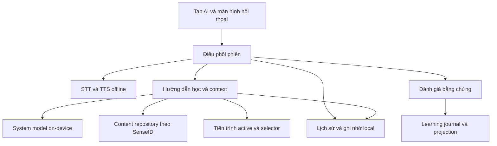

# VocabCraft — Người bạn gia sư AI on-device

Ngày: 2026-09-06. Trạng thái: các quyết định sản phẩm đã được duyệt trong hội thoại; bản spec tổng hợp chờ người dùng đọc và duyệt. Chưa triển khai hoặc kiểm chứng trên thiết bị.

## 1. Mục tiêu và cơ sở

Giúp người Việt mới học tiếng Anh nhớ từ, tự diễn đạt và tự tin giao tiếp thông qua một người bạn AI mang vai trò gia sư. Lời hứa: **Cùng bạn biến những từ đã học thành điều bạn có thể nói.**

Người dùng đã chọn mô hình gia sư dẫn dắt linh hoạt: AI nhìn lại tiến trình, đề xuất luyện tập, khơi gợi trí nhớ rồi trò chuyện theo tình huống; người học có thể đổi chủ đề. Giọng nói trực tiếp là trải nghiệm chính ngay trong bản đầu, không yêu cầu nhấn gửi cho từng lượt.

Bài học cung cấp nội dung; Reflex luyện gọi lại từ; AI giúp vận dụng từ và nhận hỗ trợ trong giao tiếp. AI không thay thế lịch ôn hoặc tự quyết định mastery.

Nguồn nghiên cứu và giới hạn bằng chứng: [ghi chú nghiên cứu](../../research/2026-09-06-ai-language-learning-evidence.md). Ghi chú ban đầu ưu tiên trợ giúp từ khó; spec này ghi nhận quyết định tiếp theo của người dùng mở rộng thành người bạn gia sư bằng giọng nói. Chưa có bằng chứng thử nghiệm rằng tính năng này cải thiện ghi nhớ hoặc hình thành thói quen trong VocabCraft.

## 2. Quyết định đã duyệt và ranh giới

| Nội dung | Quyết định |
| --- | --- |
| Đối tượng | Người Việt mới học tiếng Anh; không mặc định là trẻ em |
| Điểm vào | Tab AI hiện có; nhân vật, tổng kết ngắn, đề xuất và bắt đầu trò chuyện |
| Hội thoại | Giọng nói trực tiếp, ngắt lời, ngập ngừng, chuyển chủ đề; gõ là hỗ trợ |
| Ngôn ngữ | Anh–Việt, chấp nhận xen ngôn ngữ; hướng người học tự thử lại bằng tiếng Anh |
| Sửa lỗi | Sau lượt nói; lỗi trọng tâm sửa sớm, lỗi nhỏ tổng kết sau đoạn |
| Trí nhớ | Tiến trình học, lịch sử và sở thích/mục tiêu được cho phép lưu |
| Tiến trình | Cập nhật từ bằng chứng đủ tin cậy, đúng nghĩa trong nội dung chuẩn |
| Thiết bị | Nhóm iPhone hỗ trợ Apple Intelligence; còn phải kiểm tra runtime và tài nguyên |
| Offline | Toàn bộ phiên hoạt động không có Internet sau khi chuẩn bị tài nguyên |
| Cloud | Không có đường gọi cloud trong bản đầu; mở rộng riêng sau này |
| Nhân vật | Một người bạn gia sư nhất quán; tên và artwork cuối cùng là công việc thiết kế sau |

Trong phạm vi bản đầu: hội thoại, hỗ trợ, lịch sử, tiếp tục phiên, ghi nhớ có quyền kiểm soát, tổng kết và tích hợp tiến trình. Không có chấm phát âm âm vị/trọng âm/ngữ điệu, nhiều nhân vật, đồng bộ lịch sử AI giữa thiết bị, tự gửi thông báo hoặc phát sinh thuê bao cloud. Hệ thống backup/sync khác của app không được tự động đưa lịch sử/ghi nhớ AI vào payload.

Spec quy định mục tiêu trải nghiệm; không cam kết rằng API Apple hiện tại đã đáp ứng mọi mục tiêu. Nếu một yêu cầu cốt lõi không đạt bước kiểm chứng ở mục 12, việc phát hành tính năng bị chặn và cần thảo luận điều chỉnh. Không tự hạ xuống hội thoại nhấn-gửi, bỏ song ngữ hoặc chuyển cloud.

## 3. Tab AI và bắt đầu phiên

### 3.1 Trạng thái sẵn sàng

Hiển thị nhân vật AI, một lời chào và tổng kết ngắn từ dữ liệu thật. Chỉ nêu số lượng, từ yếu hoặc tiến bộ có bằng chứng. Ví dụ nội dung minh họa: “Hôm nay bạn đã học 8 từ. Với prefer, bạn vẫn cần gợi ý khi đặt câu. Mình cùng thử gọi đồ uống nhé?”

Hành động chính: bắt đầu trò chuyện. Hành động phụ: chọn chủ đề khác. Có đường vào lịch sử và mục quản lý ghi nhớ. Không mở microphone chỉ vì người học xem tab. Lời chào trên tab là nội dung hiển thị; giọng nói bắt đầu sau hành động bắt đầu phiên và khi audio sẵn sàng.

Chưa có lịch sử: lấy chủ đề bài vừa học hoặc mời chọn một tình huống đơn giản. Không bịa lỗi hoặc sở thích. Phiên dang dở: cho tiếp tục hoặc bắt đầu phiên mới. Chỉ một phiên hội thoại hoạt động tại một thời điểm.

### 3.2 Kiểm tra trước phiên

Kiểm tra riêng: thiết bị/OS, system model khả dụng, ngôn ngữ, STT offline, giọng đọc offline Anh và Việt, quyền micro/speech và nội dung học đã tải. Các trạng thái chưa hỗ trợ, chưa bật, thiếu tài nguyên, quyền bị từ chối phải có hướng dẫn phù hợp.

Tài nguyên hệ thống do OS quản lý: chỉ hướng dẫn hoặc gọi API quản lý được hỗ trợ; không giả định app có quyền ép tải/xóa model hệ thống. Chỉ hiển thị phần trăm tải nếu có số liệu thật. Không cho thấy trạng thái “đang nghe” trước khi capture sẵn sàng.

Máy thuộc nhóm Apple Intelligence nhưng thiếu một khả năng cốt lõi vẫn chưa đủ điều kiện bắt đầu phiên giọng nói. Có thể cho xem lịch sử hoặc luyện nội dung biên tập; phải gọi đúng tên trải nghiệm, không trình bày là hội thoại AI offline đầy đủ.

## 4. Vòng luyện tập và hành vi gia sư

Mạch phiên: nhìn lại → mục tiêu nhỏ → câu hỏi gợi nhớ → hội thoại → phản hồi/thử lại → tổng kết. Có thể lặp một vài đoạn trong cùng phiên. Mỗi đoạn tập trung khoảng 2–3 sense; không yêu cầu dùng đủ để được kết thúc.

Chọn sense từ nội dung vừa học, đến lịch ôn hoặc bằng chứng còn cần hỗ trợ. Dùng selector/projection của app, không giao model tự đoán lịch ôn. Nếu các từ không tạo được tình huống tự nhiên, giảm số từ hoặc chọn đoạn khác. Người học đổi chủ đề thì AI theo chủ đề đó; các sense không còn phù hợp được ghi chưa luyện, không ghi sai.

Mỗi lượt AI thường có một ý chính hoặc một câu hỏi. Tiếng Anh vừa trình độ; tiếng Việt hỗ trợ nghĩa, giải thích lỗi và khi người học cầu cứu. Xen tiếng Việt không tự động là lỗi. Giảm trợ giúp theo bằng chứng và yêu cầu người học, không chỉ theo số ngày sử dụng.

Gợi ý tăng dần: ngữ cảnh/ý nghĩa → khung câu hoặc cụm gợi ý → câu mẫu nếu vẫn cần. Người học được yêu cầu xem đáp án, bỏ qua hoặc đổi chủ đề. Sau khi đưa đáp án, mời thử lại; không bắt lặp đến khi đúng.

Sửa lỗi gây khó hiểu hoặc liên quan sense mục tiêu ngay sau lượt nói. Gom các lỗi nhỏ để nhận xét cuối đoạn. Mỗi lần một điểm trọng tâm: công nhận ý → chỉ chỗ sai → giải thích ngắn → cách nói đúng → mời thử lại → tiếp tục hội thoại. Câu đúng nhưng chưa tự nhiên được gọi là gợi ý cải thiện, không kết luận sai.

Nhân vật ấm áp, kiên nhẫn, tôn trọng; khích lệ dựa trên điều quan sát được. Giới thiệu rõ là AI. Không trách vì nghỉ học, không dùng tình cảm để ép quay lại. Chấp nhận các yêu cầu nói chậm, giải thích tiếng Việt, đổi chủ đề, tạm dừng và kết thúc bằng lời nói.

## 5. Giọng nói, lượt nói và vòng đời

Phiên có các trạng thái nghiệp vụ: chưa bắt đầu, chuẩn bị, hoạt động, tạm dừng, tổng kết, đã kết thúc, cần khôi phục. Trong trạng thái hoạt động có pha nghe, chờ hoàn tất lượt, tạo phản hồi và phát giọng nói.

| Tình huống | Hành vi bắt buộc |
| --- | --- |
| Ngập ngừng giữa câu | Giữ buffer/lượt hiện tại, không tự đánh giá; kết thúc lượt dựa trên cơ chế đã đo với người mới |
| Im lặng kéo dài | Hỏi nhẹ xem có cần giúp, không đánh sai; không lặp lời nhắc liên tục |
| Người học nói khi AI đang nói | Dừng output, hủy phần generation/phát còn lại của lượt cũ, nhận lượt mới |
| TTS bị ngắt | Phân biệt văn bản đã tạo với phần thực sự phát; không giả định người học đã nghe gợi ý chưa phát |
| AI nghe tiếng của chính mình | Echo handling và turn ownership ngăn tạo lượt/attempt giả |
| Tắt micro | Dừng thu nhận lời người học, trạng thái hiển thị chính xác; không chấm im lặng |
| Chuyển sang gõ | Giữ phiên/mục tiêu; đánh giá lượt gõ theo text, không tính là bằng chứng nói |
| Sửa transcript | Tạo revision của lượt, làm mất hiệu lực đánh giá dựa trên revision cũ |
| Cuộc gọi hệ thống, app vào nền, audio route mất | Tạm dừng, giải phóng capture đúng quyền sở hữu; trở lại phải xác nhận tiếp tục |
| Hủy hoặc kết thúc trong lúc chuẩn bị | Không được mở micro/phát câu trả lời muộn sau hủy |
| Model lỗi, thiếu tài nguyên, áp lực bộ nhớ/nhiệt | Dừng an toàn, giữ dữ liệu đã lưu, hướng dẫn thử lại hoặc luyện nội dung dự phòng |

Ngưỡng im lặng và cấu hình end-of-turn không cố định trước khi đo. Quy tắc lựa chọn là đạt bộ kiểm chứng ở mục 12; không dùng một timeout ngắn coi mọi khoảng nghỉ là kết thúc.

Transcript hai bên cập nhật theo lượt, phân biệt tạm thời/final và phần AI chưa phát hết. Có góp ý gắn với lượt, nghe lại, mở nghĩa Việt, tắt mic và kết thúc. Hoàn thành phiên không bắt buộc nhìn màn hình. Bản đầu không yêu cầu nghe lại bản ghi âm người học; nghe lại câu bằng TTS phải được gọi rõ là giọng đọc câu.

## 6. Đánh giá và cập nhật tiến trình

### 6.1 Đơn vị bằng chứng

Bằng chứng gắn với active profile, session, turn revision, SenseID, sense revision, content version, hình thức trả lời, mức gợi ý, retry và evaluator version. Chỉ transcript final và đã xử lý nghi vấn nhận diện mới được xét. Không dùng điểm tự tin do model tự tuyên bố làm bảo đảm độ chính xác.

| Quan sát | Kết quả học |
| --- | --- |
| Tự dùng đúng sense trong câu phù hợp | Bằng chứng vận dụng độc lập, khi evaluator đã vượt kiểm chứng |
| Dùng đúng sau gợi ý | Bằng chứng có hỗ trợ; không đồng nhất với tự vận dụng |
| Lặp lại câu mẫu vừa nghe | Luyện lặp, chưa phải chứng minh tự nhớ; giữ ở nhật ký AI, không cộng mastery |
| Diễn đạt đúng bằng từ khác | Công nhận giao tiếp đúng; sense mục tiêu chưa có bằng chứng |
| Dùng đúng từ nhưng nghĩa khác mục tiêu | Không ghi thành công cho sense mục tiêu |
| Sai nghĩa/cách dùng đã xác nhận | Bằng chứng cần ôn, có giải thích |
| Nghe nhầm, không chắc, ngoài kho, đang tranh chấp | Unscored hoặc chưa luyện; không phạt tiến trình |

Không gán điểm phát âm từ fuzzy transcript matching. Không tự xếp lại CEFR của người học từ một câu. Một lần dùng đúng không tự đánh dấu mastered.

### 6.2 Tách phản hồi với quyết định ghi điểm

Model có thể đưa phản hồi sư phạm, nhưng app kiểm tra cấu trúc, sense, bằng chứng, hint và trạng thái lượt trước khi quyết định ghi kết quả. Evaluator câu mở chỉ được phép phát kết quả scored sau khi vượt bộ kiểm chứng. Nếu chưa đạt, câu mở vẫn được hỗ trợ nhưng lưu unscored; bài kiểm tra có đáp án chuẩn có thể tạo bằng chứng recall theo rule đã kiểm chứng. Không được quảng bá trạng thái fallback này là đã chấm tự động khả năng giao tiếp đầy đủ.

Chỉ các kết quả đủ tin cậy đi vào learning journal và projection hiện có. Các kết quả có gợi ý không được trở thành independent success chỉ vì outcome là correct. Phải kiểm tra/mở rộng projection trước khi nối luồng AI, giữ nguyên nghĩa dữ liệu của Lesson/Reflex. Không gọi lesson completion hoặc mở khóa bài chỉ vì kết thúc cuộc trò chuyện AI.

### 6.3 Sửa sai và báo nhận xét chưa đúng

Người học sửa transcript hoặc phản đối góp ý sẽ lập tức đưa bằng chứng liên quan vào trạng thái disputed/inactive, loại ảnh hưởng khỏi tiến trình và đề xuất ôn cho đến khi đánh giá lại. Không yêu cầu kết nối hoặc gửi người kiểm duyệt để chức năng này hoạt động offline.

Learning journal hiện có append/counter nhưng chưa có thao tác thu hồi đánh giá ở bề mặt đã kiểm tra. Tích hợp bắt buộc bổ sung cơ chế invalidation/supersession có version và tái tính projection theo sense, thay vì sửa/xóa lén attempt bất biến hoặc chèn một attempt âm. Attempt thay thế liên kết bằng chứng cũ, mỗi revision chỉ có một kết quả active. Retry ghi dữ liệu là idempotent. Chi tiết schema/migration là nhiệm vụ trong implementation plan của phần tích hợp và phải tương thích shared contract.

Đánh giá lại không đủ chắc chắn thì giữ unscored. Việc người học đồng ý một lời giải thích không thay thế bằng chứng evaluator đúng.

### 6.4 Từ mới

Từ ngoài kho được giải thích với mức thận trọng và có thể lưu vào danh sách chờ tra cứu. Không tự tạo published SenseID hay sửa từ điển chuẩn. Nếu tìm thấy sense trong nội dung chuẩn, người học có thể lưu vào Kho Từ; lưu không có nghĩa học xong. Từ ngoài kho không cập nhật mastery/SRS.

## 7. Lịch sử, trí nhớ và quyền dữ liệu

| Loại | Nguồn và chính sách |
| --- | --- |
| Tiến trình học | Journal/projection active; không lấy từ tóm tắt tự do của model |
| Sở thích/mục tiêu | AI đề xuất ghi nhớ; chỉ lưu sau đồng ý rõ ràng bằng lời hoặc thao tác; im lặng không là đồng ý |
| Lịch sử phiên | Lời thoại, góp ý, sense đã luyện, mức hỗ trợ, trạng thái tiếp tục |
| Tóm tắt ngữ cảnh | Dữ liệu dẫn xuất có provenance, có thể tạo lại; không là nguồn điểm số hoặc sự thật cá nhân |

Không lưu điều được nói trong nhập vai thành sự thật cá nhân. Người học có màn hình xem/sửa/xóa ghi nhớ, kiểm tra đề xuất chưa duyệt và hủy việc lưu. Ghi nhớ bị xóa/sửa phải bị loại khỏi context đang hoạt động và các tóm tắt dẫn xuất trước phản hồi tiếp theo; không để phiên cũ tự khôi phục thông tin đã xóa.

Lịch sử/ghi nhớ gắn profile; đổi profile phải dừng phiên và không dùng context profile cũ. Xóa phiên có lựa chọn xóa ghi nhớ bắt nguồn từ phiên. Tiến trình học được quản lý riêng; xóa lịch sử không vô tình reset tiến trình. Bằng chứng tối thiểu còn cần cho một attempt được giữ riêng với định danh/revision để báo sai và invalidation vẫn hoạt động; không giữ nguyên transcript đã yêu cầu xóa dưới tên khác. Sau khi thiếu câu gốc thì không đánh giá lại nội dung đã xóa, chỉ có thể vô hiệu hóa kết quả.

Không lưu raw audio lâu dài; buffer xử lý trong bộ nhớ được giải phóng theo vòng đời. Lịch sử và ghi nhớ ở local store có bảo vệ dữ liệu hệ thống. Không đưa transcript, audio, ghi nhớ cá nhân vào log/analytics/crash metadata. Tài nguyên tải không bao gồm việc gửi nội dung học cá nhân. Cloud/sync AI không hoạt động trong bản đầu.

## 8. Kết thúc, lưu và khôi phục

Người học kết thúc bất cứ lúc nào. AI cũng có thể đề nghị tổng kết sau một đoạn; người học chọn tiếp tục được. Không áp hạn mức phút cloud hay coi phiên ngắn là thất bại.

Tổng kết dùng dữ liệu thật: sense tự dùng được, sense cần trợ giúp, chưa đánh giá, ví dụ từ cuộc trò chuyện còn được phép lưu và một đề xuất luyện tiếp. Nếu model tóm tắt lỗi, dùng template và số liệu chuẩn. Không cần chờ model để ghi kết quả đã xác nhận.

Lưu lượt final và bằng chứng theo transaction/idempotency. Khi lỗi lưu, hiển thị chưa lưu; không báo đã cập nhật tiến trình. Khôi phục từ lượt đã lưu gần nhất, không khôi phục raw audio dở dang, không ghi lặp attempt. Phiên đang hoạt động khi app bị đóng được khôi phục ở trạng thái tạm dừng, micro không tự bật.

## 9. Kiến trúc và tích hợp repository

Bốn ranh giới trách nhiệm đã duyệt; đây là module logic, không mặc định bốn Swift packages hoặc một framework kiến trúc mới.

- Điều phối phiên sở hữu state machine, quyền lượt, cancellation và generation ID; UI phản ánh state, không điều khiển audio bằng side effect rải rác.
- Giọng nói/model có interface thay thế được cho fake, runtime Apple và provider tương lai. Capability trả trạng thái rõ ràng. Bản đầu chỉ đăng ký implementation local; không xây cloud adapter trước.
- Hướng dẫn học sở hữu mục tiêu, gợi ý, context chọn lọc và thời điểm sửa. Nội dung từ ContentRepository, không lấy kiến thức model làm bản chuẩn.
- Đánh giá/lưu trữ sở hữu bằng chứng, version, invalidation, idempotency và projection. Model không có tool sửa trực tiếp mastery hoặc xuất bản nội dung.

Context gồm chỉ dẫn cố định, mục tiêu hiện tại, snapshot sense chuẩn, vài lượt gần nhất và ghi nhớ được phép liên quan. Dự trù phần output và schema trong budget; khi gần giới hạn, rút gọn lịch sử đã kết thúc. Không loại mất trạng thái hint hoặc disputed vì đó là dữ liệu nghiệp vụ ngoài context. Một model request hoạt động tại một thời điểm nếu runtime yêu cầu; hủy/đổi lượt không cho kết quả cũ quay lại UI.

Nội dung người học và transcript là dữ liệu không tin cậy; không đưa vào system instruction. Tool chỉ đọc nội dung/tiến trình phù hợp profile; ghi nhớ có bước đồng ý, ghi điểm đi qua validator. Yêu cầu trong hội thoại không thể tự thay luật chấm hoặc quyền dữ liệu.

### Đối chiếu mã nguồn tại `8eb8636b`

- [AIAssistantPlaceholderView](../../../VocabCraftApp/Features/AIAssistant/Views/AIAssistantPlaceholderView.swift): điểm thay thế theo scope.
- [ContentModels](../../../VocabCraftApp/Core/Content/ContentModels.swift): SenseDetail có definition EN/VI, CEFR, examples, collocations, revision.
- [LearningEvents](../../../VocabCraftApp/Core/Learning/LearningEvents.swift): applicationText/applicationSpeech, outcome unscored, hintCount, evaluatorVersion và sense identity.
- [LearningJournal](../../../VocabCraftApp/Core/Learning/LearningJournal.swift): append/counter; invalidation và semantics hỗ trợ là thay đổi cần bổ sung, không có sẵn.
- [SpeechKit README](../../../Packages/SpeechKit/README.md): capture và transcript/fuzzy evaluation hiện có không chứng minh mixed-language offline conversation hoặc chấm ngữ nghĩa.
- [Shared learning contract](2026-09-05-shared-learning-contract-design.md): progress theo sense, attempts là nguồn, projection tính lại; AI phải tuân theo.
- [Speech coordination design](2026-09-05-speech-runtime-coordination-remediation-design.md): trước khi tích hợp kiểm tra implementation hiện hành và dùng chung quyền sở hữu audio session với Lesson/Reflex. Không thêm chủ sở hữu AVAudioSession cạnh tranh.

## 10. UI, localization và accessibility

Ưu tiên CraftUIKit: CraftPageHeader, CraftCard, CraftIconButton và các thành phần được kiểm tra có sẵn như CraftWaveformView, CraftTactileMicHubView, CraftSpeechWordTokenView, CraftFeedbackSheet. Cần kiểm tra API/semantics thực tế trước tái sử dụng; CraftVoiceMatchCard phục vụ matching không mặc định là màn hình hội thoại.

Chưa thiết kế hoặc phê duyệt component chat/nhân vật mới. Nếu inventory đầy đủ xác nhận thiếu, phải trình phương án mở rộng CraftUIKit hoặc app-level view để người dùng quyết định theo AGENTS.md trước khi triển khai UI đó. Điều này không chặn việc đọc/duyệt spec hoặc kiểm chứng runtime không có UI mới.

Toàn bộ styling dùng theme tokens. Chuỗi UI, fallback, lời mở đầu cố định và accessibility khai báo trong catalog app.ai_assistant.* hoặc craft.* theo layer; EN/VI đầy đủ và format parity. Lời người dùng và nội dung sinh động là dữ liệu runtime, không được đưa literal mẫu vào Swift views; phải bảo đảm UI hiển thị đúng ngôn ngữ. Không hand-edit OpenWiki.

VoiceOver đọc được trạng thái nghe/nói, điều khiển và góp ý; không tự đọc từng partial transcript đè lên giọng AI. Tôn trọng Dynamic Type, Reduce Motion; trạng thái không chỉ phân biệt bằng màu/chuyển động. Không buộc nhìn avatar để biết đến lượt.

## 11. Lộ trình và giới hạn phát hành

1. Kiểm chứng on-device trước: Apple runtime, offline STT/TTS Anh–Việt, đổi lượt, đánh giá và hiệu năng trên thiết bị thật.
2. Lát cắt hội thoại hoàn chỉnh: một nhân vật, tình huống đơn giản, gợi ý và tổng kết; nội dung hẹp để kiểm chứng, không coi là toàn bộ bản phát hành.
3. Tích hợp progress/memory/history, invalidation và phục hồi; mở chủ đề linh hoạt trên cùng cơ chế.
4. Kiểm chứng toàn phạm vi bản đầu và usability, rồi mới phát hành tính năng.

Mở rộng riêng: cloud opt-in theo chi phí/quyền dữ liệu; pronunciation scoring chuyên sâu; tình huống sắp gặp; tùy chọn nhân vật/giọng; tiến bộ dài hạn; nhắc luyện do người học chọn. Không ngầm thu hẹp cam kết bản đầu trong các bước nội bộ.

## 12. Kiểm chứng khả thi và tiêu chí chấp nhận

Các ngưỡng số bên dưới là **đề xuất kỹ thuật cho bản spec này**, cần được duyệt cùng tài liệu. Chưa có kết quả đo. Không dùng benchmark chung của hãng để kết luận đã đạt.

### 12.1 Cổng khả thi thiết bị

Kiểm tra trên iPhone yếu nhất thuộc tập thiết bị dự định hỗ trợ và ít nhất một máy mới hơn; ghi rõ model máy, OS, locale, model/runtime version và tài nguyên. Dùng public API, không dựa vào năng lực riêng của Siri chưa mở cho app. Bắt đầu khảo sát với runtime Apple hỗ trợ Foundation Models; OS tối thiểu phát hành được xác định bằng tổ hợp thực sự vượt cổng, không suy ra từ nhãn Apple Intelligence.

Nếu không hỗ trợ được toàn nhóm máy như mục tiêu, báo rõ tập máy bị thiếu và xin duyệt thay đổi phạm vi trước triển khai sản phẩm; không âm thầm loại máy.

| Kiểm tra | Điều kiện qua |
| --- | --- |
| Offline toàn phiên | Sau chuẩn bị tài nguyên, airplane mode hoàn thành phiên 15 phút, tổng kết, lưu và khôi phục; không có yêu cầu mạng của tính năng |
| Xen Anh–Việt | 30 tình huống có lời cầu cứu/chuyển ngôn ngữ trong câu, ít nhất 3 giọng người Việt; hiểu đúng ý đủ để tiếp tục ở ít nhất 27/30 |
| Ngập ngừng | 20 lượt có pause 1–3 giây giữa câu; ít nhất 18/20 không bị AI giành lượt trước khi nói xong |
| Ngắt lời | 20 lần ngắt; p95 từ phát hiện giọng người học đến dừng TTS không quá 300 ms; không phát lại output cũ |
| Độ trễ | 50 lượt warm: p95 từ kết thúc lời nói thực tế đến âm thanh AI đầu tiên không quá 3 giây; bao gồm endpointing/STT/model/TTS |
| Tài nguyên | Phiên 15 phút trên máy thấp nhất không crash/OS termination, không thermal serious/critical, không tăng bộ nhớ liên tục; báo peak memory và pin thực đo |
| Khôi phục | Hủy khi chuẩn bị, background, route change, thiếu asset đều giữ state đúng, không micro hoặc generation muộn |

Warm/cold được đo riêng; cold có trạng thái chuẩn bị, không được giấu vào số latency warm. Các bộ mẫu này chỉ là cổng prototype, chưa chứng minh chất lượng cho toàn bộ người dùng.

### 12.2 Cổng chất lượng hướng dẫn và đánh giá

Tập tối thiểu 100 lượt do người có năng lực tiếng Anh duyệt, cân bằng: câu đúng nhiều cách, sai sense, lỗi collocation/ngữ pháp, câu có hint, nhại câu mẫu, code-switch, transcript lỗi, ngoài kho, sửa transcript và tranh chấp. Gắn expected explanation, permitted alternatives và expected evidence class; tách tập tinh chỉnh prompt với tập kiểm tra giữ lại.

- Phản hồi đúng nghĩa, đúng lý do và vừa trình độ đạt ít nhất 95% tập kiểm tra.
- Precision của các kết quả scored tối thiểu 98%; báo riêng đúng/sai và tỷ lệ được chấm. Coverage scored trên nhóm câu rõ ràng đủ điều kiện đạt ít nhất 80%, tránh vượt precision bằng cách bỏ chấm mọi câu.
- Không có trường hợp trong bộ kiểm tra ghi independent success cho nhại đáp án, sai sense, transcript disputed hoặc từ ngoài kho.
- Chưa vượt cổng: semantic scoring không được bật. Không dùng mức confidence tự báo của LLM thay kết quả kiểm tra.
- Không đạt cổng hội thoại hoặc sửa lỗi cốt lõi: trình kết quả và phương án điều chỉnh cho người dùng, chưa chuyển triển khai toàn bộ.

### 12.3 Kiểm thử triển khai bắt buộc

Unit/state tests: cancellation/generation, interrupt TTS, hint accounting, outcome mapping, profile isolation, permission/readiness, memory consent, delete propagation và prompt/tool validation. Integration tests: journal idempotency, supersession/dispute và projection rebuild, crash recovery, asset readiness và runtime ownership với Lesson/Reflex.

Test double local cho model/STT/TTS phục vụ phát triển/CI không tốn API; không thay thế đánh giá giọng nói thật. Test on-device dùng fixtures đã cho phép sử dụng, không ghi log nội dung cá nhân. Thử speaker và headset, gõ/voice, VoiceOver và EN/VI.

Trước tuyên bố triển khai hoàn thành, chạy các quality gate của repo: CraftUIKit LocalizationTests, swift test ở các package liên quan và full app suite, SwiftLint, Xcode build không lỗi/cảnh báo. Chỉ viết spec không yêu cầu chạy app build; kiểm tra tài liệu bằng diff, liên kết và tính nhất quán.

### 12.4 Giá trị học tập

Usability ban đầu với 5–8 người mới học: có bắt đầu được, cầu cứu, hiểu sửa lỗi và tự thử lại không. Sau đó đánh giá tự nhớ sau 24 giờ/7 ngày và dùng trong câu mới, so với luyện hiện có cùng thời lượng. Theo dõi quay lại và hoàn thành như chỉ số phụ; không coi số lượt chat, lời khen AI hoặc một tuần quay lại là chứng minh thói quen lâu dài.

## 13. Điều kiện chuyển sang implementation plan

Người dùng duyệt bản spec này, bao gồm các ngưỡng kiểm chứng và chi tiết tích hợp mới được làm rõ. Plan đầu tiên là kiểm chứng on-device có đầu ra quyết định tiếp tục/điều chỉnh, kèm danh sách API và thiết bị được xác minh. UI mới còn phải qua quyết định CraftUIKit nếu có gap. Không chốt nhà cung cấp cloud, dùng API có phí hoặc thực hiện triển khai app trong giai đoạn viết spec.
