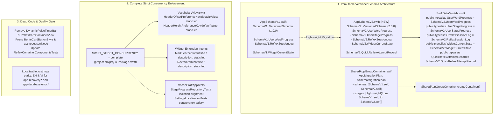

# Package 4: Schema Migration Scalability & Strict Concurrency Quality Gate Design Spec

**Date:** 2026-09-10  
**Status:** Approved by User  
**Scope:** Package 4 of Architecture & Performance Audit (Finding 1, Finding 3, Finding 9)

---

## 1. Executive Summary & Goals

Package 4 serves as the final stabilization and quality hardening phase of the [Architecture & Performance Audit](file:///Users/hoojinguyen/Projects/vocab-craft-app/docs/reviews/2026-09-09-architecture-performance-audit.md), addressing long-term schema migration scalability, dead code removal, and strict concurrency safety:

1. **Immutable VersionedSchema Architecture & Migration Safety (Finding 1 & 3)**:
   - Freeze `SchemaV2` into an independent, immutable schema definition in [`VocabCraftApp/Core/Database/Schemas/AppSchemaV2.swift`](file:///Users/hoojinguyen/Projects/vocab-craft-app/VocabCraftApp/Core/Database/Schemas/AppSchemaV2.swift).
   - Prevent future model changes in root classes from mutating historical `VersionedSchema` definitions.
   - Maintain 100% backward compatibility at domain and view layers through clean `typealias` bindings in [`VocabCraftApp/Core/Database/SwiftDataModels.swift`](file:///Users/hoojinguyen/Projects/vocab-craft-app/VocabCraftApp/Core/Database/SwiftDataModels.swift).
   - Provide realistic SQLite database migration testing verifying that upgrading from `SchemaV1` to `SchemaV2` preserves all user records and streaks without triggering store reset.
2. **Dead Code Elimination & Workspace Hygiene (Finding 9)**:
   - Formally commit the removal of unused components: [`DynamicPulseTimerBar.swift`](file:///Users/hoojinguyen/Projects/vocab-craft-app/VocabCraftApp/Features/Vocabulary/Views/Components/DynamicPulseTimerBar.swift) (superseded by `CraftCountdownTimerBar`), [`ReflexCardContainerView.swift`](file:///Users/hoojinguyen/Projects/vocab-craft-app/VocabCraftApp/Features/Reflex/Core/Components/Container/ReflexCardContainerView.swift), unreferenced `BentoCardButtonStyle` in [`VocabTheme.swift`](file:///Users/hoojinguyen/Projects/vocab-craft-app/VocabCraftApp/Core/DesignSystem/VocabTheme.swift), and unused private state `activeLessonNode` in [`HomepageView.swift`](file:///Users/hoojinguyen/Projects/vocab-craft-app/VocabCraftApp/Features/Homepage/Views/HomepageView.swift).
   - Prune obsolete component-only unit tests in [`ReflexContainerComponentsTests.swift`](file:///Users/hoojinguyen/Projects/vocab-craft-app/VocabCraftAppTests/Features/Reflex/ReflexContainerComponentsTests.swift).
   - Ensure 100% bilingual parity (EN & VI) in [`Localizable.xcstrings`](file:///Users/hoojinguyen/Projects/vocab-craft-app/VocabCraftApp/Resources/Localizable.xcstrings) for database error and recovery strings.
3. **Strict Concurrency Enforcement & Swift 6 Readiness (Finding 3 & 9)**:
   - Enable `SWIFT_STRICT_CONCURRENCY = complete` globally across all targets in `VocabCraftApp.xcodeproj` (`VocabCraftApp`, `VocabCraftWidgetExtension`, `VocabCraftAppTests`).
   - Configure `.enableUpcomingFeature("StrictConcurrency")` in [`Package.swift`](file:///Users/hoojinguyen/Projects/vocab-craft-app/Package.swift).
   - Systematically eliminate all concurrency warnings: convert mutable global statics in PreferenceKeys and AppIntents to immutable `let` constants, and align test suite actor isolation boundaries.

---

## 2. Architecture & Detailed Design



### 2.1 Subsystem 1: SwiftData Schema Freezing & Migration Architecture

#### Problem & Root Cause
In `SharedAppGroupContainer.swift`, `SchemaV2` currently references mutable top-level types (`UserWordProgress.self`, `UserStageProgress.self`). If any property is added or altered in those classes, `SchemaV2` implicitly mutates, breaking migration playback and violating Apple's SwiftData VersionedSchema contract.

#### Architectural Solution
1. **Self-Contained `AppSchemaV2.swift`**:
   - Create [`VocabCraftApp/Core/Database/Schemas/AppSchemaV2.swift`](file:///Users/hoojinguyen/Projects/vocab-craft-app/VocabCraftApp/Core/Database/Schemas/AppSchemaV2.swift).
   - Implement `SchemaV2: VersionedSchema` with `versionIdentifier = Schema.Version(2, 0, 0)`.
   - Embed all models directly within `SchemaV2`:
     - `SchemaV2.UserWordProgress`
     - `SchemaV2.UserStageProgress`
     - `SchemaV2.ReflexSessionLog`
     - `SchemaV2.WidgetCurrentState`
     - `SchemaV2.QuickReflexAttemptRecord`
   - Include all initializers, attributes, unique constraints, and mapping helper methods (`toData()`).
2. **Transparent Typealiases in `SwiftDataModels.swift`**:
   - Replace top-level model definitions with:
     ```swift
     public typealias UserWordProgress = SchemaV2.UserWordProgress
     public typealias UserStageProgress = SchemaV2.UserStageProgress
     public typealias ReflexSessionLog = SchemaV2.ReflexSessionLog
     public typealias WidgetCurrentState = SchemaV2.WidgetCurrentState
     public typealias QuickReflexAttemptRecord = SchemaV2.QuickReflexAttemptRecord
     ```
   - Retain `@unchecked Sendable` fallback structs in `#else` blocks for non-SwiftData platforms.
3. **Migration Plan & Fixture Verification**:
   - `AppMigrationPlan` in [`SharedAppGroupContainer.swift`](file:///Users/hoojinguyen/Projects/vocab-craft-app/VocabCraftApp/Core/Database/SharedAppGroupContainer.swift) coordinates migration stages.
   - Enhance [`SchemaMigrationTests.swift`](file:///Users/hoojinguyen/Projects/vocab-craft-app/VocabCraftAppTests/Core/Database/SchemaMigrationTests.swift) to:
     - Open a persistent SQLite file with `SchemaV1` and persist records.
     - Re-open the same file with `SchemaV2` via `AppMigrationPlan`.
     - Validate that all properties (including `consecutiveCorrectStreak`, `isBookmarked`, `nextReviewDate`) map correctly and that new models (`UserStageProgress`, `QuickReflexAttemptRecord`) can be inserted seamlessly.

---

## 2.2 Subsystem 2: Dead Code & Workspace Hygiene

#### Cleaned Components
1. **`DynamicPulseTimerBar.swift`**: Deleted. All countdown animations now reside in `CraftCountdownTimerBar` in `CraftUIKit`.
2. **`ReflexCardContainerView.swift`**: Deleted. Reflex drill views now use direct SwiftUI compositions with `CraftCard` and `CraftDepthTokens`.
3. **`BentoCardButtonStyle`** in `VocabTheme.swift`: Removed unreferenced button style.
4. **`activeLessonNode`** in `HomepageView.swift`: Removed unused private state.
5. **`ReflexContainerComponentsTests.swift`**: Removed obsolete test cases that only verified instantiation of `ReflexCardContainerView`.
6. **`Localizable.xcstrings`**: Ensure 100% complete EN/VI translations for `app.database.error.*` and `app.recovery.*`.

---

## 2.3 Subsystem 3: Complete Strict Concurrency Enforcement

#### Build Configuration
1. **Xcode Project Settings**:
   - Add `SWIFT_STRICT_CONCURRENCY = complete;` to `VocabCraftApp.xcodeproj/project.pbxproj` for:
     - Project-level build configuration (`Debug` & `Release`).
     - `VocabCraftApp` target (`Debug` & `Release`).
     - `VocabCraftWidgetExtension` target (`Debug` & `Release`).
     - `VocabCraftAppTests` target (`Debug` & `Release`).
2. **SPM `Package.swift`**:
   - Add `swiftSettings: [.enableUpcomingFeature("StrictConcurrency")]` to `VocabCraftApp`, `VocabCraftWidgetExtension`, and `VocabCraftAppTests` targets.

#### Concurrency Warnings Resolution
1. **PreferenceKey Mutable Statics in [`VocabularyView.swift`](file:///Users/hoojinguyen/Projects/vocab-craft-app/VocabCraftApp/Features/Vocabulary/Views/VocabularyView.swift)**:
   - Change `static var defaultValue: CGFloat = 0` to `static let defaultValue: CGFloat = 0` in `HeaderOffsetPreferenceKey`.
   - Change `static var defaultValue: CGFloat = 50` to `static let defaultValue: CGFloat = 50` in `HeaderHeightPreferenceKey`.
2. **AppIntent Mutable Statics in [`MarkLearnedIntent.swift`](file:///Users/hoojinguyen/Projects/vocab-craft-app/VocabCraftWidgetExtension/AppIntents/MarkLearnedIntent.swift) & [`NextWordIntent.swift`](file:///Users/hoojinguyen/Projects/vocab-craft-app/VocabCraftWidgetExtension/AppIntents/NextWordIntent.swift)**:
   - Change `public static var title` and `public static var description` to `public static let`.
3. **Actor Isolation in [`StageProgressRepositoryTests.swift`](file:///Users/hoojinguyen/Projects/vocab-craft-app/VocabCraftAppTests/Core/StageProgressRepositoryTests.swift)**:
   - Mark `setUp()` / `tearDown()` or isolate repository operations cleanly to eliminate actor isolation mismatch warnings with XCTestCase.
4. **Static Mutable State in [`SettingsLocalizationTests.swift`](file:///Users/hoojinguyen/Projects/vocab-craft-app/VocabCraftAppTests/SettingsLocalizationTests.swift)**:
   - Isolate or synchronize `catalogStrings` to comply with Sendable rules.

---

## 3. Quality Gate & Verification Strategy

| Phase | Check | Command | Success Criteria |
| :--- | :--- | :--- | :--- |
| **1. Dead Code** | Git working tree cleanliness | `git status -s` | Only intentional, documented changes present |
| **2. Localization** | Design system & app catalog | `swift test --package-path Packages/CraftUIKit --filter LocalizationTests` | 100% passed, 0 missing keys |
| **3. Concurrency** | SPM compilation with strict concurrency | `swift build --build-tests -Xswiftc -strict-concurrency=complete` | 0 errors, 0 warnings |
| **4. Unit Tests** | Full root SPM test suite | `swift test` | 298+ tests passed in 48 suites |
| **5. Package Tests** | Subpackage test suites | `swift test --package-path Packages/CraftUIKit` && `swift test --package-path Packages/SpeechKit` | 100% passed |
| **6. SwiftLint** | Lint enforcement | `swiftlint lint --quiet --no-cache` | 0 violations, 0 warnings |
| **7. Xcode Simulator** | Full iOS simulator build & test | `xcodebuild test-without-building -scheme VocabCraftAppTests -destination 'platform=iOS Simulator,name=iPhone 17 Pro' -quiet` | 0 compiler warnings, 100% passed |

---

## 4. Planned Commits

1. `chore(cleanup): remove deprecated reflex card container and pulse timer dead code`
2. `refactor(database): freeze SchemaV2 and establish immutable VersionedSchema architecture`
3. `feat(concurrency): enable SWIFT_STRICT_CONCURRENCY complete and resolve all diagnostics`
