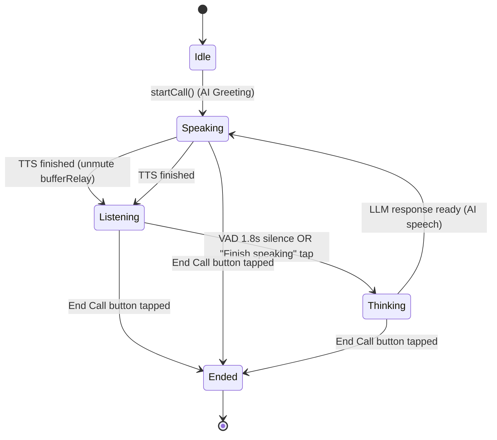

# Speaking AI Voice Conversation Resilience & UI/UX Redesign Specification

- **Date**: 2026-09-28
- **Status**: Approved
- **Scope**: Architectural Redesign
- **Target Platforms**: iOS 17+, macOS (Catalyst/Mac)

---

## 1. Executive Summary & Root Cause Analysis

During practical device testing of the Speaking AI Voice Conversation feature (`RoleplayVoiceCallView`), several critical functional and user experience issues were identified:

1. **Truncated Scaffolding Hints**: The suggested response sentences were truncated (`...`) into single-line fragments, preventing learners from reading full conversational sentences.
2. **Speech Recognition Failure (Silent Mic)**: The microphone frequently failed to detect the user's voice even in quiet environments.
3. **Choppy, Disconnected Conversation Flow**: Turn-taking was unnatural due to aggressive deallocation of audio resources between turns, leading to noticeable pauses and audio pops.
4. **Lack of Fuzzy Speech Matching**: Target vocabulary detection relied on rigid regex exact-matching rather than forgiving phonetic and morphological tolerance from `SpeechKit`.
5. **Design System & Safe Area Violations**: The view failed to respect top safe area insets (Dynamic Island and status bar clock overlapped header buttons) and bottom safe area insets (Home Indicator overlapped call action buttons), violating `AGENTS.md` and Apple Human Interface Guidelines.

This specification details the comprehensive architectural overhaul to address all five root causes.

---

## 2. Audio Engine & Speech Recognition Architecture

### 2.1 Root Cause of Audio Failure
In the legacy implementation, `TurnBasedVoiceConversationEngine` interacted with two uncoordinated audio services: `TextToSpeechService` and `SpeechRecognitionService`.
- When AI finished speaking, `TextToSpeechService` released its `.playback` lease, causing `AudioSessionCoordinator` to deactivate hardware (`setActive(false)`).
- `SpeechRecognitionService` immediately tried to acquire `.speechCapture` and reinstall `AVAudioEngine.inputNode.installTap`.
- This rapid deactivation/reactivation cycle caused `hardwareFormat` corruption (0 sample rate / 0 channels) or silent crashes in `SFSpeechRecognizer`, entering unrecoverable standby.

### 2.2 Resilient Architecture: `ResilientConversationSpeechEngine`
Instead of tearing down audio hardware between every turn, the conversation engine adopts the persistent session architecture proven in `ResilientReflexSpeechEngine`:

- **Shared Audio Pipeline**:
  - Uses `SpeechAudioEngineController` and `AudioBufferRelay`.
  - Holds a continuous `.duplexSpeech` (or `.playAndRecord`) lease for the lifetime of the call (`startCall` to `endCall`).
- **Buffer-Level Input Muting**:
  - During AI speech (TTS active): `bufferRelay.mute()` prevents speaker output from bleeding into the speech recognizer.
  - On TTS completion: `bufferRelay.unmute()` instantly allows audio buffers into a new `SFSpeechAudioBufferRecognitionRequest` in `< 50ms` without touching CoreAudio hardware.
- **Continuous Streaming & Real-time Metering**:
  - Streaming partial transcripts update the UI smoothly as the user speaks.
  - Normalized audio levels (RMS to dB scaling) feed directly into `CraftVoiceOrbView` for an organic breathing audio wave pulse.

---

## 3. Two-Tier SpeechKit Fuzzy Tolerance Engine

Learners speaking a foreign language frequently use inflectional variations (e.g. "beverages" instead of "beverage") or slight accent variations. The system adopts a two-tier evaluation model leveraging `SpeechKit`:

### 3.1 Tier 1: Target Vocabulary Matching (`ReflexSpeechMatcher`)
- Replaces rigid word-boundary regex in `ExecuteRoleplayTurnUseCase`.
- Evaluates spoken text using `ReflexSpeechMatcher.isReflexMatch(spokenText:targetLemma:toleranceThreshold: 0.70)`.
- Covers English morphological rules:
  - Extended inflections: `-s`, `-es`, `-ed`, `-ing`, `-tion`, `-ment`.
  - Vowel drop: *hesitate* $\rightarrow$ *hesitating*.
  - Y-to-I mutation: *pastry* $\rightarrow$ *pastries*, *happy* $\rightarrow$ *happiness*.
  - Tiered Levenshtein similarity with $\ge 0.70$ threshold.
- Automatically marks matched target words as mastered and triggers visual badge unlock animations.

### 3.2 Tier 2: Suggested Response Alignment (`FuzzySpeechMatcher`)
- Compares user utterance against each candidate in `suggestedResponses` via `FuzzySpeechMatcher.evaluate(spokenText:targetSentence:passThreshold: 0.70)`.
- If similarity score $\ge 70\%$:
  - Recognizes that the learner adopted this suggestion.
  - Grants credit for all target words embedded in the suggested sentence.
  - Passes the normalized target sentence alongside raw transcription to the LLM prompt, ensuring the AI maintains contextual coherence even if Apple STT produced minor phonetic misspellings.

---

## 4. Natural Hybrid Turn-Taking Flow

To eliminate disjointed and robotic pauses:

1. **Smart Voice Activity Detection (VAD)**:
   - Dynamic trailing silence duration of 1.8 seconds via `SilenceDetector`.
   - Allows natural mid-sentence pauses for thinking without premature cut-offs.
2. **Explicit "Finish Speaking" Action**:
   - A dedicated `CraftButton` ("Tap when finished speaking") is rendered while in `.listening` state.
   - Users who finish speaking can tap to immediately trigger `.thinking` without waiting for the 1.8s silence timer.
3. **Sub-second Turn Transition**:
   - Switching from speech to thinking to TTS occurs seamlessly without audio clicks or deallocations.

---

## 5. UI/UX & Layout Architecture (Option A: Scaffolding Drawer)

### 5.1 Safe Area Conformance
- The view structure enforces strict safe area boundaries:
  - Top padding: `.safeAreaPadding(.top)` with minimum 16pt clearance below the Dynamic Island / Status Bar clock.
  - Bottom padding: `.safeAreaPadding(.bottom)` elevating action buttons safely above the Home Indicator.

### 5.2 Five-Zone Layout Hierarchy
1. **Top Header HUD**:
   - `CraftIconButton` (close icon) with discard confirmation alert flow.
   - Character title (`CraftFont.headline.bold()`) & Role subtitle (`CraftFont.caption`).
   - `CraftBadge` (`app.ai_call.active_badge`, tone: `.success`, variant: `.subtle`).
2. **Target Words Strip**:
   - Horizontal scrolling strip with `CraftBadge` for each target vocabulary item.
   - Mastered items transition with spring scale animation to `tone: .success`, `variant: .solid`, `symbol: .checkmarkCircle`.
3. **Center Stage**:
   - `CraftVoiceOrbView`: Proportional 140pt circular orb with audio level breathing pulse.
   - State indicator: *Listening...*, *Emma is speaking...*, *Thinking...* using `theme.colors.textSecondary`.
   - Live Subtitles Pill: Card showing character's question and user's live streaming transcript.
4. **Scaffolding Drawer (`RoleplaySuggestedDrawer`)**:
   - **Collapsed State**: Elegant floating capsule button: `CraftButton` (*"Suggested responses (3) ⌃"*).
   - **Expanded State**: Bottom sheet / drawer with dedicated scrollable container:
     - 100% full multi-line text wrapping with `.lineLimit(nil)` and `.fixedSize(horizontal: false, vertical: true)` — zero truncation.
     - Embedded target words highlighted in `theme.colors.brandPrimary`.
     - `CraftIconButton` with `.speakerWave2` for instant TTS pronunciation preview.
5. **Bottom Action Dock**:
   - "Finish Speaking" button rendered during `.listening`.
   - Three standard call controls:
     - Subtitles toggle (`.docText`).
     - End Call button (`.phoneDown`, variant: `.danger`, shape: `.circle`, size: `.xl`).
     - Mute toggle (`.micSlash` / `.audio`).

### 5.3 Design System & Token Discipline
- 100% compliant with `CraftUIKit` tokens (`CraftColorTokens`, `CraftTypographyTokens`, `CraftSpacingTokens`, `CraftRadiusTokens`).
- Zero hardcoded colors or ad-hoc margins.

---

## 6. Localization Taxonomy (100% Bilingual EN/VI)

All strings reside in `Localizable.xcstrings` under the `app.ai_call.*` namespace:

| Key | English (en) | Vietnamese (vi) |
| :--- | :--- | :--- |
| `app.ai_call.active_badge` | Live Call | Đang gọi |
| `app.ai_call.suggested_title` | Suggested Responses | Gợi ý câu trả lời |
| `app.ai_call.suggested_toggle` | Suggested responses (%lld) | Gợi ý câu trả lời (%lld) |
| `app.ai_call.listen_sample` | Listen to sample | Nghe phát âm mẫu |
| `app.ai_call.finish_speaking` | Tap when finished speaking | Chạm khi nói xong |
| `app.ai_call.mic_muted` | Microphone muted | Đã tắt mic |
| `app.ai_call.listening_prompt` | Speak into the microphone... | Hãy nói vào microphone... |
| `app.ai_call.retry_listening` | Tap to retry microphone | Chạm để thử lại mic |

---

## 7. Data Flow & State Machine

---

## 8. Verification & Quality Gates

To strictly comply with Section 5 of `AGENTS.md`:

1. **Localization Parity Test**: `swift test --filter LocalizationTests` verifying 100% bilingual parity for `app.ai_call.*`.
2. **SpeechKit & Fuzzy Unit Tests**: `swift test --filter FuzzySpeechMatcherTests` and `ReflexSpeechMatcherTests` validating inflection coverage and 70% threshold tolerance.
3. **Conversation Engine Tests**: `TurnBasedVoiceConversationEngineTests` verifying warm audio session, buffer mute/unmute, and hybrid turn transitions.
4. **SwiftLint & Xcode Zero Warnings**: Run `swiftlint` and verify compilation with **0 errors and 0 warnings**.
