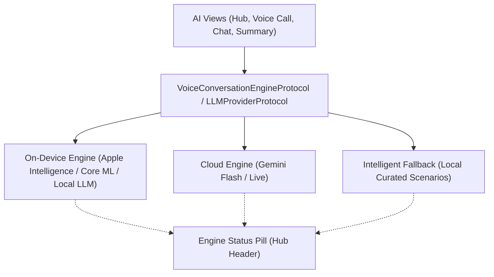

# VocabCraft — AI Assistant: The Warm Companion Hub (UI/UX Redesign Spec)

- **Date:** 2026-10-05
- **Status:** Approved by Human Partner
- **Scope:** Complete synchronous UI/UX redesign of the AI Assistant subsystem (`AIAssistantHubView`, `RoleplayVoiceCallView`, `RoleplayRoomView`, `RoleplaySummaryView`, `AIConfigSheet`).

---

## 1. Executive Summary & Product Vision

### 1.1 The Core Promise
Biến tính năng AI từ một danh mục kịch bản kỹ thuật khô khan thành một **Người bạn gia sư AI đồng hành (The Warm Companion)** theo tinh thần: *"Cùng bạn biến những từ đã học thành điều bạn có thể nói"*.

### 1.2 Identified Problems from Simulator Visual Audit
1. **Layout & Safe Area Overlap:** `CraftFloatingTabBar` che lấp 50% thẻ kịch bản cuối cùng trên `AIAssistantHubView`, cắt ngang nút bấm vi phạm Apple Human Interface Guidelines (HIG).
2. **Technical Anti-Pattern:** Banner "Gemini API Setup" to bản đặt ngay đỉnh màn hình học tập tạo cảm giác công cụ thử nghiệm chưa hoàn thiện.
3. **Cắt chữ (Text Truncation):** Nút secondary trên thẻ kịch bản bị co ngắn thành `"Start..."` trên màn hình tiêu chuẩn.
4. **Hội chứng "Trang giấy trắng" (Blank Slate Paralysis):** Màn hình chat văn bản trống rỗng 80% khi bắt đầu, gây tâm lý sợ sai và bí ý tưởng cho người học ở trình độ sơ cấp (A2–B1).
5. **Mất cân đối tỷ lệ trong cuộc gọi thoại:** `CraftVoiceOrbView` lơ lửng, phụ đề dạng thẻ trắng đục đơn điệu, icon Mute bị nhầm lẫn giữa mic và loa (`.audio` thay vì `mic.fill`/`mic.slash.fill`).
6. **Báo cáo tổng kết đứt gãy (Dead-End Flow):** Màn hình Summary thiếu vinh danh chi tiết từ vựng và chỉ có 1 nút "Back to Hub", không mở lối tiếp nối vào hệ sinh thái học tập (Personal Vault / Reflex Blitz).

---

## 2. Design System & Component Hierarchy (CraftUIKit-First)

### 2.1 Theme & Token Discipline
* **Zero Raw Styling:** Tuyệt đối không dùng hardcoded colors, system paddings hay ad-hoc corner radii.
* **Tokens sử dụng:**
  * Bảng màu: `theme.colors.canvasBackground`, `surfaceCard`, `brandPrimary`, `accent`, `textPrimary`, `textSecondary`, `statusSuccess`, `statusWarning`, `statusDanger`.
  * Khoảng cách: `theme.spacing.xxs` (4pt), `xs` (8pt), `sm` (12pt), `md` (16pt), `lg` (24pt), `xl` (32pt), `xxl` (48pt).
  * Bo góc: `theme.radii.sm` (8pt), `md` (12pt), `lg` (16pt), `xl` (24pt), `full` (Circle).
  * Kính mờ: `CraftGlassTokens` kết hợp `.ultraThinMaterial`.

### 2.2 Component Reuse Map
* `CraftPageHeader`: Header trang với scroll fade và action slot.
* `CraftCard`: Container thẻ với style `.outlined` hoặc `.elevated`.
* `CraftBadge`: Huy hiệu trạng thái, level và từ vựng mục tiêu.
* `CraftButton` & `CraftIconButton`: Nút tương tác đảm bảo tối thiểu 44x44pt touch target.
* `CraftVoiceOrbView`: Trung tâm trực quan cho cuộc gọi thoại (140pt) phản hồi theo `audioLevel`.

---

## 3. Detailed Screen Specifications

### 3.1 AI Assistant Hub (`AIAssistantHubView`)

#### 3.1.1 Header & Engine Status
* Loại bỏ banner cấu hình to bản ở đầu ScrollView.
* Thay thế bằng **Engine Status Pill** nằm cạnh nút cài đặt:
  * On-Device: `CraftBadge("On-Device (Local)", symbol: .sparkles, variant: .subtle, tone: .neutral)`
  * Cloud: `CraftBadge("Cloud Active", symbol: .checkmarkCircle, variant: .subtle, tone: .success)`
  * Chạm vào pill sẽ mở `AIConfigSheet` dạng modal tinh tế.

#### 3.1.2 Companion Hero Card (`CompanionHeroCard`)
* **Avatar & Persona:** Hình ảnh đại diện gia sư với ánh hào quang pulsing nhẹ.
* **Contextual Greeting:** Đọc số từ vựng vừa học trong ngày từ `UserProgressRepository`: *"Chào bạn! Hôm nay bạn đã nạp 3 từ mới. Hãy cùng mình luyện 2 phút để biến từ vựng thành phản xạ nhé!"*.
* **Target Word Badges:** Dải badge từ vựng mục tiêu trong ngày.
* **Primary Action:** Nút lớn `Luyện nói 2 phút ngay` (`CraftButton` size `.lg`, `variant: .primary`, full width) mở trực tiếp `RoleplayVoiceCallView`.
* **Secondary Action:** Nút `Nhắn tin nhập vai` (`CraftButton` size `.md`, `variant: .subtle`) mở `RoleplayRoomView`.

#### 3.1.3 Scenario Practice Section & Re-designed Scenario Cards
* **Topic Filter Bar:** Cuộn ngang mượt mà, hỗ trợ các chủ đề: *Tất cả*, *Ẩm thực & Cafe*, *Du lịch & Khách sạn*, *Công sở*, *Phỏng vấn*.
* **Thẻ Kịch bản (Loại bỏ triệt để lỗi cắt chữ "Start..."):**
  * Cột trái: Icon chủ đề (48x48pt) với nền bo góc mềm.
  * Cột giữa: Tiêu đề in đậm, mô tả vai trò đối thoại, hàng badge từ vựng thu nhỏ.
  * Cột phải: 2 nút icon tròn tách biệt chuẩn 44x44pt touch target:
    * `CraftIconButton(symbol: .audio, variant: .filled, tone: .primary)` -> Gọi thoại ngay.
    * `CraftIconButton(symbol: .docText, variant: .subtle, tone: .neutral)` -> Chat văn bản.
* **Safe Area Bottom Inset:**
  * Thêm `Spacer(minLength: theme.spacing.xxl + 88)` ở cuối ScrollView, đảm bảo thẻ cuối cùng nổi hoàn toàn trên `CraftFloatingTabBar`.

---

### 3.2 Voice Call Screen (`RoleplayVoiceCallView`)

#### 3.2.1 Bố cục & Trọng tâm Thị giác
* **Top Bar:** Nút đóng (X) 44pt, Tên nhân vật & Vai trò, Huy hiệu trạng thái đập nhẹ thời gian thực (Pulsing Live Indicator).
* **Target Words Bar:** Dải từ vựng mục tiêu; khi chạm vào từ sẽ mở Quick Tooltip Sheet giải nghĩa và ví dụ phát âm.
* **Center Stage:** `CraftVoiceOrbView` (140pt) nằm ở trung tâm thị giác, phản hồi nhịp thở theo giọng AI và mở rộng vòng sóng âm theo âm lượng người học (`audioLevel`).
* **Translucent Subtitles Card:** Chất liệu kính mờ Liquid Glass (`.ultraThinMaterial`), hiển thị song song lời AI vừa nói và transcript nhận diện trực tiếp lời người học.
* **Scaffolding Drawer:** Ngăn kéo gợi ý câu trả lời mẫu tích hợp nút loa mini (`CraftIconButton(symbol: .audio)`) để nghe phát âm mẫu trước khi nói vào mic.

#### 3.2.2 Thanh Điều khiển Cuộc gọi (Control Bar)
* **Nút Phụ đề (Trái):** `CraftIconButton(symbol: .quoteBubble, size: .lg)`.
* **Nút Cúp máy (Giữa):** `CraftIconButton(symbol: .phoneDown, size: .xl, shape: .circle, variant: .danger)`.
* **Nút Micro Mute (Phải):** `CraftIconButton(symbol: isMuted ? .micSlash : .mic, size: .lg)` — khắc phục dứt điểm nhầm lẫn với biểu tượng loa.

---

### 3.3 Text Chat Screen (`RoleplayRoomView`)

#### 3.3.1 Xóa bỏ "Hội chứng Trang giấy trắng" (Blank Slate Paralysis)
* **Avatar & Character Header:** Hiển thị rõ nhân vật đối thoại (Emma - Barista) và nút kết thúc phiên.
* **Sentence Starter Chips:** Ngay trên ô nhập liệu, bổ sung thanh cuộn ngang các khung câu mở đầu:
  * Ví dụ: `[ "I'd like to order a..." ]`, `[ "Could I get a..." ]`, `[ "How much is this?" ]`.
  * Chạm vào chip sẽ tự động điền vào TextField để người học bổ sung từ vựng mục tiêu.
* **Interactive Target Badges:** Dải từ vựng mục tiêu hỗ trợ tap để tra nghĩa nhanh.
* **Bong bóng Hội thoại & Gợi ý Cải thiện (Refinement Hints):**
  * Bong bóng AI kèm nút loa phát âm tự nhiên.
  * Khi người dùng trả lời chưa tự nhiên, hiển thị thẻ gợi ý: *"💡 Cách nói tự nhiên hơn: [Câu chuẩn bản xứ] 🔊"*.

---

### 3.4 Session Summary Screen (`RoleplaySummaryView`)

#### 3.4.1 Báo cáo & Lời Động viên Gia sư
* **Gia sư Avatar & Lời khen:** Nhận xét cá nhân hóa dựa trên kết quả phiên.
* **Bảng Thành tích & Độ lưu loát:** Điểm lưu loát (Fluency Score %) và thưởng XP tích lũy.
* **Vinh danh Chi tiết Từ vựng:**
  * Phân tách rõ: Từ đã làm chủ (✅ Mastered in context) và Từ chưa kịp vận dụng (⚠️ Needs practice).
* **Takeaways Chuẩn Bản xứ:**
  * Hiển thị câu gốc của người học và câu sửa của người bản xứ.
  * Tích hợp nút **[🔖 Lưu vào Kho Từ Cá Nhân]** (`ToggleWordBookmarkUseCase`) để đưa vào lịch ôn tập ngắt quãng (SRS).

#### 3.4.2 Mở lối Vòng lặp Học tập (Next Learning Action)
* **Primary Action:** `⚡️ Củng cố từ chưa vững với Reflex Blitz (60 giây)`: Chuyển hướng người học vào bài tập phản xạ chớp nhoáng cho các từ chưa đạt.
* **Secondary Action:** `Hoàn tất & Trở về Hub`: Đóng phiên và lưu tiến trình.

---

### 3.5 AI Engine Preferences Sheet (`AIConfigSheet`)
* Tách biệt khỏi trải nghiệm học thông thường, chỉ mở khi người dùng tap vào Engine Status Pill hoặc nút Settings.
* Cung cấp các tùy chọn:
  * **Chế độ hoạt động:** Tự động (Ưu tiên On-Device) / Luôn dùng On-Device / Cloud Enhanced (Gemini).
  * **Cấu hình Gemini API Key:** Ô nhập an toàn có ẩn/hiện và xóa nhanh.
  * **Quản lý Trí nhớ AI:** Xem danh sách dữ liệu AI đang nhớ về người học, cho phép xóa dữ liệu bộ nhớ để đảm bảo tính riêng tư.

---

## 4. Scalability Architecture (Hybrid Engine Readiness)

1. **On-Device First (Apple Intelligence / Core ML):**
   * Bảo mật tuyệt đối, hoạt động 100% offline, zero latency, không đòi hỏi API key.
2. **Cloud Enhanced (Gemini Live / Flash):**
   * Mở rộng cho các đoạn hội thoại dài, sửa lỗi ngữ pháp phức tạp và giọng nói biểu cảm đa dạng.
3. **Curated Intelligent Mock (Fallback):**
   * Chạy mượt mà trên môi trường Simulator, thiết bị cũ hoặc khi không có mạng.

---

## 5. Zero Hardcoded Strings & Localization Architecture

Tuân thủ nghiêm ngặt chuẩn Layer 2 (`app.ai.*`) trong `VocabCraftApp/Resources/Localizable.xcstrings`:

| Key | English (en) | Vietnamese (vi) |
| :--- | :--- | :--- |
| `app.ai.hub.engine.on_device` | On-Device (Local) | On-Device (Nội bộ) |
| `app.ai.hub.engine.cloud` | Cloud Active | Đã kết nối Cloud |
| `app.ai.hub.companion.badge` | Daily Companion | Bạn Đồng Hành Hôm Nay |
| `app.ai.hub.companion.start_call` | Quick Voice Practice (2m) | Luyện nói 2 phút ngay |
| `app.ai.hub.companion.start_chat` | Text Roleplay | Nhắn tin nhập vai |
| `app.ai.hub.scenarios.title` | Topic Scenarios | Thực hành theo tình huống |
| `app.ai.call.live_badge` | Live Call | Trực tiếp |
| `app.ai.call.mic_mute` | Mute microphone | Tắt micro |
| `app.ai.call.mic_unmute` | Unmute microphone | Bật micro |
| `app.ai.call.suggested_preview` | Listen example | Nghe thử câu mẫu |
| `app.ai.chat.starter_chips_title` | Sentence Starters | Khung câu gợi ý |
| `app.ai.chat.refine_prefix` | Natural way to say: | Cách nói tự nhiên hơn: |
| `app.ai.summary.mastered_words` | Mastered in conversation | Từ vựng đã chinh phục |
| `app.ai.summary.unmastered_words`| Needs more practice | Cần luyện thêm |
| `app.ai.summary.save_to_vault` | Save to Personal Vault | Lưu vào Kho từ cá nhân |
| `app.ai.summary.action_reflex` | Drill weak words in Reflex (60s) | Củng cố từ chưa vững với Reflex (60s) |

---

## 6. Verification Plan & Quality Gates

### 6.1 Localization & Unit Testing
* Chạy `swift test --filter AIAssistantLocalizationTests` xác nhận 100% cặp khóa `en` và `vi` khớp định dạng.
* Chạy `swift test --filter AppBootstrapperTests` xác thực router và launch arguments.

### 6.2 Visual Multi-Device Verification (Xcode Simulator MCP)
* Kiểm tra bố cục Hub trên cả iPhone SE (375pt) và iPhone 17 Pro / Pro Max (430pt):
  * Xác thực thẻ kịch bản cuối cùng không bị che bởi `CraftFloatingTabBar`.
  * Xác thực không có nút nào bị co cụt chữ (`Start...`).
  * Xác thực touch target của mọi icon button đạt tối thiểu 44x44pt.

### 6.3 Code Quality & Linter
* SwiftLint: 0 warnings, 0 errors.
* Xcode Compiler: 0 warnings (kể cả cảnh báo Swift 6 Concurrency).
