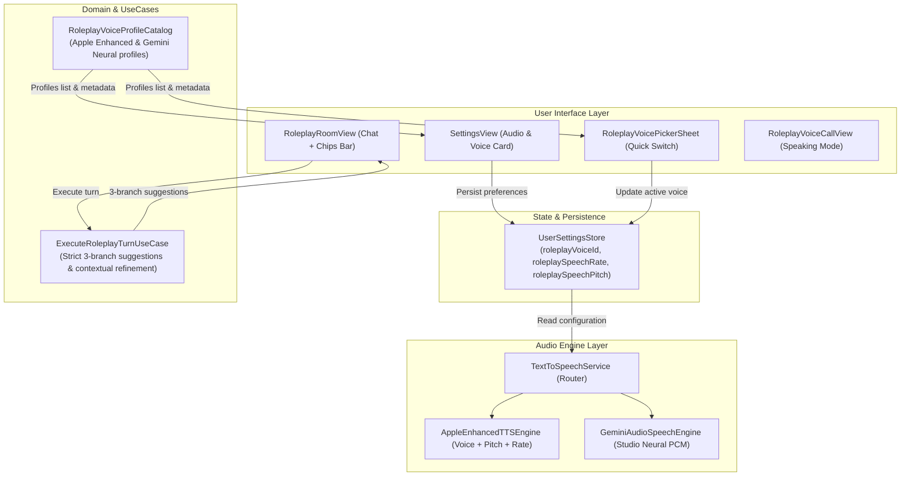

# Specification: Role Play Voice Customization & High-Precision Chat Suggestions

**Date:** 2026-10-06  
**Status:** Approved  
**Author:** AI Pair Programmer & User  
**Target Platform:** iOS 17.0+, macOS 14.0+

---

## 1. Overview & Objectives

Following user feedback on VocabCraft's AI Role Play system:
1. **Chat Suggestions & Refinements:** Current suggested sentences and refinement corrections were generic or occasionally pedantic/inaccurate. In addition, `RoleplayRoomView` lacked an interactive suggested response chips UI above the input bar, requiring users to manually compose every reply.
2. **Speaking Voice Realism & Customization:** On-device synthesized voices can feel synthetic without user control over specific voice talents, pitch, and speed. Users require a dedicated voice selection and audio configuration surface in Settings and a quick picker in Role Play, enabling them to preview and choose natural voices (Apple Enhanced/Premium voices and Google Gemini Cloud Studio Neural voices) tailored to their personal preference.

### Success Criteria:
- **High-Precision Chat Suggestions:** LLM prompt enforces accurate, contextual 3-branch suggested responses (Target Vocabulary, Polite Question, Natural Conversational Reaction).
- **Intelligent Sentence Refinement:** `refinementSuggestion` is strictly restricted to correcting ungrammatical or awkward sentences; natural native-like utterances return `nil`/`null`.
- **Interactive Quick-Response Chips:** A horizontal scrolling chips container in `RoleplayRoomView` lets users tap a suggestion to instantly insert or send it.
- **Role Play Voice Profiles & Catalog:** `RoleplayVoiceProfile` provides curated voices spanning Apple Enhanced/Premium (Ava, Zoe, Daniel, Oliver, Samantha, Nathan) and Gemini Cloud Neural (Aoede, Puck, Charon, Kore).
- **Voice Customization & Preview UI:** A dedicated card in `SettingsView` with voice picker, real-time audio preview (▶️ Listen sample), speed slider (0.75x–1.25x), and pitch slider (0.85x–1.15x).
- **Quick Voice Selector in Roleplay:** A quick-access sheet in `RoleplayRoomView` and `RoleplayVoiceCallView` allowing mid-session voice changes.
- **Zero Raw Styling & Zero Hardcoded Strings:** 100% CraftUIKit tokens, 100% bilingual parity (EN & VI) in `Localizable.xcstrings`.
- **Zero Warnings & 100% Tests Pass Rate:** Full test suite verification with strict concurrency compliance.

---

## 2. Architecture & Data Flow



---

## 3. Detailed Component Specifications

### 3.1 Domain Model: `RoleplayVoiceProfile`

**File:** `VocabCraftApp/Domain/Entities/RoleplayVoiceProfile.swift`

```swift
public enum VoiceEngineType: String, Sendable, Codable, CaseIterable {
    case appleEnhanced
    case geminiNeural
}

public struct RoleplayVoiceProfile: Identifiable, Sendable, Equatable, Hashable {
    public let id: String
    public let displayNameKey: String
    public let gender: VoiceGender
    public let locale: String
    public let engine: VoiceEngineType
    public let qualityDescriptionKey: String
    public let sampleText: String
    public let appleVoiceIdentifier: String?
    public let geminiPersona: VoicePersona?

    public init(
        id: String,
        displayNameKey: String,
        gender: VoiceGender,
        locale: String,
        engine: VoiceEngineType,
        qualityDescriptionKey: String,
        sampleText: String = "Hi! I'm excited to practice English conversation with you.",
        appleVoiceIdentifier: String? = nil,
        geminiPersona: VoicePersona? = nil
    ) {
        self.id = id
        self.displayNameKey = displayNameKey
        self.gender = gender
        self.locale = locale
        self.engine = engine
        self.qualityDescriptionKey = qualityDescriptionKey
        self.sampleText = sampleText
        self.appleVoiceIdentifier = appleVoiceIdentifier
        self.geminiPersona = geminiPersona
    }
}
```

**Catalog:** `VocabCraftApp/Data/AI/RoleplayVoiceProfileCatalog.swift`
- Default ID: `"systemAuto"` (automatically adapts to character's gender & persona).
- Apple Enhanced Profiles:
  - `apple-ava` (Female, US, warm & natural)
  - `apple-zoe` (Female, US, youthful & expressive)
  - `apple-samantha` (Female, US, clear & articulate)
  - `apple-daniel` (Male, UK, elegant & standard)
  - `apple-oliver` (Male, UK, friendly & warm)
  - `apple-nathan` (Male, US, resonant & calm)
- Gemini Cloud Studio Profiles (active when Gemini API Key is configured):
  - `gemini-aoede` (Female, Studio Neural)
  - `gemini-puck` (Male, Studio Neural)
  - `gemini-charon` (Male, Deep Studio Neural)
  - `gemini-kore` (Female, Expressive Studio Neural)

---

### 3.2 User Settings Persistence

**File:** `VocabCraftApp/Core/Database/UserSettingsStore.swift`
- Properties:
  - `public var roleplayVoiceId: String` (defaults to `"systemAuto"`, backed by UserDefaults `"roleplay_voice_id"`)
  - `public var roleplaySpeechRate: Double` (defaults to `1.0`, range `0.75...1.25`, key `"roleplay_speech_rate"`)
  - `public var roleplaySpeechPitch: Double` (defaults to `1.0`, range `0.85...1.15`, key `"roleplay_speech_pitch"`)

---

### 3.3 Prompt & Suggestion Logic

**File:** `VocabCraftApp/Domain/UseCases/ExecuteRoleplayTurnUseCase.swift`
Update `systemPrompt` rules:
```text
REFINEMENT GUIDELINES:
- `refinementSuggestion`: Only provide an improved sentence if the user's message has grammatical errors, awkward word choice, or unnatural phrasing.
- If the user's message is already grammatically correct and natural English, set `refinementSuggestion = null`. Never rewrite a correct sentence just for stylistic novelty.
- When provided, keep the refinement concise (under 12 words) and natural.

SUGGESTED RESPONSES GUIDELINES:
- `suggestedResponses`: Generate exactly 2 to 3 distinct candidate responses (3 to 7 words each) that directly continue the current conversation thread:
  1. Target Word Branch: A natural answer incorporating at least one target word from [targetWordIds].
  2. Question/Inquiry Branch: A polite follow-up question or request relevant to what the character just said.
  3. Conversational Reaction Branch: A natural, colloquial reaction (agreement, polite decline, or quick remark).
```

---

### 3.4 Interactive Chips Bar in `RoleplayRoomView`

**File:** `VocabCraftApp/Features/AIAssistant/Views/RoleplayRoomView.swift`
- `RoleplayRoomViewModel` manages `suggestedResponses: [String]` initialized from `scenario.starterSuggestions` and updated on each turn from `output.suggestedResponses`.
- UI: A scrollable horizontal bar above `bottomInputBar`:
  - Each chip is a pill-shaped `CraftCard` / button with an icon (`.sparkles` or `.bubble`).
  - Tapping a chip populates `viewModel.inputText` or sends directly.
  - An expand/collapse toggle button allows hiding the suggestions if the user prefers typing freely.

---

### 3.5 Audio Router & Engine Integration

**File:** `VocabCraftApp/Core/Audio/TextToSpeechService.swift`
- When context is `.conversation(persona, locale)`:
  - Check `settingsStore?.roleplayVoiceId`.
  - If a specific profile is selected:
    - If `geminiNeural` profile and API Key configured: route to `geminiEngine.synthesizeAndPlay`.
    - If `appleEnhanced` profile: resolve voice by identifier or name, apply `roleplaySpeechPitch` and `roleplaySpeechRate`, and speak via `appleEngine`.
    - If `"systemAuto"`: resolve best voice according to character persona with pitch scaling.
- Preview playback: `previewVoice(profile: RoleplayVoiceProfile, rate: Double, pitch: Double)` plays `profile.sampleText` immediately for user feedback.

---

### 3.6 Settings & Quick Picker UI

**Files:**
- `VocabCraftApp/Features/Settings/Views/SettingsView.swift`: `SettingsRoleplayVoiceCard` containing:
  - Voice Profile Menu / Picker with badges (`Enhanced`, `Studio Neural`).
  - ▶️ Listen Preview button with playing indicator.
  - Speech Speed & Pitch sliders with live numeric badges.
- `VocabCraftApp/Features/AIAssistant/Views/Components/RoleplayVoicePickerSheet.swift`:
  - Compact modal sheet accessible from navigation bar in `RoleplayRoomView` and `RoleplayVoiceCallView` to switch voice on the fly.

---

## 4. Localization Keys (Bilingual EN & VI)

`VocabCraftApp/Resources/Localizable.xcstrings`:
- `app.settings.voice.section_title`: "Role Play Voice" / "Giọng đọc Role Play"
- `app.settings.voice.current_profile`: "Active Voice" / "Giọng đang dùng"
- `app.settings.voice.auto_persona`: "Automatic (Character Persona)" / "Tự động (Theo tính cách nhân vật)"
- `app.settings.voice.preview_button`: "Play Preview" / "Nghe thử"
- `app.settings.voice.previewing`: "Playing..." / "Đang phát..."
- `app.settings.voice.speed`: "Voice Speed" / "Tốc độ đọc"
- `app.settings.voice.pitch`: "Voice Pitch" / "Cao độ âm sắc"
- `app.settings.voice.quality_apple`: "Device Enhanced" / "Thiết bị - Tự nhiên"
- `app.settings.voice.quality_gemini`: "Cloud Studio Neural" / "Cloud - Siêu thực"
- `app.ai_assistant.room.suggestions_header`: "Suggested Responses" / "Gợi ý trả lời"
- `app.ai_assistant.room.voice_picker_title`: "Select AI Voice" / "Chọn giọng đọc AI"

---

## 5. Verification & Testing Plan

1. **Unit Tests:**
   - `RoleplayVoiceProfileCatalogTests`: verify profile mappings, identifiers, and persona fallbacks.
   - `UserSettingsStoreTests`: verify persistence and default values of `roleplayVoiceId`, `roleplaySpeechRate`, and `roleplaySpeechPitch`.
   - `ExecuteRoleplayTurnUseCaseTests`: verify 3-branch suggestions rule and null-refinement rule when utterance is natural.
   - `RoleplayRoomViewModelTests`: verify suggestion updates, chip selection populating input, and voice preview triggers.
2. **Quality & Verification Gates:**
   - `swift test` 100% pass rate.
   - `swiftlint --strict` 0 violations.
   - Clean compilation on Xcode with 0 errors and 0 warnings.
   - Physical device test verification on iPhone 16 Pro "Hooji".
